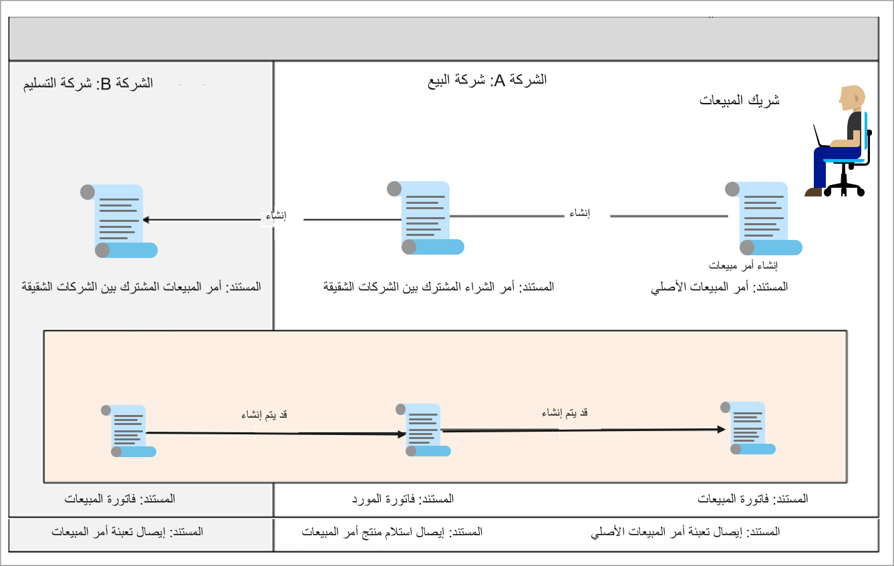

غالباً ما تشتري وتبيع المؤسسات الكبيرة بين الشركات التابعة لها. تسهل Supply Chain Management التجارة بين الشركات الشقيقة بحيث يمكن للكيانات القانونية للمنظمة تداول السلع في حين يتم إنشاء جميع الوثائق تلقائياً للكيانات القانونية المشاركة، مما يوفر الوقت والمال للمنظمة.

توضح الصورة التالية العمليات التجارية النموذجية بين الشركات الشقيقة للأعمال التي تدعمها Supply Chain Management، وكيفية سير إجراءات الحركات‬ بين الشركة البائعة والشركة التي تقدم سيناريوهات التسليم غير المباشر. 

- **التسليم غير المباشر**: يتم استلام البضائع الخاصة بالتسليم غير المباشر بصورة فعلية ثم يتم شحنها من الشركة البائعة إلى العميل.

- **التسليم المباشر**: لا يتم استلام البضائع بصورة فعلية في الشركة البائعة. يتم إرسال البضائع مباشرةً إلى العميل من شركه التسليم، وذلك عند الطلب من الشركة البائعة. 

  

 

لمزيد من المعلومات، راجع [تكوين واستخدام التجارة بين الشركات الشقيقة في Dynamics 365 Supply Chain Management](/training/modules/configure-use-intercompany-trade-dyn365-supply-chain-mgmt/?azure-portal=true). 
