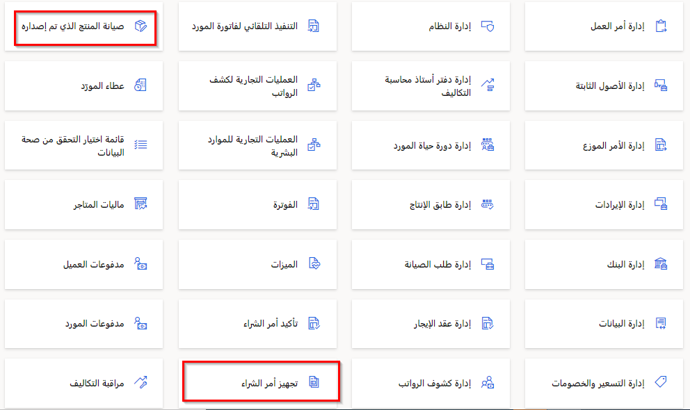
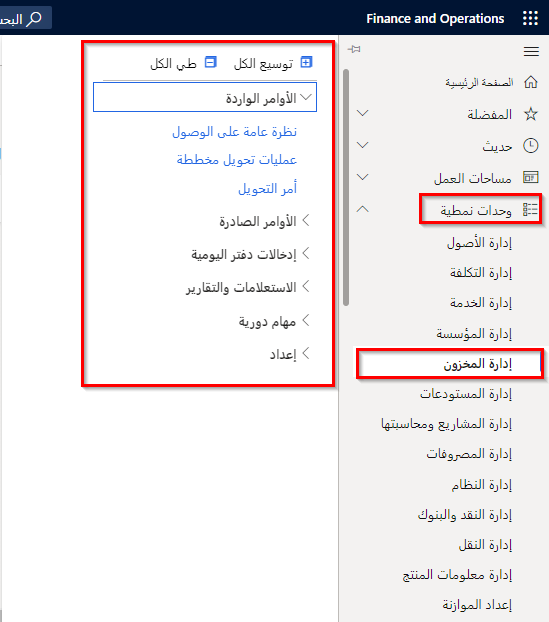

## السيناريو
الآن بعد أن تعلمت أساسيات Dynamics 365 Supply Chain Management، والوحدات والميزات التي تتضمنها، حان دورك لاستكشافها.

1.  بعد أن تقوم بتسجيل الدخول إلى بيئة معملية باتباع الإرشادات المذكورة أعلاه، يمكنك تحديد الإطارات المتجانبة الموجودة في **الصفحة الرئيسية** لفتح مساحات العمل. على سبيل المثال، **تحضير أمر الشراء** أو **صيانة المنتج التي تم إصداره**.

    
 
    قم بإغلاق مساحة العمل بتحديد العلامة **X** في أعلى اليسار.
2.  حدد أيقونة **الوحدات النمطية** في جزء التنقل على اليمين، وافتح وحدة نمطية، واستكشف العديد من الصفحات في تلك الوحدة النمطية. على سبيل المثال، **إدارة المخزون**.

    
 
    > [!NOTE]
    > في هذه البيئة المعملية، ستجد تطبيقات تابعة لـ Dynamics 365 أكثر تثبيتاً من Dynamics 365 Supply Chain Management. لذلك، ستري أيضاً الوحدات النمطية التي لا تعد جزءاً من إدارة سلسلة التوريد. 

3.  وعند الانتهاء من استكشاف Dynamics 365 Supply Chain Management، يمكنك إغلاق بيئة المعمل.
