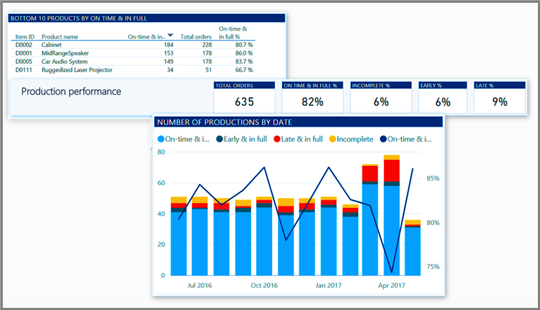
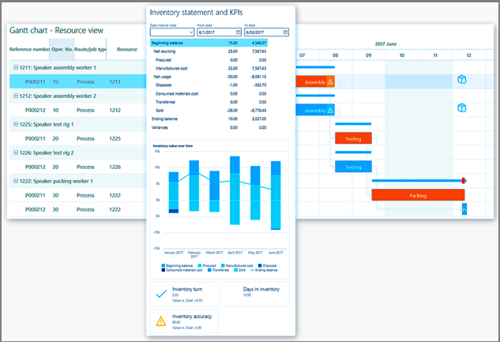

تمكن إدارة سلسلة التوريد المؤسسات من التشغيل الأكثر ذكاء مع العمليات المتصلة وتنفيذ المهام التالية:
 
- إنشاء مزيج تصنيع مثالي من المنفصل ومحدود الفاقد وعملية الحل الواحد لدعم العمليات عبر سلسلة التوريد.
- تحسين معلمات التصنيع لكل مجموعة منتجات، بما في ذلك التجهيز للتخزين وإجراء الأمر وسحب الأمر وتكوين الأمر وهندسة الأمر.
- تسهيل الجدولة بواسطة رؤية الوقت الحقيقي في الموارد باستخدام نموذج المورد الموحد ومحرك الجدولة عبر الوحدة النمطية للإدارة المالية في إدارة سلسلة التوريد.
- تحسين تدفق المواد المصنعة والسلع الجاهزة مع إدارة المستودعات والخدمات اللوجستية المتقدمة.
- تحسين جودة المنتج عن طريق تحديد وحل المشكلات من خلال الرؤى في الوقت الفعلي والذكاء التنبؤي.
 
    

## أتمتة سلسلة التوريد وتنظيمها 

تساعد إدارة سلسلة التوريد الشركات على تحسين التنفيذ وتقليل التكاليف من خلال مزامنة التجهيزات عبر المواقع والمستودعات وأوضاع النقل. بالإضافة إلى ذلك، فإنها تمكن المؤسسات من توفير استجابة أسرع لطلب العميل عن طريق التنفيذ التلقائي لتنسيق سلس لعمليات الطلب النقدي.

ومن خلال العمليات، توفر إدارة سلسلة التوريد رؤية وتحكم في كافة المواقع والمستودعات للاستجابة الاستباقية للإصدارات باستخدام إمكانيات التحليل المالي.

ومن خلال توحيد العمليات من المبيعات إلى الاستيفاء، تربط إدارة سلسلة التوريد بسلاسة بين المبيعات والشراء مع الخدمات اللوجستية والإنتاج وإدارة المستودعات لعرض شامل لسلسلة التوريد في المؤسسة. إذ يقلل ذلك تكاليف التدبير ويتيح تحكماً أكبر من خلال أتمتة عمليات التدبير إلى الدفع‬.
 

