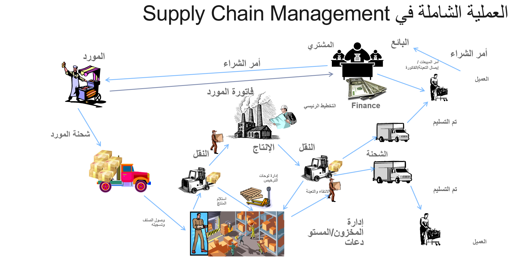
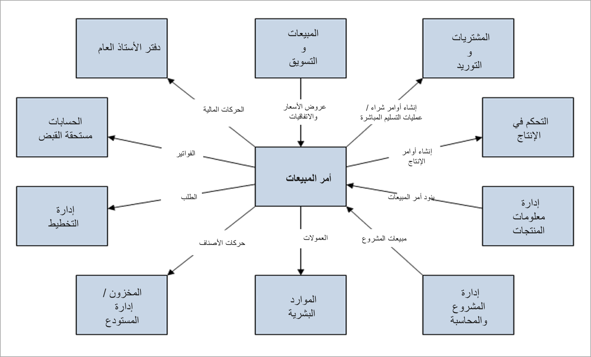
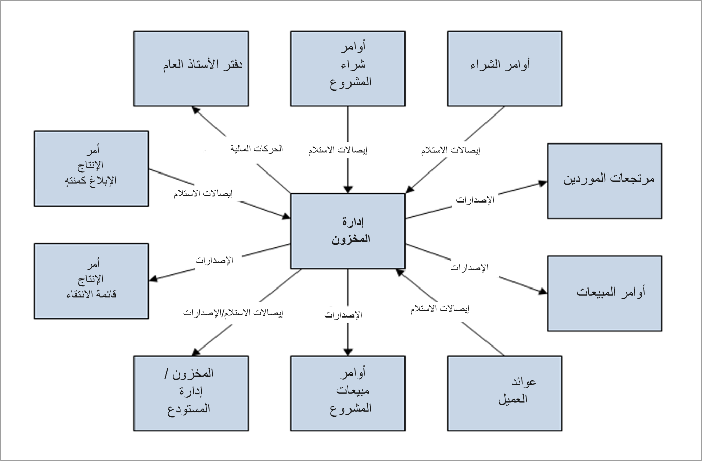

يتم تنظيم التوزيع والتجارة في Supply Chain Management في الوحدات النمطية المتعددة وكذلك مساحات العمل المستندة إلى الدور والتي تركز على المهام اليومية المرتبطة بالدور المعين.

يساعد الأمان المستند إلى الدور في Supply Chain Management وDynamics 365 Finance في الحفاظ على أمان البيانات المالية والتشغيلية. 
 
فيما يلي المسؤوليات الخاصة بقادة التشغيل.  

- **زيادة كفاءة التشغيل** - محاولة تسريع وتيرة ودقة عمليات الأعمال من خلال عمليات مبسطة تنسق بشكل فعال بين الأشخاص والأصول والموارد لتقليل التكاليف وتحسين مستويات الخدمة ودفع النمو. 

    في Finance، تتحكم الوحدة النمطية للأصول الثابتة في الأصول الموجودة في سلسلة التوريد من خلال التكامل مع الوحدة النمطية لإدارة المخزون في Supply Chain Management. 

    تتحكم الوحدة النمطية للموارد البشرية في Finance، والوحدات النمطية لإدارة المؤسسة في الموارد مثل الأشخاص والأجهزة والموردين.
- **تحسين التخطيط الاستراتيجي** - يساعد التخطيط الرئيسي والوحدات النمطية لإدارة المخزون الشركات في تحسين التخطيط الاستراتيجي من خلال تقديم طريقة عرض موحدة للمخزون والمستودع والتصنيع والخدمة واللوجستيات مع التحليلات المتوقعة التي تحوِّل البيانات إلى معارف دقيقة لدعم اتخاذ قرارات استراتيجية بشكل أفضل.
- **تحسين إنتاجية قوة العمل** - توفر مصدراً واحداً من المعلومات المهنية التي تحرك الإنتاجية من الأصول والموارد، وتوائم الموظفين نحو الأهداف الإستراتيجية، وتمكّن الاستجابة في الوقت الفعلي لمتطلبات المؤسسة والعملاء.

توفر Supply Chain Management أدوات وميزات مع عناصر تحكم ذكية مضمنة مثل المخططات ومؤشرات الأداء الأساسية (KPI) ومساحات العمل لتحسين إنتاجية قوة العمل.
 

سيتم تسجيل كافة الأموال الواردة والصادرة في دفتر الأستاذ العام في Finance، ويكون لكل بنك حساب مقابل في دليل الحسابات. وهذا يسهل تسوية كشوف الحسابات البنكية مع حركات الإدارة المالية في المعالجة الدورية.

 

باستخدام الوحدة النمطية الخاصة بالتدبير والتوريد في Supply Chain Management، يمكنك إجراء كافة عمليات الشراء والتفاوض وإنشاء اتفاقيات الشراء الخاصة بالمورد، وإدارة أوامر الشراء مع إدارة التغييرات أو بدونها، والموافقة على سير العمل، وغير ذلك.
 

يمكنك التحكم في الأصناف الموجودة في موقع المستودع ومعالجة الحركة الخاصة بها في سلسلة التوريد. تتم إدارة عمليات مثل الجرد والنقل والعزل ومراقبة الجودة بسهولة باستخدام وحدتي إدارة المخزون وإدارة المستودع Warehouse Management.

يتم تنفيذ كافة أوامر المبيعات، التفاوض وإنشاء اتفاقيات البيع الخاصة بالعميل، وإدارة أوامر الإرجاع باستخدام الوحدة النمطية الخاصة بالمبيعات والتسويق.

يمكن أن تساعدك الوحدة النمطية لإدارة النقل في العثور على مسارات لتسليم البضائع إلى العملاء باستخدام برنامج لحساب التكاليف وتحديد أفضل مسار استناداً إلى التكلفة أو وقت التسليم.

تلقي الوحدات التالية نظرة مقربة على كل من هذه الوحدات النمطية.

