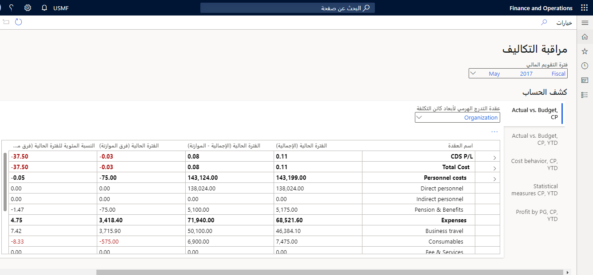

تتيح لك محاسبة التكاليف جمع البيانات من مصادر مختلفة، مثل دفتر الأستاذ العام ودفاتر الأستاذ الفرعية والموازنات والمعلومات الإحصائية. يمكنك بعد ذلك تحليل بيانات التكلفة وتلخيصها وتقييمها حتى تتمكن الإدارة من اتخاذ أفضل القرارات الممكنة لتحديثات الأسعار والموازنات والتحكم في التكاليف وما إلى ذلك.

تشكّل مساحة عمل **مراقبة التكاليف** نقطة مركزية حيث يمكن للمدراء المسؤولين عن مراقبة كائن تكلفة أو مجموعة من كائنات التكلفة داخل بُعد أو عبر الأبعاد (على سبيل المثال، مراكز التكلفة ومجموعات المنتجات) الوصول إلى التقارير. تُدار التقارير الموجودة في مساحة العمل بواسطة محاسبي التكلفة لتمكين تناسق التخطيط والبيانات المستخدمة لإعداد التقارير عبر المؤسسة بكاملها.

تعرض هذه الصورة الصفحة **مراقبة التكاليف** في **محاسبة التكاليف > مساحات العمل > مراقبة التكاليف**
 

لمزيد من المعلومات، راجع [الشروع في العمل مع محاسبة التكاليف لسلاسل الإمداد في مسار تعليم Dynamics 365 Finance](/training/paths/get-started-cost-accounting-supply-chains-dyn365-finance/?azure-portal=true). 
