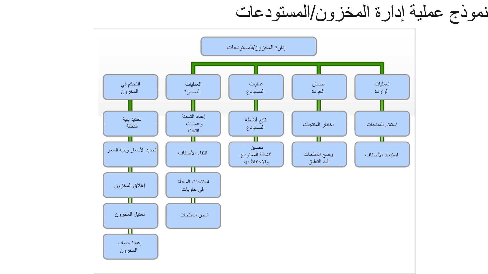

توضح الصورة التالية العمليات النموذجية للمؤسسة باستخدام وحدات إدارة المخزون وإدارة المستودعات في Supply Chain Management.
  

 
يمكنك استخدام الوحدات لإدارة المخزون وإدارة المستودعات لأداء المهام التالية:

- العمليات الواردة
- ضمان الجودة
- عمليات المستودعات
- العمليات الصادرة
- التحكم في المخزون

لمزيد من المعلومات حول وحدات إدارة المخزون وإدارة المستودعات، راجع وحدات ومسارات التعلم التالية.

- [تكوين إدارة المخزون والتعامل معها في Dynamics 365 Supply Chain Management](/learn/modules/configure-inventory-management-dyn365-supply-chain-mgmt/?azure-portal=true)

- [تكوين مراقبة الجودة وإدارة الجودة والتعامل معهما في Dynamics 365 Supply Chain Management](/learn/modules/configure-work-quality-control-dyn365-supply-chain-mgmt/?azure-portal=true)
 
- [تكوين إدارة المستودعات والتعاون معها في Dynamics 365 Supply Chain Management](/learn/paths/configure-work-warehouse-management-dyn365-supply-chain-mgmt/?azure-portal=true) 
 
