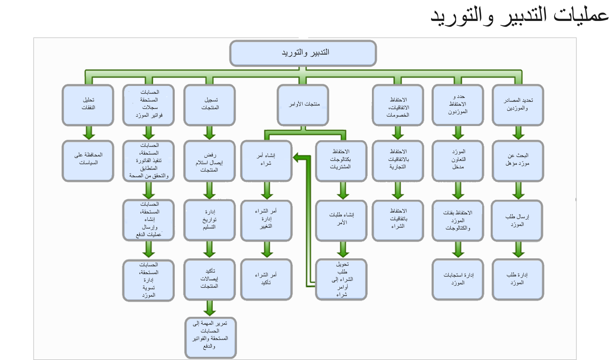

يغطي التدبير والتوريد جميع الخطوات من تحديد الحاجة إلى المنتج والخدمات من خلال شراء المنتج والاستلام وإعداد الفواتير ومعالجة الدفع مع الموردين. يمكن تكوين عمليات التدبير لاحتياجات العمل المحددة من خلال تحديد سياسات الشراء ومهام سير العمل.

توضح الصورة التالية عمليات الأعمال النموذجية التي تستخدم وحدة التدبير والتوريد في Supply Chain Management.
  

لمزيد من المعلومات، راجع [تكوين وإدارة التدبير والموردين في مسار تعلم Dynamics 365 Supply Chain Management](https://docs.microsoft.com/learn/paths/configure-manage-procurement-vendors-dyn365-supply-chain-mgmt//?azure-portal=true).

