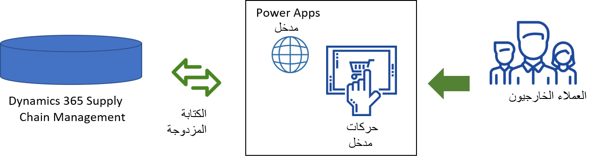

تعتمد أنظمة سلاسل التوريد على التكامل. تتطلب أن يتم دمج أقسام المخزون وطلب العميل والمبيعات بدلاً من وجودها في مخزن منفصل. يساعد مدخل العملاء المؤسسات التي تستخدم Supply Chain Management على تعزيز هذا التكامل وإبقاء عملائها على اطلاع.

مدخل العملاء عبارة عن قالب لمداخل Power Apps يتيح للشركات إنشاء موقع ويب خارجي للعملاء للوصول إلى بيئة Supply Chain Management الخاصة بك. 

يستخدم القالب الكتابة المزدوجة وSupply Chain Management ومداخل Power Apps التي تتطلب القليل من الترميز لإنشاء المداخل. يمكن تعديل القالب ليمثل العلامة التجارية للشركة، وإضافة وظائف متزايدة، وتغيير تجربة المستخدم. 

تتضمن الوظائف الجاهزة لقالب مدخل العملاء ما يلي:

- عرض محفوظات الأوامر
- عرض معلومات الحساب
- إنشاء أوامر
- أدوار الويب المكونة مسبقاً وأذونات الكيانات لمستخدمي مداخل Power Apps
- إمكانات الدعوة لدعوة العملاء إلى المدخل.

يمكن تعديل الوظيفة التي يوفرها قالب مدخل العملاء حسب الرغبة.

 > [!VIDEO https://www.microsoft.com/videoplayer/embed/RE4ylwW]

يعتمد مدخل العملاء على مداخل Power Apps والكتابة المزدوجة.

- **مداخل Power Apps** - لاستضافة مدخل العملاء؛ يتم ترخيص المداخل حسب الاستخدام.
- **الكتابة المزدوجة** - لتمكين الكتابة المزدوجة لكيانات Supply Chain Management

لمعرفة المزيد حول كيفية إعداد وإدارة مدخل العملاء، راجع [تثبيت مدخل العملاء وإعداده وتحديثه‬](/dynamics365/supply-chain/sales-marketing/customer-portal-setup/?azure-portal=true).