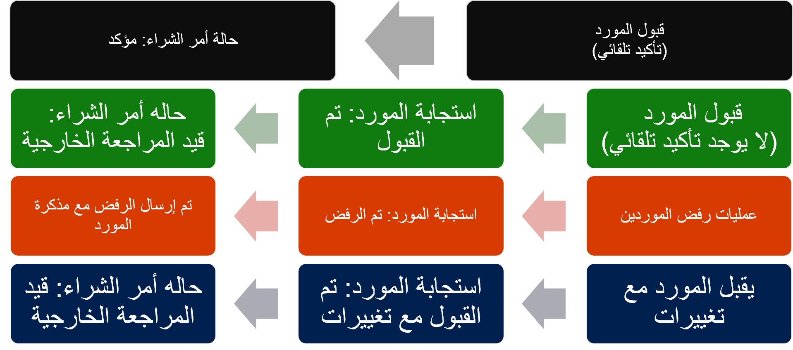

تعرض واجهة تعاون المورد في Supply Chain Management مجموعة محدودة من المعلومات حول أوامر الشراء والفواتير ومخزون الشحن لمستخدمي الموردين الخارجيين. من هذه الواجهة، يمكن للمورد أيضاً الرد على طلبات عروض الأسعار (RFQ) وعرض معلومات الشركة الأساسية وتحريرها.

توضح الصورة التالية العمليات النموذجية بين الشركة والمورد الذي قد يستخدم ميزات تعاون المورد في Supply Chain Management.

  

لمزيد من المعلومات، راجع [تكوين وإدارة تعاون المورد في Dynamics 365 Supply Chain Management](https://docs.microsoft.com/learn/modules/configure-manage-vendor-collaboration-dyn365-supply-chain-mgmt/?azure-portal=true).
