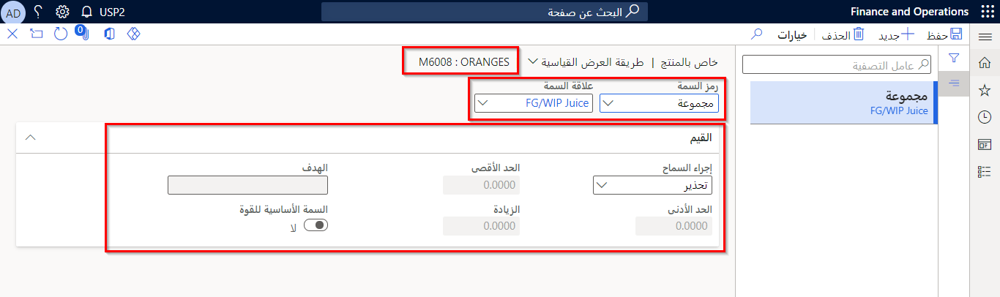

سمات الدُفعة هي خصائص المواد الخام والمنتجات المنتهية التي تشكل دفعات المخزون. يمكن أن تختلف سمات الدُفعة وفقاً لعوامل مثل الظروف البيئية أو جودة المواد الخام المستخدمة في إنتاج المجموعة، أو نتيجة المنتج المنتهي.

يمكن أن يختلف عدد وأنواع سمات الدُفعة المستخدمة بشكل كبير من صناعة واحدة إلى أخرى. فيما يلي مثالان على استخدام سمات الدُفعة:

-   في صناعة الجبن، يعتبر الحليب أحد المواد الخام المستخدمة في إنتاج الجبن. في هذا السيناريو، يمكن أن يحتوي الحليب على سمات دُفعات لتتبع محتوى الدهون في كل حاوية حليب فردية. يمكن أن يكون للجبن المنتج من الحليب سمات أخرى، مثل الرطوبة والعمر.

-   في صناعة الصلب، قد يكون للحديد المنتج سمات مثل نسب محتوى المغنيسيوم والفضة والزنك.

يمكن النظر في أمثلة أخرى لسمات الدُفعة في صناعة تصنيع الطلاء، حيث يتم فحص الطلاء وتسجيل سمات الدُفعة للون واللزوجة والنسبة المئوية لمستويات المركبات العضوية المتطايرة في كل دُفعة.

لإدارة سمات الدُفعة بشكل أفضل وتيسير صيانتها، يجب أولاً تحديد السمات الخاصة بالمنتج. بعد ذلك، يمكنك تجميع السمات في حالة وجود منتجات يتم فيها وصف دفعات المنتج بنفس السمات.

يتعين عليك إنشاء سمات الدُفعة لكل متطلب من العملاء لاستخدامها في تعقب البيانات الخاصة بالدُفعة والصنف.

يمكن أن تحتوي سمة الدُفعة على أنواع البيانات التالية:

-   **السلسلة** (إدخال العبارة أو النص الحر) - يعد هذا النوع مفيداً لتسجيل معلومات المورد أو وصف اللون.

-   **العدد الصحيح** - إدخال بيانات العدد الصحيح.

-   **الكسر** - يسمح بإدخال البيانات بالخانات العشرية.

-   **التعداد** - قائمة بالقيم المحددة لسمة الدُفعة. يجب إعداد قائمة القيم هذه على سمة الدُفعة أثناء إنشاء السمة.

-   **التاريخ** - هذا النوع مفيد لتسجيل تواريخ شهادات الموردين أو تواريخ الاختبار.

-   **إجراء السماح**

    -   **تحذير** - يتلقى المستخدم تحذيراً عندما لا تكون سمة الدُفعة المُدخلة ضمن إجراء السماح.

    -   **غير مسموح به** - لا يُسمح للمستخدم بإدخال قيمة سمة دُفعة خارج إجراء السماح. **غير مسموح به** ينطبق فقط على أنواع **عدد صحيح** و **كسر**؛ وكافة الأنواع الأخرى تكون افتراضية على **تحذير** فقط.

-   **الحد الأدنى** - تعيين الحد الأدنى للقيمة المسموح بها لنوع السمة **عدد صحيح** أو **كسر**.

-   **الحد الأقصى** - تعيين الحد الأقصى للقيمة المسموح بها لنوع السمة **عدد صحيح** أو **كسر**.

-   **الهدف** - يستخدم لتعيين القيمة المستهدفة لسمة الدُفعة.

-   **الزيادة** - تعيين الزيادة للقيمة المسموح بها لنوع السمة **عدد صحيح** أو **كسر**.

**إدارة معلومات المنتج> إعداد > الفئات والسمات > سمات الدُفعة**

عند تعيين سمة (سمات) الدُفعة لمنتج ما، يمكن ضبط قيمة سمة الدُفعة على سمات الدفعات الفردية. يكون هذا الأسلوب مفيداً عندما يكون لدى الشركة العديد من الأصناف المختلفة التي تستخدم نفس مجموعة سمات الدُفعة، ولكن كل صنف له قيمة مستهدفة مختلفة للحد الأدنى والأقصى لتلبية المتطلبات. بالتالي، يمكنك تجاوز القيم الافتراضية على مستوى المنتج.

**مثال**

قد يكون لدى الشركة العديد من المواد الكيميائية المختلفة حيث يتم قياس اللزوجة، ولكن لكل مادة كيميائية، يلزم نطاق لزوجة محدد. سيتم إعداد سمة الدُفعة للنطاقات الواقعية من اللزوجة، بينما سيكون لكل صنف سمة الدُفعة من اللزوجة المعينة للصنف بنطاق فريد للصنف.

وبالمثل، بالنسبة إلى متطلبات الصنف، يمكن تعيين سمة دُفعة لعميل معين لصنف ذي متطلبات خاصة بالعميل تم إعدادها لمجموعة الصنف/العميل. يمكن أن تكون المتطلبات على مستوى العميل أكثر صرامة من المتطلبات الداخلية بناءً على كيفية تخطيط العميل لاستخدام المواد. بالنسبة لمثال اللزوجة، قد يرغب أحد العملاء في المواد الأقل لزوجة للمساعدة على التدفق عبر مفاعل أنبوبي، بينما قد يرغب عميل آخر في مادة أكثر لزوجة لتطبيق مختلف.

يمكنك الوصول إلى صفحات المنتجات التي تحددها في صفحة **إدارة معلومات المنتج > إعداد > الفئات والسمات > سمات الدُفعة** . بعد تعيين سمات الدُفعة لمنتج ما، يمكنك إضافة قيم سمات الدُفعة إلى مجموعات المنتجات الفردية في الصفحة **خاص بالمنتج**.

يمكنك تحديد الزر **خاص بالمنتج** لتعيين النطاق المقبول للقيم الصالحة لكل صنف.

عندما تعمل باستخدام سمات الدُفعة، ضع في اعتبارك الحقائق التالية:

-   بالنسبة للأصناف التي تُستخدم فيها أوامر الجودة لتحديد قبول الدُفعة، يمكن استخدام نتائج أمر الجودة لتحديث سمات الدُفعة.

-   يمكن أن يشير إعداد أمر الجودة إلى ما إذا كان يجب تحديث سمات الدُفعة.

-   يمكن أيضاً وضع علامة على نتائج أمر الجودة الفردية لتحديث سمات الدُفعة بشكل فردي.

-   يمكن استخدام الوظيفة لإعادة اختبار الدفعات أو اختبار إعادة العمل.

-   تكون سمات الدُفعة مفيدة عندما يجب تعيين قائمة مجموعة من السمات لأصناف متعددة وجميعها لها نفس متطلبات نطاق سمة الدُفعة.

**إدارة معلومات المنتج > إعداد > الفئات والسمات > مجموعات سمات الدفعات** تسمح بتعيين سمات دُفعات متعددة إلى صنف دون الحاجة إلى سرد كل سمة.

مثال على استخدام سمات الدُفعة هو شركة كيميائية، حيث يتم قياس جميع المذيبات المشتراة لمتطلبات المركبات العضوية المتطايرة والنقاء.

يمكن أن يمتلك العميل نطاقاً من القيم الصالحة لسمة الدُفعة المعينة التي يمكن تعيينها لمجموعة من المنتجات. مع ذلك، يمكن تجاوز قيم السمات على مستوى المنتج. عند إتمام حجز الدفعات للوفاء بأمر المبيعات لهذا العميل، يجب عليك حجز الدُفعة الصحيحة التي تستند إلى متطلبات العميل لسمات الدُفعة. تقوم Supply Chain Management بإنجاز هذه المهمة من خلال السماح لك بالبحث في دفعات للحجوزات بناءً على متطلبات سمة الدُفعة المحددة للعميل.

### السيناريو

في إنتاج المواد اللاصقة من الإيبوكسي، يتم تصنيع الدُفعات لتلبية المتطلبات القياسية الداخلية حول الثقل النوعي، واللزوجة، وقوة المواد المُعالجة. تم تعيين هذا المعيار الداخلي للسماح بمبيعات المنتج بشكل عام. يتم طلب هذه المواد نفسها من قبل العملاء الصناعيين الذين لديهم معايير قائمة على العملاء والصناعة يجب أن يفي بها المركب، مثل متطلبات الطيران والسيارات ومتطلبات البناء العامة. هذه المتطلبات أكثر صرامة من المتطلبات الداخلية القياسية ويجب استيفاؤها لبيعها لهؤلاء العملاء. بدلاً من إنشاء أرقام أصناف فريدة لهذه المواصفات المختلفة، يتم تصنيع جميع الدفعات تحت صنف واحد واختبارها من حيث الثقل النوعي SG واللزوجة وقوة مواد المعالجة. بعد ذلك، عند الحصول على أمر من أحد هؤلاء العملاء الصناعيين، تتم مراجعة المخزون مقابل متطلبات العميل باستخدام بحث سمة الدُفعة لتحديد ما إذا كانت الدُفعة موجودة في المخزون تفي بالمتطلبات. إذا كان الأمر كذلك، يتم حجز هذه الدُفعة وشحنها إلى العميل.

شاهد الفيديو التالي للاطلاع على نظرة عامة حول سمات الدُفعة وعرض توضيحي لكيفية إنشائها.

 > [!VIDEO https://www.microsoft.com/videoplayer/embed/RE3TDUx ]

