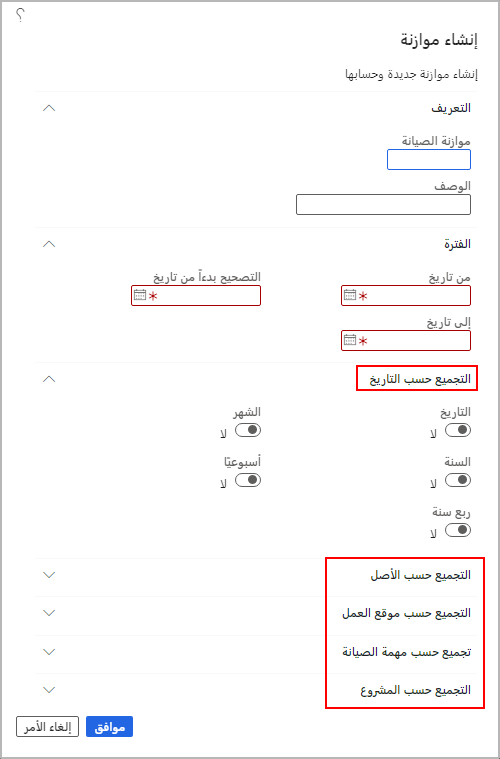

الآن وبعد أن فهمت الأساسيات، يمكنك البدء بإنشاء موازنة صيانة.

1.  انتقل إلى **إدارة الأصول > الاستعلامات > موازنة الصيانة > الموازنة**، وحدد **إنشاء موازنة**. يظهر مربع الحوار **إنشاء موازنة**.
2.  في حقل **موازنة الصيانة**، أدخِل معرفاً فريداً لهذه الموازنة. ويمكن تحديد هذا المعرف مسبقاً بواسطة شركتك أو مصطلح مختصر، مثل "MBUD" لموازنة الصيانة، متبوعاً بأرقام لوصف الفترة. 
3.  في حقل **الوصف**، أدخِل وصفاً يساعد في التعرف على هذه الموازنة.
4.  في علامة التبويب السريعة **الفترة**، أدخِل تاريخ بدء فترة الموازنة في حقل **تاريخ البدء**، وأدخِل تاريخ انتهاء فترة الموازنة في حقل **تاريخ الانتهاء** .
5.  يُعد الحقل **تاريخ بدء التكاليف التصحيحية** هو المكان الذي يمكنك فيه إدخال تاريخ البدء عندما تريد أن يبحث النظام عن أي تكاليف تصحيحية مقترنة بهذه الموازنة من فترة موازنة سابقة.
6.  فيما يلي سلسلة من علامات التبويب السريع **التجميع حسب...** . في هذا القسم، يمكنك الاستمرار في إدخال مزيد من التفاصيل المرتبطة بمعلومات الموازنة. يمكن أن تستند التفاصيل إلى التاريخ أو الأصل أو موقع العمل أو مهمة الصيانة أو المشروع. 
7.  عند الانتهاء من إضافة جميع المعلومات المرتبطة بهذه الموازنة، حدد **موافق**.

    **إدارة الأصول > الاستعلامات > موازنة الصيانة > الموازنة**

    

8.  سوف تظهر صفحة **موازنات الصيانة**. من هذه الصفحة، يمكنك أداء مهام متعددة: 

    -    حدد **بنود الموازنة** لعرض جميع بنود الموازنة التي تم إنشاؤها لتلك الفترة المحددة. 

    - قم بالموافقة على الموازنة عن طريق تحديدها من قائمة الموازنات ثم حدد **موافقة**. عندما يظهر مربع الحوار **الموافقة على الموازنة**، حدد **موافق**. بعد اكتمال الموافقة، سيظهر اسمك تلقائياً في حقل **تمت الموافقة بواسطة** في صفحة **موازنات الصيانة**.
    
    > [!NOTE]
    > عند الموافقة على موازنة صيانة، يتم تأمينها. لا يمكنك إجراء أي تسويات عليها أو إجراء إعادة حساب عليها. لإجراء أي تغييرات على الموازنة التي تمت الموافقة عليها، عليك إزالة الموافقة. لإزالة الموافقة، عليك الرجوع إلى موازنة الصيانة، حدد **موافقة** ثم حدد **موافق**.

    - يمكنك أيضاً نسخ موازنة الصيانة استناداً إلى ميزانية موجودة. حدد الموازنة التي تريد نسخها ثم حدد "نسخ". ضع في الاعتبار السيناريو الذي تستخدم فيه موازنة الصيانة نفسها لكل شهر في السنة. في هذه الحالة، يمكنك ببساطة تحديد موازنة الشهر السابق وتحديد "نسخ" لإنشاء إصدار الشهر التالي.

    > [!NOTE]
    > تعتمد موازنات الصيانة على بنود جدول الصيانة وليس التكاليف الفعلية. إذا كنت ترغب في حساب التكاليف الفعلية للفترة نفسها، ستحتاج إلى الانتقال إلى صفحة **التحكم في تكلفة الأصول**.

شاهد الفيديو التالي لإنشاء موازنة صيانة.
 
> [!VIDEO https://www.microsoft.com/videoplayer/embed/RE4oP4r]
