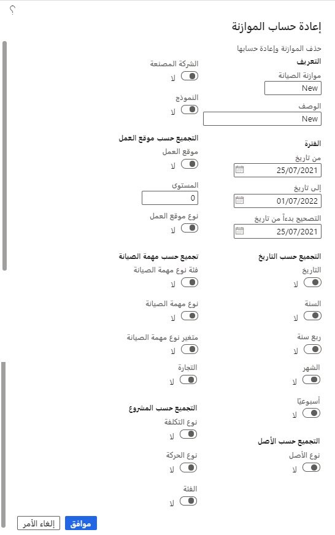

تراجع هذه الوحدة كيفية إعادة حساب بنود موازنة الصيانة وتعديلها، بما في ذلك كيفية تحديث بنود الموازنة بالتكاليف الفعلية عند مرور فترة الموازنة وترحيل التكاليف في "إدارة الأصول". قد ترغب في استخدام هذه الوظيفة إذا قمت مسبقاً بإنشاء موازنة بالتكلفة المتوقعة لأسطول جديد من الشاحنات لشركتك، ولكن الآن لديك التكاليف الفعلية التي تحتاج إلى تحديثها في الموازنة. 

## إعادة حساب موازنة الصيانة
قبل إعادة حساب موازنة الصيانة، من المهم ملاحظة أنه لا يمكنك إعادة حساب موازنة الصيانة عند الموافقة على الموازنة. إذا كانت إعادة الحساب مطلوبة، فيتعين عليك إزالة الموافقة على الموازنة. 

1.  في صفحة **بنود موازنة الصيانة**، حدد **إعادة حساب**. يظهر مربع الحوار **إعادة حساب الموازنة**، حيث يمكنك إجراء التعديلات اللازمة. على سبيل المثال، إذا كنت ترغب في تغيير **تاريخ بدء التصحيح** إلى إطار زمني سابق، أو إذا كنت ترغب في تجميع المعلومات حسب أنواع الأصول أو مواقع العمل.
2.  عند الانتهاء من إجراء عمليات التحرير، حدد **موافق**.

    **إدارة الأصول > الاستعلامات > موازنة الصيانة > الموازنة**

    
 
3.  يتم تشغيل إعادة الحساب، مع حذف بنود الموازنة السابقة واستبدالها ببنود موازنة جديدة استناداً إلى القيم التي قمت بتعيينها.
    
    **إدارة الأصول > الاستعلامات > موازنة الصيانة > الموازنة**

    
 
    
 

## تعديل بنود الموازنة
في بعض الأحيان، ستحتاج إلى إجراء تعديل على بند موازنة محدد. على سبيل المثال، اكتشفت مؤخراً أنه تمت إضافة تكلفة إضافية أو أنها تضمنت أصلين بدلاً من واحد. بدلاً من تشغيل عملية إعادة الحساب، يمكنك اتباع الخطوات التالية لإجراء التعديل:

1.  في صفحة **بنود موازنة الصيانة**، حدد بنود الموازنة التي ترغب في تحديثها. من القائمة العلوية، حدد **تعديل**. يظهر مربع حوار **تسوية بنود الموازنة المحددة**.
2.  لإضافة التكلفة الإضافية، حدد خانة الاختيار **إضافة تكلفة** وأدخل المبلغ في الحقل **إضافة قيمة**.
3.  لحساب الأصل الإضافي، حدد خانة الاختيار **مضاعفة تكلفة** وأدخل العامل في الحقل **مضاعفة قيمة**.

    على سبيل المثال، إذا أدخلت **2** في الحقل **مضاعفة قيمة**، فإنك تضاعف تكلفة الموازنة. إذا أدخلت **1.2** في الحقل، فسيؤدي ذلك إلى زيادة تكلفة الموازنة بنسبة 20 في المئة. إذا لزم الأمر، يمكنك تقليل إدخال التكلفة بواسطة رقم "0.x" لتحديد التقليل. على سبيل المثال، إذا أدخلت **0.7**، فسيؤدي ذلك إلى تقليل تكلفة الموازنة بنسبة 30%.

4.  وعند الانتهاء، حدد **موافق**، سيقوم النظام بتحديث بند الموازنة وفقاً لذلك. 

## تحديث التكاليف الفعلية
أحياناً، يكون من الضروري إجراء تحديثات للتكاليف الفعلية. يحدث هذا الموقف عادة بعد مرور تواريخ بنود الموازنة وترحيل التكاليف الفعلية المرتبطة في إدارة الأصول. يشرح هذا الموضوع كيف يمكنك إجراء هذه التحديثات.

في صفحة **بنود موازنة الصيانة**، حدد تحديث التكلفة. عند ظهور مربع الحوار **حساب التكلفة الفعلية**، حدد **موافق**.

ونظراً لأنه تم ترحيل التكاليف الفعلية بالفعل، فسيتم تحديث حقول **التكلفة الفعلية** الموجودة في بنود الموازنة تلقائياً. قد تلاحظ أنه تم إنشاء بنود موازنة جديدة لأنواع أصول جديدة، إذا تم استخدامها في أصول تم إنشاء أوامر العمل من أجلها وترحيل التكاليف ذات الصلة بعد إنشاء الموازنة. ستعرض بنود الموازنة الجديدة هذه التكاليف الفعلية فقط لأن الموازنة الأصلية لم تُحسب لها.

> [!NOTE]
> للاطلاع على نظرة عامة على التكاليف الفعلية مقسمة إلى تكاليف وقائية وتصحيحية واستثمارية، انتقل إلى **إدارة الأصول > الاستعلامات > الأصول > التحكم في تكاليف الأصول**، حيث يمكنك تشغيل حساب لنفس الفترة.

## إضافة بنود الموازنة يدوياً
استناداً إلى القسم السابق، ضع في اعتبارك سيناريو تعلمت فيه أنه تم إنشاء أنواع أصول جديدة بعد إجراء موازنة الصيانة. بدلاً من الانتظار حتى انقضاء تاريخ الموازنة، فأنت تريد تضمين تكاليف الأصول الجديدة في موازنة الصيانة الحالية الخاصة بك. 

لإدخال التكاليف الجديدة، في صفحة **بنود موازنة الصيانة**، حدد **جديد** ثم أدخل تكلفه الموازنة الجديدة.

