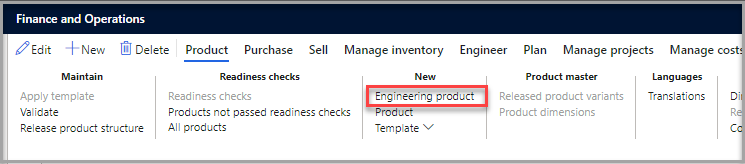
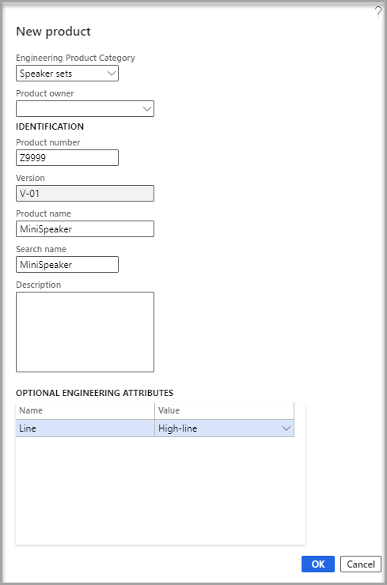

المنتج الهندسي هو منتج يتم إصداره والتحكم فيه من خلال إدارة التغييرات الهندسية. يمكنك التحكم في وقت إنشاء منتج جديد وكيفية إصداره للكيانات القانونية في Supply Chain Management وكيفية استخدام المنتج في الحركات.

لإنشاء منتجات هندسية، اتبع الخطوات التالية:

1.  تأكد من أنك في الكيان القانوني لمؤسستك الهندسية.

1.  افتح صفحة  **المنتجات الصادرة** باتباع إحدى هذه الخطوات:

    -   انتقل إلى  **إدارة معلومات المنتجات > المنتجات > المنتجات الصادرة**.

    -   انتقل إلى  **إدارة التغيير الهندسي > عام > المنتجات الصادرة**.

1.  في جزء الإجراءات، في علامة التبويب  **المنتج** ، في المجموعة  **جديد** ، حدد  **منتج هندسي**.

    > [!div class="mx-imgBorder"]
    > 

1.  في مربع الحوار  **منتج جديد** ، عيِّن القيم الآتية:

    - **فئة منتج الهندسة**

    - **مالك المنتج (اختياري)** - أضف مالك المنتج إذا كنت تستخدم ملكية المنتج. إذا لم تقم بإضافة مالك المنتج أثناء الإعداد، فلن تتمكن من إضافة مالك المنتج بعد إصدار المنتج.

    - **رقم المنتج** - أضف رقم المنتج.

    - **اسم المنتج** - أضف اسم المنتج.

    > [!NOTE]
    > يمكنك تعيين حقل  **الإصدار** تلقائياً باستخدام قاعدة رقم إصدار المنتج التي قمت بإعدادها مسبقاً، ويتم أيضاً تعيين **السمات** من **فئة المنتج الهندسي** إلى **بند** افتراضياً.

1.  حدد  **موافق** لإنشاء المنتج وإغلاق مربع الحوار.

    > [!div class="mx-imgBorder"]
    > 

يتم فتح صفحة **التفاصيل** الخاصة بالمنتج الجديد. تتم تعبئة القيم مثل  **مجموعة أبعاد التخزين**، و  **مجموعة أبعاد التعقب**، و  **مجموعة النماذج** استناداً إلى **فئة المنتج الهندسي** الذي حددته والسياسات المقابلة.
