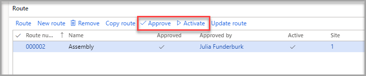
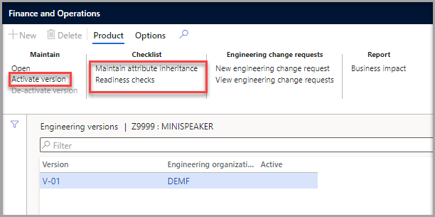

يصف المسار ترتيب العملية المطلوب لإنتاج منتج. للحصول على مزيد من المعلومات، راجع [المسارات والعمليات](/dynamics365/supply-chain/production-control/routes-operations/?azure-portal=true).

لإنشاء المسار على قائمة مكونات الصنف من الوحدة السابقة، اتبع الخطوات التالية:

1.  في صفحة **الإصدار الهندسي**، في علامة التبويب السريعة **المسار**، حدد **مسار جديد**.

1.  في صفحة **إنشاء مسار**، أضف **وصفاً** للمسار.

1.  إذا كنت تنسخ هذا المسار من مسار آخر، فيمكنك تحديد زر التبديل **نسخ**، وستكون قادراً على تحديد مسار موجود لتوفير الوقت.

1.  حدد **الموقع**.

1.  حدد **موافق**.

1.  في صفحة **الإصدار الهندسي** ، في علامة التبويب السريعة **المسار** ، حدد **موافقة**.

1.  في مربع الحوار الذي يفتح، حدد  **موافق**.

1.  في صفحة **الإصدار الهندسي** ، في علامة التبويب السريعة **المسار**، حدد **تنشيط**.

1.  لاحظ أنه تم تحديد مربعي الاختيار **نشط** و **‏‏تمت الموافقة عليه** للمسار.

    > [!div class="mx-imgBorder"]
    > 

> [!NOTE]
> عند إنشاء المنتج الهندسي باستخدام قوائم مكونات الأصناف والمسارات القابلة للتطبيق، ستحتاج إلى إجراء **فحوصات الجاهزية** (راجع وحدة **استخدام فحوصات الجاهزية** في هذه الوحدة) التي ربما تكون قد قمت بتكوينها مسبقاً ثم حدد **تنشيط** لتنشيط إصدار المنتج. يتم تنفيذ هذه الخطوات في صفحة **الإصدار الهندسي** التي تظهر في لقطة الشاشة التالية.

> [!div class="mx-imgBorder"]
> 

شاهد الفيديو التالي للاطلاع على عرض توضيحي لكيفية إنشاء منتج هندسي.

> [!VIDEO https://www.microsoft.com/videoplayer/embed/RWCZ2j]

