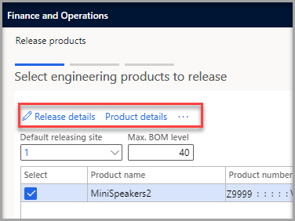
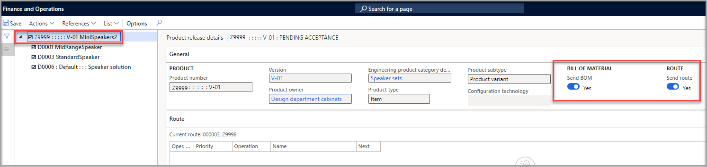
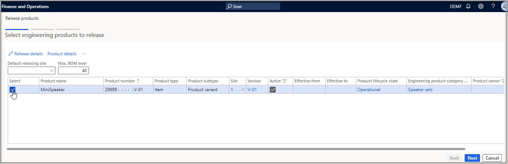

والآن بعد قيام قسم الهندسة بتصميم المنتج، تكون جاهزاً لإصدار المنتج إلى الشركات التشغيلية التي تخطط لاستخدامه. عند إصدار المنتج الهندسي، تقوم أيضاً بإصدار قائمة BOM والأصناف التي تكون قائمة BOM والمسار.

إذا كنت تستخدم خيار **مالك المنتج**، فيمكن لمالك ذلك المنتج فقط إصدار المنتج. ومع ذلك، عندما يكون منتج جزءاً من قائمة BOM، لا يفحص النظام جميع المنتجات الموجودة في قائمة BOM، الأصل فقط. إذا كان لسطر قائمة BOM مالك منتج مختلف، فإنه يمكن إصدارها بواسطة مالك الصنف الرئيسي.

يعرف مالكو المنتج كيفية استخدام المنتجات وتغييرها. عندما تستخدم عمليات سير عمل المنتج الهندسي لإصدار المنتجات أو طلبات تغيير المنتج، نوصي باستخدام خيار **مالك المنتج** في عملية الاعتماد.

لإصدار المنتج، اتبع الخطوات التالية:

1.  انتقل إلى  **إدارة معلومات المنتجات > المنتجات > المنتجات الصادرة**.

1.  في جزء الإجراءات، ضمن علامة التبويب  **المنتج** ، في مجموعة  **الصيانة** ، حدد  **بنية إصدار المنتج**  لفتح معالج  **إصدار المنتجات** .

1.  في صفحة **تحديد المنتجات الهندسية للإصدار** ، حدد خانة الاختيار **تحديد** .
1.  حدد **تفاصيل الإصدار**.

1.  تظهر صفحة **تفاصيل إصدار المنتج** ، حيث يمكنك مراجعة تفاصيل المنتج الذي تم إصداره وبنيته. يمكنك تحديد أي عنصر فرعي في الجزء الأيمن لمراجعة التفاصيل الخاصة به. إذا كان لأي صنف فرعي قائمة BOM، فيمكنك أيضاً تحديد إصدار قائمة BOM لهذا الفرع.

1.  أغلق الصفحة للعودة إلى معالج معالج **‏‫إصدار المنتجات**.

    > [!div class="mx-imgBorder"]
    > 
    
    > [!div class="mx-imgBorder"]
    > 

1.  حدد **التالي**.

    > [!div class="mx-imgBorder"]
    > 

1.  في الصفحة **تحديد الشركات**، حدد **موقع الشركة** و **الاستلام**.

1.  حدد **التالي**.

1.  حدد **إنهاء**.
