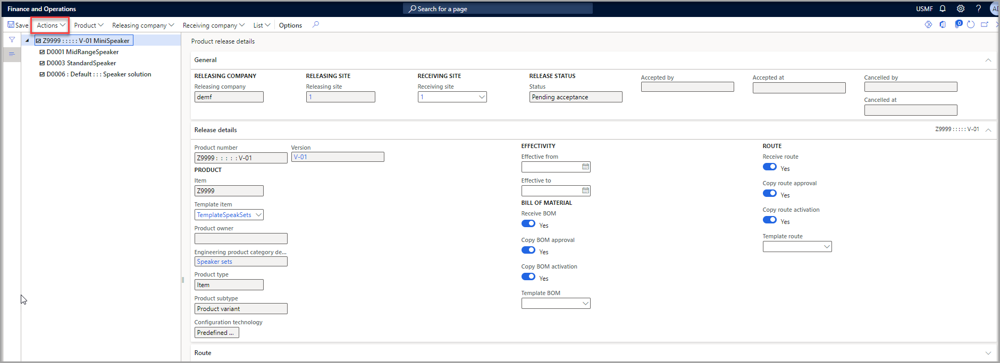

عندما يصدر قسم الهندسة معلومات للشركات المحلية حول مكان استخدام المنتج، فسيكون المنتج متاحاً للتسليم في الشركة المحلية. في **معلمات إدارة التغييرات الهندسية**، يتم تعيين **قبول المنتج** إلى **يدوي** بشكل افتراضي. وبالتالي، يجب على الشركة التشغيلية المحلية مراجعة المنتج الصادر وقبوله.

لمراجعة المنتج وتحريره لكيان قانوني آخر، اتبع الخطوات التالية:

1.  افتح الكيان القانوني التشغيلي.

1.  انتقل إلى **إدارة التغيير الهندسي > عام > إصدارات المنتج > إصدارات المنتجات المفتوحة**.

1.  تعرض الصفحة **إصدارات المنتجات المفتوحة** أي منتجات هندسية لم يتم إصدارها وستكون حالتها **الموافقة معلقة**.

1.  حدد القيمة في العمود  **رقم المنتج**  لفتح صفحة  **تفاصيل إصدار المنتج** . لاحظ التفاصيل التالية:

    - تعرض علامة التبويب السريعة **عام** معلومات حول إصدار المنتج، مثل الشركة المُصدِرة والموقع المُصدر وموقع الاستلام.
    
    - تعرض علامة التبويب السريعة **تفاصيل الإصدار** معلومات حول المنتج والإصدار الذي تم إصداره. في علامة التبويب هذه، يمكنك تعديل إعدادات مثل تواريخ السريان.
    
    - تعرض علامة التبويب السريعة **المسار** مسار المنتج.

1.  عندما تنتهي من مراجعة المعلومات، فأنت على استعداد لقبول المنتج وإصداره لشركتك. في جزء الاجراء، حدد  **إجراءات > قبول**.

    > [!div class="mx-imgBorder"]
    > 

يتم إصدار المنتج في الشركة المحددة. انتقل إلى **إدارة معلومات المنتجات > المنتجات > المنتجات الصادرة** لقراءته.

شاهد الفيديو التالي للحصول على عرض توضيحي حول كيفية إصدار المنتج الهندسي لكيان قانوني آخر وقبول ذلك المنتج.

> [!VIDEO https://www.microsoft.com/videoplayer/embed/RWD1qF]
