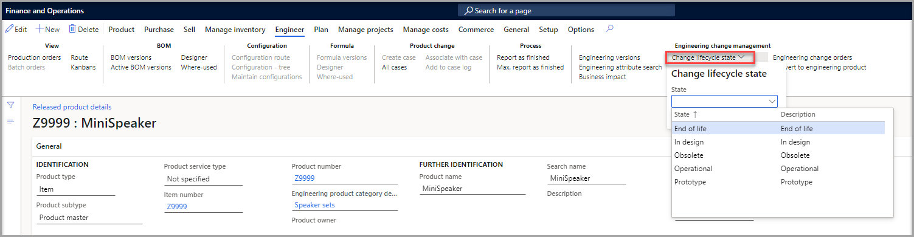

أثناء تطور المنتج الهندسي عبر دورات حياته، فإنه يمكنك التحكم في الحركات المسموح بها بكل حالة من حالات دورة حياته.

لمزيد من المعلومات، راجع [إعداد المنتجات ذات الإصدارات في الوحدة النمطية Dynamics 365 Supply Chain Management](/learn/modules/set-up-versioned-products-engineering-change-management/?azure-portal=true).

بالنسبة للمنتج الهندسي، ترتبط التغييرات في حالة دورة الحياة بالإصدارات الهندسية للمنتج. لذلك، يمكن أيضاً ربط حالة دورة حياة المنتج بإصداراته الهندسية. استخدم حالة دورة الحياة للتحكم في الحركات الخاصة بالإصدار الهندسي عندما تكون حالة دورة حياة المنتج متصلة به.

لتحديث حالة دورة الحياة يدوياً، اتبع الخطوات التالية:

1.  انتقل إلى **إدارة التغيير الهندسي > عام > المنتجات الصادرة** أو **إدارة معلومات المنتجات > المنتجات > المنتجات الصادرة**
2.  حدد المنتج. 
1.  حدد علامة التبويب **المهندس** في جزء الإجراء.
2.  في مجموعة  **إدارة التغيير الهندسي** ، حدد الخيار **تغيير حالة دورة الحياة** ثم حدد الحالة الصحيحة.

    > [!div class="mx-imgBorder"]
    > 
