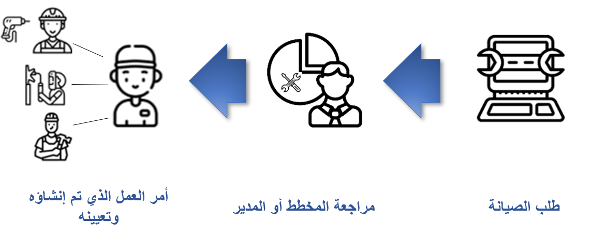

تعد طلبات الصيانة في إدارة الأصول لـ Dynamics 365 Supply Chain Management أساسية في الحفاظ على تشغيل أصولك القيّمة بكفاءة، مع إدارة وقت التوقف عن العمل وحماية إنتاجيتك الإجمالية. 

تحدد هذه الوحدة النمطية التفاصيل التالية: 

- طلبات الصيانة
- كيفية إنشاء طلبات الصيانة
- إنشاء الأصول المقترضة واستخدامها 
- تعقب الأصول الواردة والصادرة 
- استخدام مساحة عمل إدارة طلب الصيانة
- إعداد تقارير طلبات الصيانة

 

تُستخدم طلبات الصيانة لإعلام مدير التخطيط أو المخطط بأن أحد الأصول يحتاج إلى صيانة أو إصلاح. سيراجع المدير أو المخطط طلب الصيانة ويحدد، بناءً على المعلومات التي تم توفيرها، ما إذا كان طلب الصيانة قد تمت الموافقة عليه وسيحتاج إلى إنشاء أمر عمل أم أنه يتطلب معلومات إضافية أم أنه غير ضروري وبالتالي فإنه مُقفل. 

على سبيل المثال، عند الموافقة على طلب الصيانة، يتم إنشاء أمر عمل ويمكن استخدامه لأداء الوظائف التالية:

- **طلبات الصيانة** - طلبات صيانة أو إصلاح أحد الأصول.
- **الملاحظات** – الملاحظات أو المراسلات الخاصة بأحد الأصول.
- **التصحيحات** – الإصلاحات التي تتم على أحد الأصول.
- **التحسينات** – التحديثات أو عمليات التحسين التي يتم إجراؤها على الأصول.
- **الاستثمارات** – الأصول المشتراة حديثاً المراد تثبيتها.
- **الإصلاح في المستودع** - يُستخدم للأصول الموجودة في موقع آخر والتي يتم استلامها وإصلاحها ثم إعادتها إلى الموقع عند اكتمالها.

