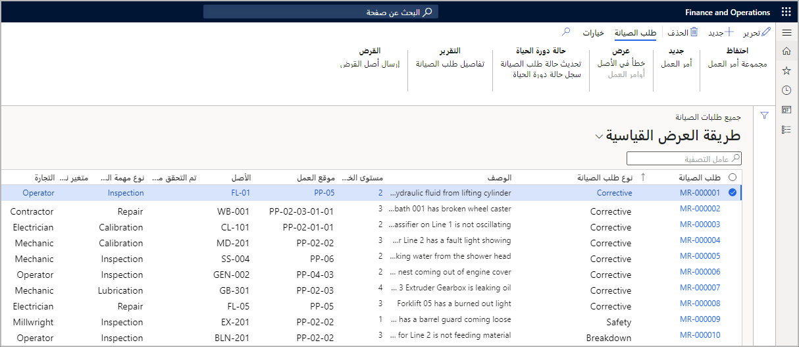

لعرض طلبات الصيانة في الصفحة "كافة طلبات الصيانة"، اتبع الخطوات التالية:

1.  لعرض طلبات الصيانة، تتوفر لديك بضعة خيارات خاصة بالمسارات التي يمكنك استخدامها:
    - **إدارة الأصول > عام > طلبات الصيانة > جميع طلبات الصيانة** 
    - **إدارة الأصول > عام > طلبات الصيانة > طلبات الصيانة النشطة**. 
    - **إدارة الأصول > عام > طلبات الصيانة > طلبات الصيانة لموقع العمل الخاص بي**.
    
    توفر الصفحة "طلبات الصيانة لموقع العمل الخاص بي قائمة بمواقع العمل التي ترتبط بها أو الأصول التي تم تثبيتها في موقع ترتبط به كعامل. 
2.  لعرض تفاصيل سجل طلب الصيانة، حدد الارتباط ضمن العمود **طلب الصيانة**. 

    **إدارة الأصول > عام > طلبات الصيانة > جميع طلبات الصيانة**

    
 
    تلخص القائمة التالية الحقول والأزرار في صفحة **جميع طلبات الصيانة**:

    - **تحرير** - يقوم بتحرير طلب الصيانة المحدد. 
    - **جديد** – يقوم بإنشاء طلب صيانة جديد.
    - **حذف** - يحذف طلب الصيانة المحدد.
    - **وعاء أوامر العمل** - يربط طلب الصيانة المحدد بوعاء أوامر عمل. 
    - **أمر العمل** - يقوم بإنشاء أمر عمل يعتمد على طلب الصيانة المحدد.
    - **خطأ الأصل** – يقوم بإنشاء تسجيل خطأ في طلب الصيانة المحدد.
    - **أوامر العمل** – يعرض قائمة بجميع أوامر العمل المرتبطة بطلب الصيانة المحدد.
    - **تحديث حالة طلب الصيانة** – يقوم بتحديث حالة طلب الصيانة.
    - **سجل حالة دورة الحياة** – يعرض سجلاً يوضح حالات دورة الحياة الخاصة بطلب الصيانة المحدد.
    - **تفاصيل طلب الصيانة** – يطبع تقريراً يوضح التفاصيل الخاصة بطلب الصيانة المحدد.
    - **إرسال أصل القرض** – يحدد أصل القرض الذي يجب أن يكون بديلاً مؤقتاً للأصل المؤقت في طلب الصيانة المحدد.

