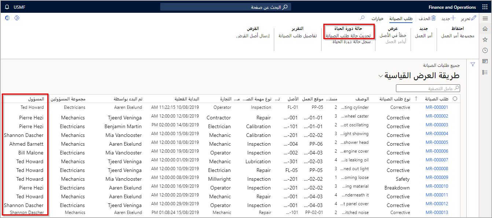

تحدد حالات دورة حياة طلب الصيانة المراحل المختلفة التي يمكن أن يمر بها طلب الصيانة. يتم تحديد حالات دورة الحياة هذه وإنشائها لتناسب احتياجات مؤسستك وتدفق العمليات بشكل أفضل. 

تتضمن أمثلة حالات دورة حياة طلب الصيانة ما يلي:

- **جديد** - يتم تلقي طلب صيانة جديد، ولكن لم تتم مراجعته بعد.
- **مراجعة** – طلب الصيانة قيد المراجعة حالياً من قِبل المدير أو المخطِّط.
- **قيد التقدم** – تم اعتماد طلب الصيانة، ويحتوي على أمر عمل نشط مقترن.
- **منتهٍ** – تم إكمال العمل المرتبط بطلب الصيانة وأمر العمل المرتبط به.
- **مرفوض** – رفض المدير أو المخطط طلب الصيانة.
- **وارد** - تُستخدم هذه الحالة عندما يتم نقل الأصول إلى موقع آخر للإصلاحات، وتعلن عن إرجاع الأصول واستلامها مرة أخرى من جانب المؤسسة وموقع العمل المعين لها.
- **صادر** - تُستخدم هذه الحالة عند تحويل الأصول إلى موقع آخر لعمليات الإصلاح. تقوم هذه الحالة بتعقب المكان الذي سينتقل إليه الأصل.

تعرض الصورة التالية مثالاً على كيفية ظهور حالات دورة الحياة في إدارة الأصول. يمكنك تحديث حالات طلب دورة حياة الصيانة لتعقب حالة طلب الصيانة، وتعقب مكان الأصول أثناء الصيانة عندما يتم نقلها من موقع إلى آخر. 

حدد **إدارة الأصول > عام > طلبات الصيانة > كافة طلبات الصيانة > حالة دورة الحياة**.

