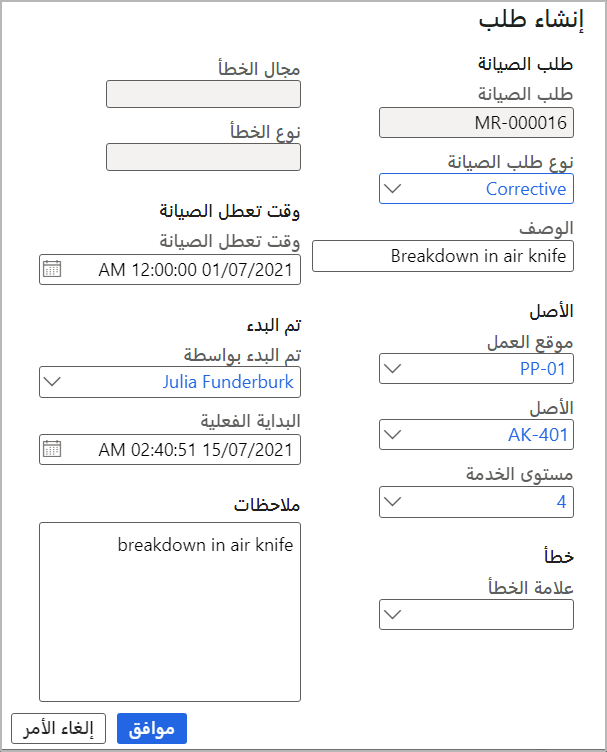

عندما يقرر عامل أن الصيانة مطلوبة، فإنه يقدم طلباً إلى المدير أو المخطط المسؤول عن مراجعة الطلبات وتحديد ما إذا كان أمر العمل ضرورياً وأنه يلزم تعيين الإصلاحات. على سبيل المثال، إذا تعطل جهاز في خط المستودع، يمكن للعامل إرسال طلب صيانة لخدمة الجهاز. 

لإنشاء طلب الصيانة، اتبع الخطوات التالية:

1.  انتقل إلى **إدارة الأصول > شائع > طلبات الصيانة > ‏‫جميع طلبات الصيانة** أو‬ **‏طلبات الصيانة النشطة**.
2.  حدد **جديد**.
3.  في مربع الحوار **إنشاء طلب**، في الحقل **نوع طلب الصيانة**، حدد نوع طلب الصيانة، على سبيل المثال، **تصحيحية**.
4.  في حقل **الوصف**، أدخل اسماً أو عنواناً يصف طلب الصيانة بإيجاز، على سبيل المثال، **عطل في سكين الهواء**.
5.  في الحقلين **موقع العمل** و **الأصل**، حدد موقع العمل أو الأصل، أو مزيجاً من موقع العمل والأصل، على النحو الذي تطلبه.‬ 
    > [!NOTE]
    > يمكنك إنشاء طلب صيانة بدون تحديد أصل، ويمكن إضافة الأصل إلى طلب الصيانة لاحقاً. إذا كان عامل الصيانة الذي قام بتسجيل الدخول مرتبطاً بمورد مرتبط بأصل، فسيتم تعيين حقل **الأصل** تلقائياً.
    
    إذا تم إرفاق طلب صيانة بالفعل بالأصل المحدد، فسيظهر شريط رسائل أعلى مربع الحوار **إنشاء طلب** لإعلامك بمعرف طلب الصيانة الحالي. ويخطرك شريط الرسائل أيضاً إذا كان الأصل مشمولاً باتفاقية ضمان.
6.  في الحقل **مستوى الخدمة**، فحدد مستوى الخدمة الذي يشير إلى مدى إلحاح الطلب.
7.  إذا حددت أحد الأصول في الخطوة **5**، يمكنك استخدام الحقول **عرض الخطأ** و **منطقة الخطأ** و **نوع الخطأ** لإنشاء تسجيل خاطئ.
8.  إذا تسبب طلب الصيانة في تعطل الصيانة، فأدخل تاريخ البدء ووقت التعطل. يتم تعيين الحقل **تم البدء بواسطة** تلقائياً إلى اسمك.
9.  يتم تعيين الحقل **البدء الفعلي** تلقائياً إلى التاريخ والوقت الحاليين. ومع ذلك، يمكنك تغيير القيمة كما هو مطلوب.
10. في الحقل **ملاحظات**، أدخل أي ملاحظات إضافية مطلوبة.
11. حدد **موافق**.

    **إدارة الأصول > عام > طلبات الصيانة > جميع طلبات الصيانة**
 
    

## تحديث طلب صيانة
أحياناً، يتم إنشاء طلب صيانة ولكن يحتاج إلى إضافة تغييرات إليه في وقت لاحق. يمكنك إجراء تغييرات في وحدة إدارة الأصول، مثل تحديث المجموعة المسؤولة أو الموقع أو نوع مهمة الصيانة. يتعين إكمال أي تغييرات يتم إجراؤها على طلب الصيانة *قبل* إنشاء أمر عمل لطلب الصيانة. 

1.  في صفحة **جميع طلبات الصيانة**، حدد طلب الصيانة المراد تحديثه. 
2.  حدد **تحرير** في جزء الإجراءات.
3.  في علامة التبويب السريعة **عام**، حدد **المجموعة** **المسؤولة** (عامل) و **عامل الصيانة المسؤول**. 
4.  قم بتحديث الحقلين **خط العرض** و **خط الطول** لتضمين الموقع الجغرافي للأصل الذي يحتاج إلى صيانة، عند الرغبة.
5.  ضمن علامة التبويب السريعة **الأصل**، حدد الأصل وتحقق من صحته. 
    > [!NOTE]
    > إذا كان سيتم تحديد أصل مختلف لاحقاً، فقم بالاحتفاظ بتعيين خيار الأصل الذي تم التحقق منه إلى **لا**.
6.  حدد **نوع مهمة الصيانة**، وإذا كانت هذه المعلومات المرتبطة، **متغير نوع مهمة صيانة مرتبطاً** و **التجارة**.
    > [!NOTE]
    > يمكن إضافة مزيد من الأخطاء إلى طلب الصيانة بعد إنشاء الطلب. بشكل مبدئي، يمكنك فقط إضافة خطأ واحد أثناء الإعداد الأولي لطلب الصيانة. 
7.  حدد **حفظ**.

