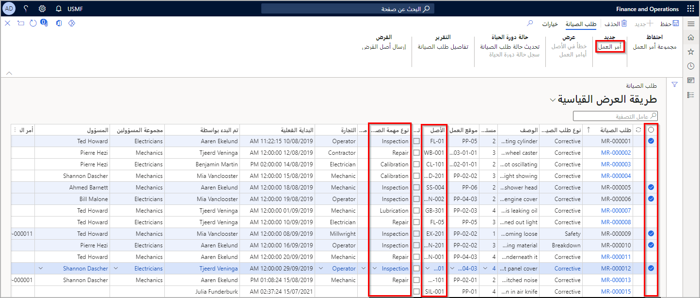
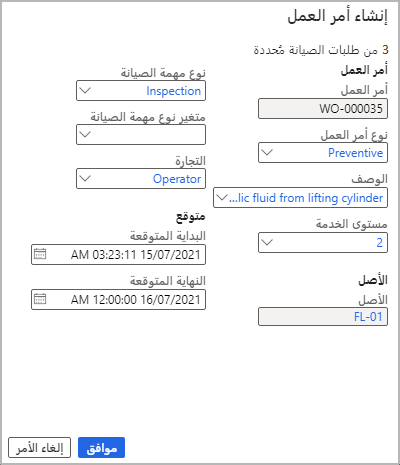
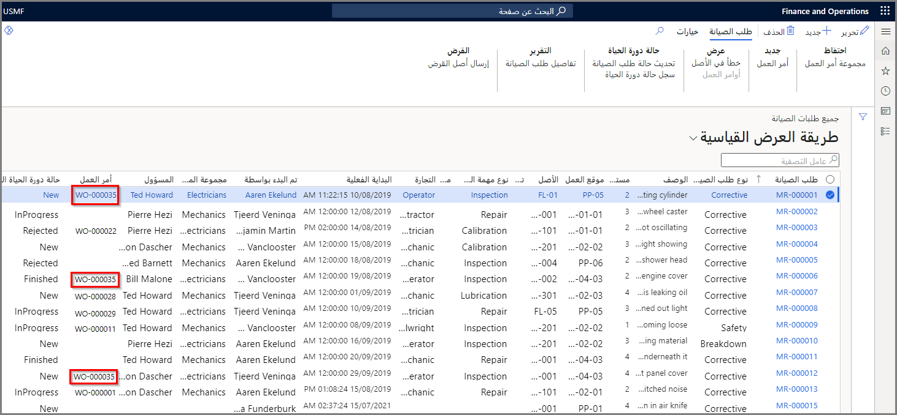
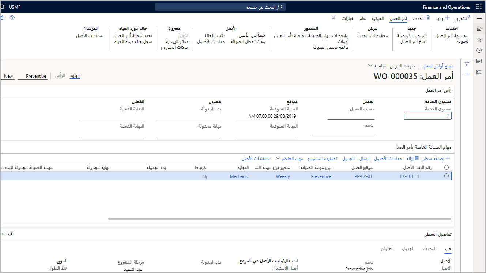

بعد مراجعة المدير أو المخطط لطلب الصيانة واعتماده، عندئذٍ يتم تحويله إلى أمر عمل. بناءً على ذلك، تم اعتماد طلب الصيانة وسيتم إنشاء أمر عمل لإكمال الطلب. 

1.  حدد **إدارة الأصول > عام > طلبات الصيانة > جميع طلبات الصيانة**.
2.  قبل أن تتمكن من إنشاء أمر عمل من طلبات الصيانة، يجب أن تحدد نوع مهمة صيانة لطلبات الصيانة وكذلك متغير نوع مهمة الصيانة ونطاقه، إذا لزم الأمر. 
3.  عند استعدادك لإنشاء أمر عمل، حدد طلبات الصيانة المراد إدراجها فيه.
    - إذا حدَّدت العديد من طلبات الصيانة لتحويلها إلى أمر العمل، فيجب تعيين الحقل **الأصل** والحقل **نوع مهمة الصيانة** قبل إنشاء أمر العمل.
    - إذا حدَّدت طلب صيانة واحد لتحويله إلى أمر عمل، فيجب تعيين الحقل **الأصل** فقط قبل إنشاء أمر العمل. ومع ذلك، عند إنشاء أمر العمل، يمكنك تحديد نوع مهمة الصيانة (ومتغير نوع مهمة الصيانة ذي الصلة ونطاقه، إذا كانت هذه المعلومات المرتبطة) في مربع الحوار **إنشاء أمر العمل**.
    - تأكد من تعيين حالة دورة حياة طلب الصيانة الخاصة بكل طلب على حالة تسمح بإنشاء أوامر العمل؛ وبخلاف ذلك، ستتلقى رسالة خطأ تفيد بأن "حالة دورة حياة طلب الصيانة لا تسمح بإنشاء أوامر العمل".
4.  ضمن القائمة الفرعية **جديد**، ضمن جزء الإجراءات، حدد **أمر العمل**.
    **إدارة الأصول > عام > طلبات الصيانة > جميع طلبات الصيانة**
 
    

5.  في مربع الحوار **إنشاء أمر العمل**:
    - حدد **نوع أمر العمل** من القائمة المنسدلة.
    - حدد **الوصف** أو أدخل وصفاً بشكلٍ يدوي.
    - حدد **مستوى الخدمة** من القائمة المنسدلة.
    - عيِّن تاريخ **البدء المتوقع**.
    - عيِّن تاريخ **الانتهاء المتوقع**.
    - حدد **موافق**.
    
    
    
    إضافة إلى ذلك، عند إنشاء أمر عمل قائم على طلب صيانة، إذا تم إدراج الأصل المرتبط بطلب الصيانة في اتفاقية الضمان، فسوف يخطرك شريط الرسائل باتفاقية الضمان.
 
6.  حدِّث الشاشة وسترى أرقام **أوامر العمل** الجديدة التي تم تعيينها للطلبات المحددة. 
    > [!NOTE]
    > ستحتاج إلى التمرير ناحية اليمين لرؤية عمود **أمر العمل**.

    
 
7.  انتقل إلى **إدارة الأصول > عام > أوامر العمل > جميع أوامر العمل**.
8.  حدد موقع أمر العمل الجديد وافتحه، حيث سترى **الأصول** و **مواقع العمل** و **أنواع مهمة الصيانة** لأمر العمل الجديد.

    **إدارة الأصول > عام > أوامر العمل > جميع أوامر العمل**

    

شاهد الفيديو التالي للتعرف على كيفية إنشاء أمر عمل من طلب الصيانة في إدارة الأصول.

 > [!VIDEO https://www.microsoft.com/videoplayer/embed/RE4peVR]

