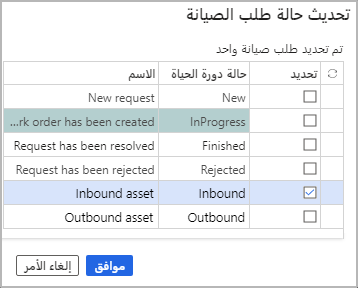

تعقب الأصول عند نقلها بين المواقع أمر ضروري. على سبيل المثال، قد تضطر إلى نقل جزء من المعدات من موقع إلى موقع آخر لإجراء صيانة. ومن الضروري أن تعلم المؤسسة موقع جميع أصولها. يمكن لإدارة الأصول تعقب الأصول الواردة والصادرة بحيث يمكنك التحكم في موقع الأصول في جميع الأوقات. ويوضح القسم الآتي العملية.

## تسجيل الأصول كواردة
فكِّر في السيناريو الذي تقوم خلاله بتسجيل الأصول الجاري استلامها في مؤسستك من موقع آخر. على سبيل المثال، قد يكون لديك ضاغط هواء يحتاج إلى الصيانة. عند إجرائك الصيانة، تقوم بنقل المعدات من موقع إلى آخر، مثل ورشة. أنت بحاجة إلى نقل ضاغط الهواء من موقع إلى آخر. 

عند إجراء هذه العملية، يجب تذكر التفاصيل الآتية:

- يجب أن تكون قد قمت فعلياً بإنشاء **واردة** أو **صادرة** أو شيئاً مشابهاً في **حالات دورة حياة طلب الصيانة**. 
- تأكد من أن **نموذج دورة الحياة** يتضمن حالات دورة الحياة التي تم نقلها إلى قسم **حالات دورة الحياة المحددة** وأن **تحديثات حالات دورة الحياة** تتضمن القدرة على الانتقال إلى الواردة والصادرة.

لتسجيل أصل كوارد، اتبع الخطوات الآتية:

1.  انتقل إلى **إدارة الأصول > طلبات الصيانة > طلبات الصيانة النشطة**.
2.  حدد طلب الصيانة من أجل فتحه.
3.  ضمن جزء الإجراءات ثم ضمن القائمة **حالة دورة الحياة**، حدد **تحديث حالة طلب الصيانة**.
4.  حدد **واردة** (أو حالة دورة حياة أخرى قمت بإنشائها للأصول الواردة)، ثم حدد **موافق**. 

    النتيجة: تم تعيين **حالة دورة الحياة الحالية** في علامة التبويب السريعة **عام** إلى **واردة**.

    **إدارة الأصول > طلبات الصيانة > طلبات الصيانة النشطة**.

    
 

## تسجيل الأصول الواردة كمستلمة
بعد استلام الأصل في مؤسستك، وضح أن الأصل قد تم استلامه:

1.   انتقل إلى **إدارة الأصول > واردة/صادرة > الأصول الواردة**.
2.  حدد الأصل أو طلب الصيانة.
3.  حدد **استلام الأصول**.
4.  في حقل **تم الاستلام**، أدخل التاريخ والوقت ثم حدد **موافق**. تتم إزالة السجل من صفحة قائمة **الأصول الواردة**.

## تسجيل الأصول كصادرة
عند الانتهاء من مهمة الصيانة أو الإصلاح واستعدادك لإرجاع الأصل إلى موقعه الأصلي، يمكنك تسجيل الأصل بأنه تم إرجاعه.

1.  حدد **إدارة الأصول > طلبات الصيانة > طلبات الصيانة النشطة**.
2.  حدد طلب الصيانة.
3.  حدد **تحديث حالة طلب الصيانة**.
4.  حدد **واردة** (أو حالة دورة حياة أخرى قمت بإنشائها للأصول الصادرة)، ثم حدد **موافق**.

## تسجيل الأصول كمُسلَّمة
لتسجيل الأصول الصادرة كمُسلَّمة، اتبع الخطوات الآتية:

1.  انتقل إلى **إدارة الأصول > واردة/صادرة > الأصول الصادرة**.
2.  حدد الأصل أو طلب الصيانة.
3.  حدد **تسليم الأصول**.
4.  في حقل **مُسلَّمة**، أدخل التاريخ والوقت ثم حدد **موافق**. تتم إزالة السجل من صفحة قائمة **الأصول الصادرة**.

