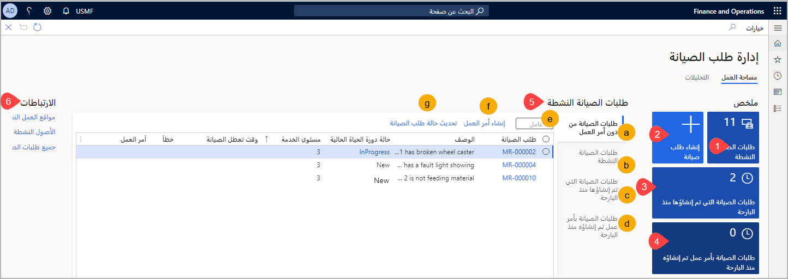

توفر مساحة عمل **إدارة طلبات الصيانة** موقعاً شاملاَ لعرض كافة طلبات الصيانة وإدارتها في إدارة الأصول. 

**إدارة الأصول > مساحات العمل > إدارة طلبات الصيانة**

 
تحتوي مساحة عمل **إدارة طلبات الصيانة** على اللوحات وعلامات التبويب الآتية (كما هو موضح في لقطة الشاشة السابقة):

1.  **طلبات الصيانة النشطة** – توفر هذه اللوحة عرض عدد **طلبات الصيانة النشطة**. ويؤدي تحديد اللوحة إلى نقلك إلى صفحة **طلبات الصيانة النشطة**. 
2.  **إنشاء طلب صيانة** - تقوم هذه اللوحة بفتح مربع حوار **إنشاء طلب صيانة** لمساعدتك على إنشاء طلب صيانة جديد.
3.  **طلبات صيانة تم إنشاؤها منذ الأمس** – تلخص هذه اللوحة عدد طلبات الصيانة التي تم استلامها خلال آخر 24 ساعة. ويؤدي تحديد اللوحة إلى نقلك إلى صفحة **طلبات الصيانة التي تم إنشاؤها منذ الأمس**. 
4.  **طلبات صيانة بأوامر عمل تم إنشاؤها منذ الأمس** – تلخص هذه اللوحة عدد طلبات الصيانة التي تم إنشاء أوامر عمل لها خلال آخر 24 ساعة. ويؤدي تحديد اللوحة إلى نقلك إلى صفحة **طلبات الصيانة مع أوامر عمل تم إنشاؤها منذ الأمس**.
5.  يوجد في القسم الأوسط العديد من علامات التبويب السريعة وروابط سريعة ذات طرق عرض متشابهة، كما ذكرنا سابقاً. ويمنحك هذا القسم القدرة على البقاء في الصفحة نفسها وذلك بتحديد علامات التبويب لعرض التفاصيل المرتبطة. ستتمتع أيضاً بحق الوصول إلى روابط سريعة لإنشاء أمر عمل وتحديث حالة دورة حياة الصيانة. علامات التبويب السريعة الواردة في هذا القسم كالآتي:

    أ.  **طلبات صيانة دون أمر عمل** – تعرض طلبات الصيانة النشطة التي لم يتم تحويلها إلى أمر العمل حتى الآن.

    ب.  **طلبات الصيانة النشطة** – تعرض قائمة بطلبات الصيانة النشطة.

    جـ.  **طلبات صيانة تم إنشاؤها منذ الأمس** – تعرض قائمة بطلبات الصيانة التي تم استلامها خلال آخر 24 ساعة. 

    د.  **طلبات صيانة بأوامر عمل تم إنشاؤها منذ الأمس** – تلخص عدد طلبات الصيانة التي إنشاء أوامر عمل لها خلال آخر 24 ساعة.

    هـ.  **عامل التصفية** – يوفر خيار البحث عن طلب صيانة محدد وتصفيته.

    و.  **إنشاء أمر عمل** – يوفر رابطاً سريعاً لفتح مربع حوار "إنشاء أمر عمل". 

    ز.  **تحديث حالة طلب صيانة** - بعد تحديد طلب الصيانة، يمكنك استخدام هذا الرابط لإدارة حالة طلب الصيانة وتحديثها بشكلٍ سريع.

6.  **الروابط** - تتوفر للوصول السريع لعرض **مواقع العمل النشطة** و **الأصول النشطة** و **جميع طلبات الصيانة** وتحديثها.

