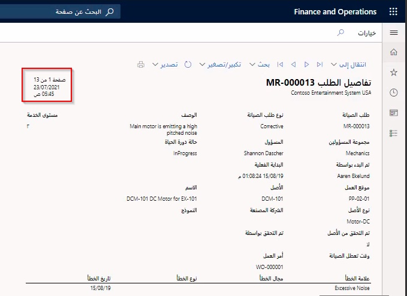
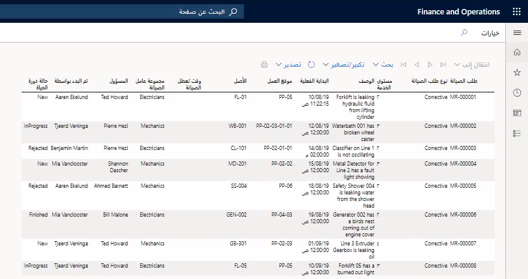

يمكن إنشاء تقريرين لطلبات الصيانة. ويوفر التقرير الأول تفاصيل الطلب، والتي قد تستخدمها للحصول على فهم شامل لحاله الطلب. أما التقرير الثاني فهو قائمة يمكنك استخدامها للتخطيط والمتابعة ويوفر طريقة عرض قائمة مفصلة لجميع طلبات الصيانة. ويمكن أن يكون لكل من هذين التقريرين مهمة دُفعة يتم إعدادها للتشغيل كل يوم أو مرة في الأسبوع، على سبيل المثال، حتى تتمكن من الحصول على ملخص شامل لطلبات الصيانة في النظام. 

## إنشاء تقرير تفاصيل طلب الصيانة
لإنشاء تقرير **تفاصيل طلب الصيانة**، اتبع الخطوات الآتية:

1.  انتقل إلى **إدارة الأصول > التقارير > طلبات الصيانة > تفاصيل طلبات الصيانة**.
2.  في علامة التبويب السريعة **‬‏‫السجلات المطلوب تضمينها‬‏‫**، حدد طلبات صيانة محددة لتضمينها في التقرير.
3.  في علامة التبويب السريعة **تشغيل في الخلفية**، قم بإعداد إنشاء التقرير كمهمة دُفعة، إذا كنت بحاجه إلى ذلك.
4.  حدد **موافق** لإنشاء التقرير.

تعرض الصورة الآتية مثالاً للتقرير **تفاصيل طلبات الصيانة**.

**إدارة الأصول > التقارير > طلبات الصيانة > تفاصيل طلبات الصيانة**.
 

يعرض الفيديو الآتي كيفية إنشاء تقرير **تفاصيل طلبات الصيانة**.

> [!VIDEO https://www.microsoft.com/videoplayer/embed/RE4prHj]

## إنشاء تقرير "قائمة طلبات الصيانة"
لإنشاء تقرير **قائمة طلبات الصيانة**، الذي يوفر طريقة عرض قائمة لجميع طلبات الصيانة لنوع الطلب نفسه، اتبع الخطوات الآتية:

1.  انتقل إلى **إدارة الأصول > التقارير > طلبات الصيانة > قائمة طلبات الصيانة**.
2.  في علامة التبويب السريعة **السجلات المطلوب تضمينها**، قم بإجراء تحديدات لتحديد طلبات الصيانة التي يتم تضمينها في التقرير.
3.  في علامة التبويب السريعة **تشغيل في الخلفية**، قم بإعداد إنشاء التقرير كمهمة دُفعة، حسب الحاجة.
4.  حدد **موافق** لإنشاء التقرير.

تعرض الصورة الآتية مثالاً للتقرير **قائمة طلبات الصيانة** لجميع طلبات الصيانة النشطة.

**إدارة الأصول > التقارير > طلبات الصيانة > قائمة طلبات الصيانة**.

 

