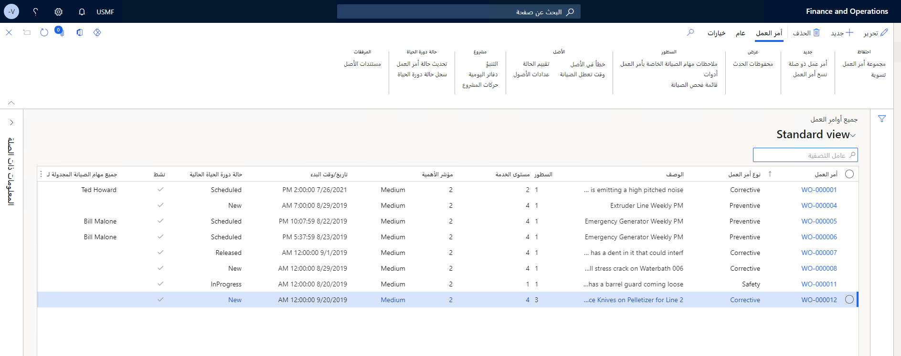
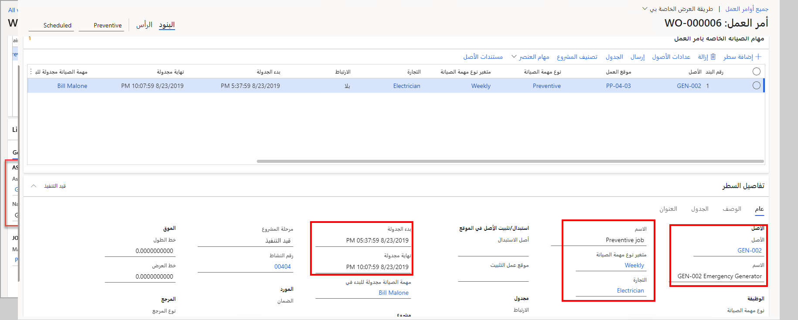

تعتبر أوامر العمل هي المركبة التي تقوم فيها إدارة الأصول في Dynamics 365 Supply Chain Management بإدارة مهام الصيانة والإصلاح الخاصة بأصول المؤسسة. يمكن إنشاء أمر عمل لأصل واحد أو لعدة أصول، وفقاً لما يجب إكماله. 

يتم إنشاء أوامر العمل في إدارة الأصول بعدة طرق:

- يمكن إعداد خطة صيانة للأصل الذي سينشئ أمر عمل تلقائياً باستخدام ميزة جدولة خطة الصيانة.
- إذا كانت لديك مهام صيانة وقائية أو طلبات صيانة، يمكن إنشاء جدول صيانة، كما يمكن إنشاء أوامر عمل من هذا النموذج.
- ويمكن إنشاء أمر العمل يدوياً.
- من صفحة **طلب الصيانة**، حيث أنشأ شخص ما الطلب.

## صفحه قائمة جميع أوامر العمل 
في صفحة قائمة **جميع أوامر العمل**، يمكنك عرض جميع أوامر العمل في النظام، بغض النظر عن حالتها. يمكن أن يكون لأمر العمل حالات دورة حياة متعددة وفقاً لاحتياجات مؤسستك. على سبيل المثال، يمكن أن يكون أمر العمل بالحالة **مُنشأ** أو **مُجدول** أو **مكتمل**. يمكنك إعداد حالات دورة الحياة وفقاً لاحتياجات مؤسستك. لمعرفة كيفية إعداد حالات دورة الحياة ونماذج دورة الحياة، انتقل إلى [حالات دورة الحياة لأمر العمل](https://docs.microsoft.com/dynamics365/supply-chain/asset-management/setup-for-work-orders/work-order-lifecycle-states/?azure-portal=true).

**إدارة الأصول > عام > أوامر العمل > جميع أوامر العمل**
 

بالإضافة إلى ذلك، يمكنك الاطلاع على معلومات حول كل أمر من أوامر العمل، بما في ذلك عدد البنود الموجودة في أمر العمل (بمعني آخر، عدد المهام الموجودة في أمر العمل، ويمكن أن تكون لديك مهمة واحدة أو عدة مهام في أمر العمل)، والوصف، وتفاصيل وقت البدء والانتهاء ونوع الصيانة والتجارة المطلوبة والمزيد. إذا كنت بحاجة إلى الاطلاع على التفاصيل الخاصة بأي أمر عمل في هذه الصفحة، فحدد **أمر العمل** الذي تريد عرضه من صفحة القائمة.  

في صفحة **جميع أوامر العمل**، يمكنك التنقل في أوامر العمل الفردية والاطلاع على مزيد من التفاصيل حول كل أمر.

 
التفاصيل الرئيسية التي يمكنك العثور عليها في صفحة **أمر العمل**:

- معرف الأصل واسمه
- اسم المهمة ومتغير النوع (أسبوعياً، كما هو موضح في الصورة السابقة)، والتجارة (فني الكهرباء، في أمر العمل هذا)
- البدء المجدول والنهاية المجدولة لأمر العمل

ضمن جزء الإجراءات، في صفحة **أمر العمل**، توجد القائمة الفرعية حيث يمكنك الاطلاع على أقسام مختلفة تحدد الوظائف المختلفة المرتبطة بأمر العمل، كما هو موضح في المقاطع التالية.

## الاحتفاظ
يحتوي قسم **الاحتفاظ** على الخيارات التالية:

- **وعاء أوامر العمل** - يمكنك إضافة أمر العمل أو إزالته من وعاء أوامر العمل.
- **التعديل** - يمكنك إجراء تعديلات على الكيانات مثل تاريخ البدء أو الانتهاء الجديد والأولوية ومجموعة المسؤولين وما إلى ذلك.

## جديد
يحتوي قسم **جديد** على الخيارات التالية:

- **أمر العمل المرتبط** – يمكنك إنشاء أمر عمل جديد مرتبط بالأمر الحالي أو إضافة أمر العمل الجديد إلى أمر موجود.
- **نسخ أمر العمل** – يمكنك إنشاء أمر عمل جديد استناداً إلى الأمر الموجود.

## العرض
يحتوي قسم **العرض** على الخيار **محفوظات الأحداث**، حيث يمكنك عرض المحفوظات المرتبطة بأمر العمل.

## البنود
يحتوي قسم **البنود** على الخيارات التالية:

- **ملاحظات مهمة صيانة أمر العمل** – يمكنك قراءة الملاحظات المرتبطة بمهمة الصيانة.
- **الأدوات** - يمكنك عرض الأدوات المطلوبة لإكمال أمر العمل.
- **قائمة فحص الصيانة** - يمكنك عرض الخطوات المطلوبة لإكمال أمر العمل.

## الأصل
يحتوي قسم **الأصل** على الخيارات التالية:

- **خطأ الأصل** - يمكنك عرض أخطاء الأصول، مثل الأعراض التي تم الكشف عنها والتي ينتج عنها أمر العمل.
- **وقت تعطل الصيانة** – يمكنك جدولة أي وقت تعطل مرتبط بإكمال أمر العمل.
- **تقييم الشرط** – يمكنك إضافة تقييم للشرط الذي تم الكشف عنه.
- **عدادات الأصول** – يمكنك إضافة أي عدادات مرتبطة بأمر العمل أو عرضها.

## المشروع
يحتوي قسم **المشروع** على الخيارات التالية:

- **التنبؤ** - يمكنك عرض تفاصيل التنبؤ المرتبطة بأمر العمل أو إضافتها (الساعات أو الأصناف أو المصروفات).
- **دفاتر اليومية** - يمكنك عرض دفاتر يومية أوامر العمل ونسخها والتحقق من صحتها وترحيلها.
- **حركات المشروع** - يمكنك عرض جميع المشروعات التي تم ترحيلها. 

## حالة دورة الحياة
يحتوي قسم **حالة دورة الحياة** على الخيارات التالية:

- **تحديث حالة أمر العمل** – يمكنك تغيير حالة أمر العمل إلى حالة مختلفة.
- **سجل حالة دورة الحياة** – يمكنك عرض سجل دورة الحياة لأمر العمل.

## المرفقات‬
يحتوي قسم **المرفقات** على الخيار **مستندات الأصول**، حيث يمكنك عرض أي مستندات مرتبطة بأمر العمل. 