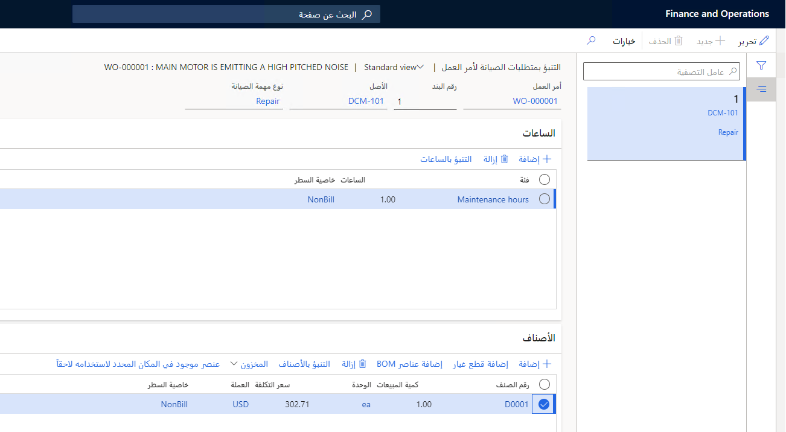
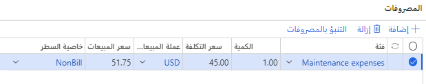
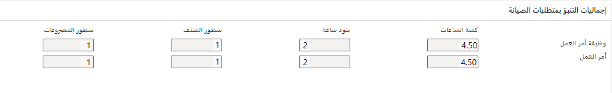
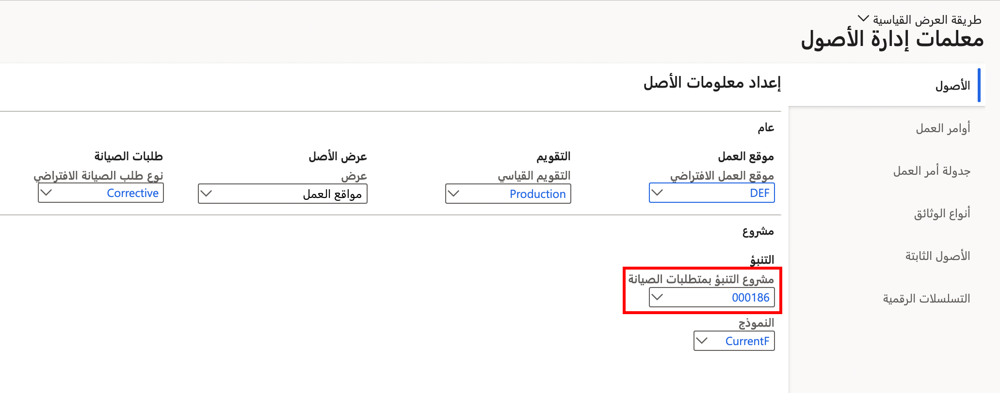
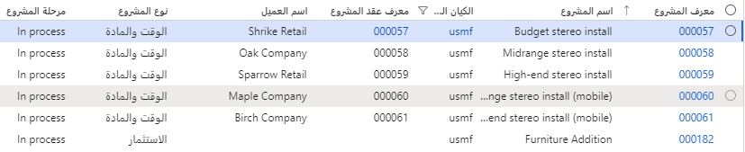
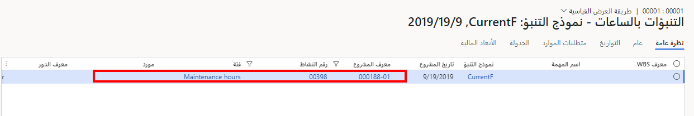
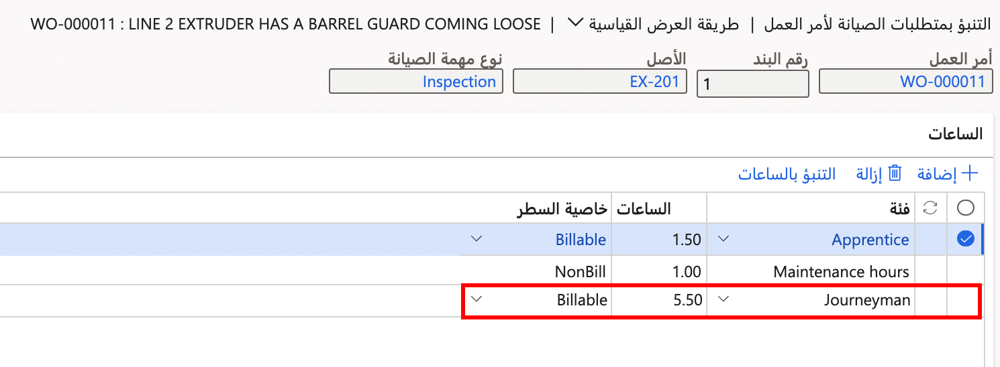

عند إنشاء أمر عمل، يتم إنشاء مهام أمر العمل التي لها أصول وأنواع مهام الصيانة. يمكن أن يكون لنوع مهمة الصيانة أيضاً تنبؤ بمتطلبات الصيانة، وفي هذه الحالة، يتم نسخ التنبؤ تلقائياً إلى أمر العمل. 

يتم تعريف التنبؤ بأنه الساعات والأصناف والمصروفات المتوقعة في أمر العمل. يمكن حذف بنود التنبؤ هذه من أمر العمل أو يمكنك إضافة بنود. يتم تحديد ما إذا كان يجب حذف بنود التنبؤ أو إضافتها بواسطة حالة دورة الحياة ونوع المشروع وقاعدة المرحلة المرتبطة بنوع المشروع. 

## عرض بنود التنبؤ بمتطلبات الصيانة 
لعرض تنبؤ بمتطلبات الصيانة، انتقل إلى **إدارة الأصول > شائع > أوامر العمل > كافة أوامر العمل** وفي قسم **المشروع**، حدد **التنبؤ**. تظهر صفحة **التنبؤ بمتطلبات صيانة أمر العمل**، حيث يمكنك الاطلاع على علامات التبويب السريعة **الساعات** و **الأصناف** و **المصروفات**. في هذه الصفحة، يمكنك عرض التنبؤات للساعات والأصناف، حيث يستخدم كل منها خصائص البنود للأصناف القابلة للفوترة أو غير القابلة للفوترة. بالنسبة للأصناف، سيتضمن إعداد **تلقائياً** سعر التكلفة الخاص بالصنف. 

 
تعرض علامة التبويب السريعة **المصروفات** كلاً من **سعر التكلفة** و **سعر المبيعات**، وهو ما يتيح لك تحديد **قابل للفوترة** أو **غير قابل للفوترة**، كما هو موضح في الصورة التالية.

 
يتم توفير ملخص لإجماليات التنبؤ في علامة التبويب السريعة **إجماليات التنبؤ بمتطلبات الصيانة**.

 
شاهد الفيديو التالي للتعرف على كيفية إضافة بنود التنبؤ إلى أمر عمل.

 > [!VIDEO https://www.microsoft.com/videoplayer/embed/RE4pmuD]
 
## التكامل مع إدارة المشاريع ومحاسبتها
يمكن إعداد أوامر العمل لتتكامل مع مشروع في Dynamics 365 Supply Chain Management، في صفحة **معلمات إدارة الأصول**. توضح الصورة التالية أنه تم إدخال مشروع في الحقل **مشروع التنبؤ بمتطلبات الصيانة**. سيتم تحديث هذا المشروع تلقائياً ببيانات أمر العمل، وسيتم ملء أي معاملات تم إنشاؤها في المشروع في أمر العمل. 

**إدارة الأصول > الإعداد > معلومات إدارة الأصول**

 
لتحديث التنبؤ بناءً على الإدخالات في الوحدات النمطية الأخرى، اتبع الخطوات التالية:

1.  حدد **إدارة الأصول > دوري > التنبؤ > تحديث التنبؤ بأمر العمل**.
2.  في مربع الحوار **تحديث التنبؤ بأمر العمل** في علامة التبويب السريعة **السجلات المطلوب تضمينها**، أضف أوامر عمل معينة أو مهام صيانة أوامر العمل، حسب الحاجة. حدد **عامل تصفية** للقيام بالتحديدات ذات الصلة.
3.  في علامة التبويب السريعة **تشغيل في الخلفية**، قم بإعداد التحديث التلقائي كوظيفة دفعية، على النحو الذي تطلبه.‬
4.  حدد **موافق** لبدء تحديث التنبؤ.

توضح الصورة التالية أن التنبؤ الذي تم إدخاله في أمر العمل موجود الآن في صفحة **المشروع**.

**إدارة المشاريع والمحاسبة > المشاريع > كافة المشاريع**

وعلى العكس من ذلك، ستقوم أي بيانات تنبؤ تم إدخالها من المشروع بتحديث التنبؤ بأمر العمل.

**إدارة الأصول > شائع > أوامر العمل > كافة أوامر العمل** > تحديد بند أمر عمل > **علامة التبويب السريعة** المشروع > **التنبؤ > التنبؤ بالساعات**

 
تم تحديث التنبؤ بأمر العمل في صفحة **التنبؤ بمتطلبات صيانة أمر العمل** كما هو موضح في الصورة التالية.

