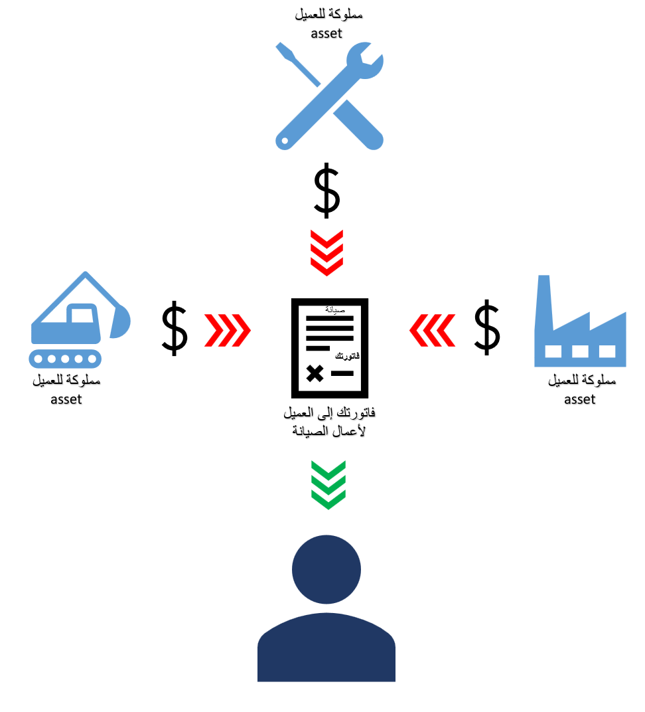

لتسهيل عملية فوترة عملائك مقابل العمل الذي تقدمه، تتيح لك ميزة فوترة أمر العمل إنشاء ومعالجة وفواتير أعمال الصيانة التي تقدمها شركتك على الأصول المملوكة للعملاء. 
 

تقدم هذه الميزة إمكانات تضيف الكفاءة والشفافية عند إنشاء أعمال الصيانة ومعالجتها وفواتيرها، بما في ذلك:

- قم بإنشاء أوامر عمل صيانة على الأصول التي يمتلكها عملاؤك.
- تسجيل الوقت والمواد والمصروفات والرسوم عند معالجة العمل على الأصول المملوكة لعملائك.
- فاتورة العملاء لأعمال الصيانة المنجزة على الأصول المملوكة لهؤلاء العملاء.

يتيح لك القيام بما يلي:

- ربط العملاء بالأصول التي يمتلكونها.
- حدد أحد العملاء واعرض الأصول التي يمتلكها العميل عند إنشاء أمر عمل.
- قم بإعداد مشروع رئيسي لكل عميل.
- انسخ عقد المشروع تلقائياً من المشروع الأصلي للعميل إلى مشروع أمر العمل ذي الصلة.
- قم بتسجيل الساعات والعناصر والمصروفات والرسوم مقابل أمر العمل وبعد ذلك قم بإنشاء اقتراح فاتورة للعميل.
- بالإضافة إلى ذلك، يمكن لإدارة الأصول استخدام نوع حركة المشروع **الرسوم** في كل من توقعات أمر العمل ودفاتر يومية أمر العمل.

لمزيد من المعلومات حول كيفية تمكين هذه الميزة، راجع [ فاتورة الصيانة على الأصول المملوكة للعملاء](/dynamics365/supply-chain/asset-management/integration-to-project-management-and-accounting/customer-billing/?azure-portal=true). 

