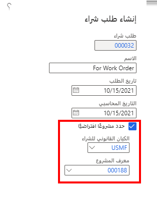
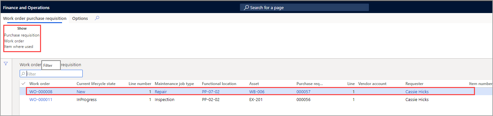
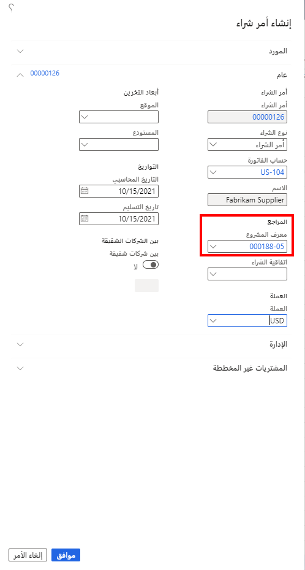
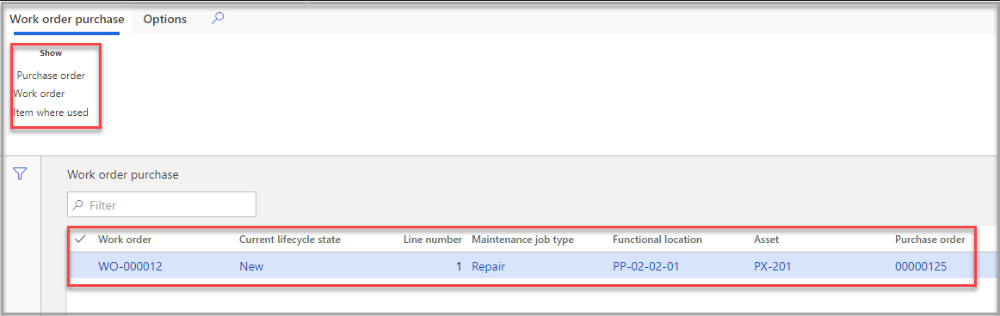
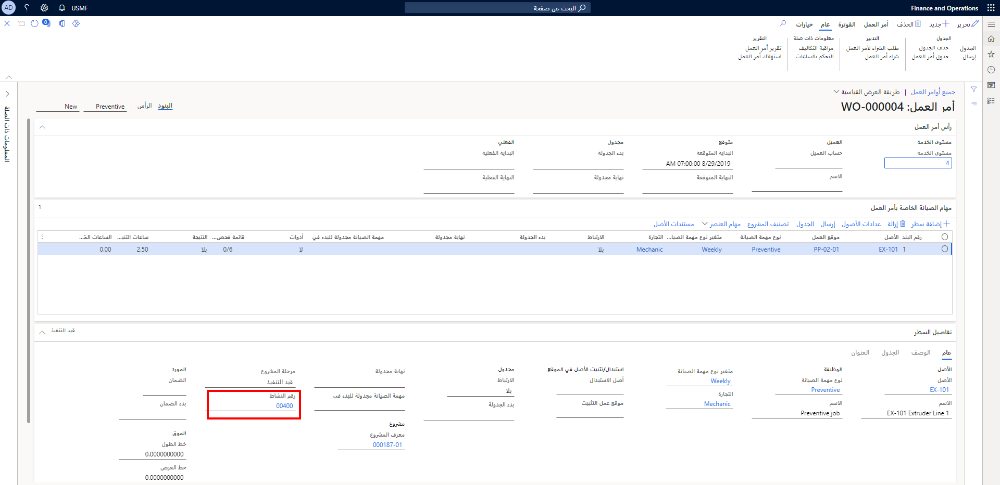

يمكن أن يحتوي أي أمر عمل على أجزاء أو مستلزمات يجب شراؤها لإكمال العمل. تتيح لك إدارة الأصول ربط أي طلب شراء أو أمر شراء من خلال المشروع. 

على سبيل المثال، قد يكون لديك ضاغط هواء يحتاج إلى عامل تصفية هواء جديد لا يتوفر لديك حالياً لاستبداله. يمكنك إنشاء طلب شراء لشراء عامل تصفية الهواء الذي تحتاجه لضاغط الهواء. 

عند إنشاء طلب شراء في **‏‫التدبير والتوريد‬ > طلبات الشراء > جميع طلبات الشراء**، يمكنك إضافة معلومات المشروع في صفحة مربع الحوار **إنشاء طلب شراء**. لتحديد المشروع، حدد **الكيان القانوني للشراء** من القائمة المنسدلة ثم حدد المشروع الذي تم تعيين طلب الشراء له باستخدام القائمة المنسدلة **معرف المشروع**. لمعرفة المزيد حول كيفية إنشاء طلبات الشراء والتعامل معها، انتقل إلى [إنشاء طلب شراء](/learn/modules/configure-perform-procure-purchase-dyn365-supply-chain-mgmt/6-requisition/?azure-portal=true). 

 
لعرض طلبات الشراء المتعلقة بأوامر العمل، يمكنك استخدام صفحة **طلب الشراء الخاص بأمر العمل**. عند الانتقال إلى **تقييم الأصول > عام > التدبير > طلب الشراء الخاص بأمر العمل**، يمكنك مشاهدة طلب تم إنشاؤه لمشروع. يمكنك أيضاً معرفة مكان عرض أمر العمل أو الطلب المحدد. 

  
ويُعد عرض أوامر الشراء هو نفس عملية عرض طلبات الشراء. 

**الحسابات الدائنة > أوامر الشراء > جميع أوامر الشراء**

 
يمكنك أيضاً عرض أمر الشراء من صفحة **شراء أمر العمل** من خلال الانتقال إلى **تقييم الأصول > عام > التدبير > شراء أمر العمل**.
 

وفي كلتا الحالتين، ستظهر هذه المستندات أيضاً في صفحة **تفاصيل المشروع** في إدارة المشاريع والمحاسبة. 

## إنشاء أمر شراء من أمر عمل
السيناريو: يحتاج أحد ضواغط الهواء لديك إلى عامل تصفية هواء جديد، ولكن ليس لديك حالياً أي عوامل تصفية في المخزون. من صفحة **جميع أوامر العمل** ومهمة أمر العمل، يمكنك إنشاء أمر شراء أو طلب شراء ذي صلة. 

1.  انتقل إلى **إدارة الأصول > عام > أوامر العمل > جميع أوامر العمل** أو **أوامر العمل النشطة**، حدد أمر العمل حيث تريد إضافة أمر شراء، ثم حدد **تحرير**.
2.  في علامة التبويب السريعة **مهام صيانة أوامر العمل**، حدد مهمة أمر العمل التي تحتاج إليها لإنشاء أمر الشراء.
3.  من القائمة المنسدلة **مهام العناصر**، حدد **أمر الشراء** من مهمة أمر العمل.
4.  في صفحة **أوامر شراء المشروع**، حدد **جديد** لإنشاء أمر الشراء.

يوضح الفيديو التالي كيفية إنشاء أمر شراء من أمر عمل.

 > [!VIDEO https://www.microsoft.com/videoplayer/embed/RE4pC6F]

## علاقة المشروع بين أمر العمل وأمر الشراء أو طلب الشراء
يمكن إقران مشروع بأمر عمل، وعند حدوث ذلك، يتم إنشاء رقم نشاط تلقائياً كلما تمت إضافة مهمة صيانة، كما هو موضح في لقطة الشاشة التالية.
 

عند إنشاء أمر شراء، يتم تحديث النشاط تلقائياً ويعمل كعلاقة بين أمر الشراء وأمر العمل.