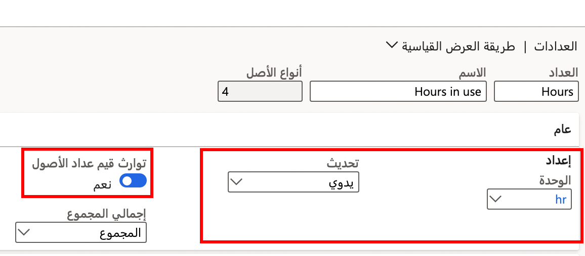
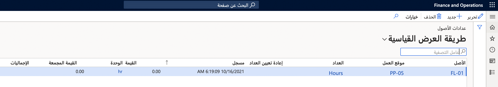

يمكن أن تحتوي العديد من الأصول على عدادات لأشياء مثل عدد الساعات التي كان فيها الأصل قيد التشغيل أو الكمية التي تم إنتاجها. على سبيل المثال، قد يتم استخدام عداد لتعقب عدد الساعات التي تم فيها تشغيل الرافعة الشوكية، أو قد يكون لجهاز التعبئة عداداً لعدِّ الأصناف التي تم إنتاجها. 

وهناك سيناريو آخر تكون فيه عدادات الأصول مفيدة عندما تمتلك أصولاً تابعة للأصل الأساسي. على سبيل المثال، يمكن أن يتكون جهاز واحد من أجزاء متعددة تُعدُّ أصولاً أيضاً. وفي تلك الحالات، يمكنك تعيين النظام ليقوم تلقائياً بتحديث العداد في الأصول التابعة عند تحديث الأصل الأساسي. 

يتم إعداد العدادات في **إدارة الأصول > الإعداد > أنواع الأصول > العدادات**. تَعرض الصورة الآتية مثالاً على عداد ساعات مستخدم في الإنتاج. في هذه الحالة، عندما تقوم بتحديث الأصل الأساسي، فإنه سيقوم تلقائياً بضبط العداد في أي أصول تابعة. 

 
يتم تحديد العدادات التي قمت بإعدادها للأصول في احتياجات الأعمال الفردية.
 
يمكنك ربط عداد بأنواع مختلفة من الأصول. في المثال الآتي، **أميال** عبارة عن إعداد في شكل عداد للشاحنات والمركبات. وإذا كانت أي أصول تابعة مرتبطة بإحدى هذه المركبات، فإن المسافة المقطوعة بالأميال التي تم إدخالها في الأصل الأساسي سيتم تطبيقها على الأصل التابع. 

استخدم المصطلح *سجل* عند إدخال قيمة في العداد. لتنفيذ هذه المهمة، اتبع الخطوات الآتية:

1.  انتقل إلى **إدارة الأصول > عام > الأصول > جميع الأصول** وحدد الأصل.
2.  من علامة التبويب **الأصل**، في القسم **وقائية**، حدد **عدادات**. تظهر صفحة **عدادات الأصول** مع قائمة بكافة عمليات تسجيل العدادات السابقة التي تم إجراؤها في هذا الأصل.
3.  حدد **جديد** لإنشاء عملية تسجيل. يظهر سطر جديد مع معرف أصل تم إدخاله تلقائياً في حقل **الأصل**.
4.  في حقل **العداد**، حدد العداد ذي الصلة من القائمة المنسدلة. ستعرض القائمة العدادات المرتبطة بنوع الأصل فقط. بعد إجراء التحديد، يتم إدخال الوحدة المرتبطة تلقائياً في حقل **الوحدة**.
5.  في حقل **مُسجَّل**، حدد التاريخ والوقت الذي تريد استخدامهما لتسجيل العداد.
6.  في حقل **القيمة**، أدخل الرقم منذ آخر عملية تسجيل عداد أو أدخل رقم العدِّ الإجمالي في حقل **القيمة المجمعة**.

عند تعاملك مع عدادات الأصول، يجب تذكر النقاط الآتية:

- عند تثبيت عداد جديد في أحد الأصول، ستحتاج إلى تسجيل التغيير في الأصل في صفحة **عدادات الأصول**. بعد اكتمال تلك المهمة، تحتاج إلى إنشاء اثنين من سطور التسجيل التي تحتوي على طوابع زمنية متطابقة. 
    - ويكون السطر الأول للعداد الجاري استبداله. 
    - وفي السطر الثاني المرتبط بالعداد الجديد، حدد خانة الاختيار **إعادة تعيين العداد**. يعرض حقل **الإجماليات** مجموع إجماليات العدادات لكافة القيم المسجلة في نوع العداد هذا.
- إذا كان لديك أحد الأصول التي تستخدم خطة صيانة ذات نوع فاصل زمني "مرة واحدة من ..." أو "بمجرد الوصول إلى..." وتم أيضاً تحديد خانة الاختيار **إعادة تعيين العداد**، فإن هذا العداد يظل نشطاً لقيامك بإنشاء سطر عداد منفصل والبدء من جديد باستخدام عداد جديد.

**إدارة الأصول > عام > الأصول > جميع الأصول** > تحديد الأصل > **العدادات**

