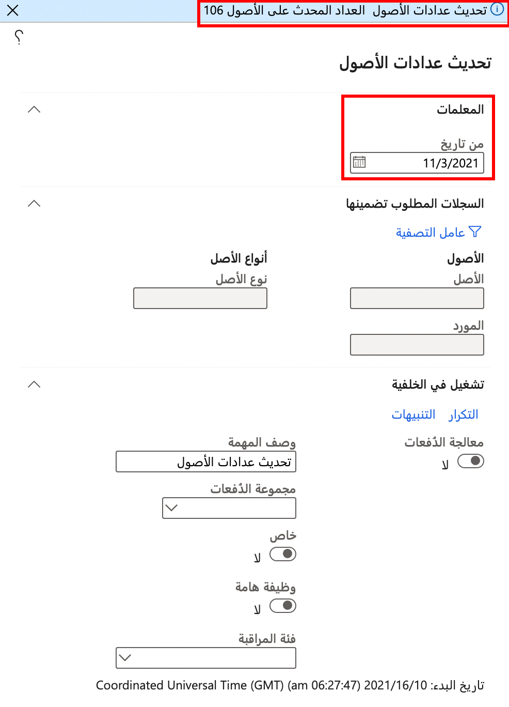

يمكن تحديث العدادات يدوياً في أحد الأصول، كما يمكن تحديثها تلقائياً استناداً إلى ساعات الإنتاج أو كمية الإنتاج. 

ويمكن تحديث القيم من تسجيلات الإنتاج إذا كانت مرتبطة بمَورد تم إعداده في وحدة التحكم في الإنتاج، ومن جانبك تقوم بتسجيل عدد الساعات المستخدمة في المَورد أو الأصناف التي تم إنتاجها. 

بالنسبة إلى عدد الأصناف التي تم إنتاجها، فإنها تشتمل على كل من الكمية المناسبة والكمية غير الصحيحة، والتي يتم تسجيلها عند ترحيل دفتر يومية **تم بالإبلاغ عنه كمنتهٍ** في الإنتاج. 

اتبع الخطوات الآتية لتحديث عدادات الأصول:

1.  انتقل إلى **إدارة الأصول > دوري > الأصول > تحديث عدادات الأصول**.
2.  في الحقل **تاريخ البدء**، أدخل التاريخ الذي تريد أن يبدأ فيه التحديث التلقائي. 

    وهذا التاريخ سيُلغي التاريخ الفعلي الذي تم الإخبار به في "التحكم في الإنتاج". وسيقوم كل تسجيل إنتاج بعد هذا التاريخ بتحديث عداد الأصول. (يجب تعيين الأصل إلى مَورد محدد).

    في لقطة الشاشة، لاحظ أنه بعد 31 ديسمبر 2019، سيتم تحديث عدادات أصول بإجمالي 109 استناداً إلى عمليات تسجيل الإنتاج.
 
    

عند التعامل مع عدادات الأصول، يجب تذكر النقاط الآتية:

- لا يزال بإمكانك إنشاء عمليات تسجيل قيم العدادات اليدوية، حتى وإن كان يتم تحديث نوع العدادات تلقائياً. 
- يمكنك إعداد العدادات المرتبطة بعداد آخر. في هذه الحالة، عندما يتم تحديث العداد، فإنه يقوم تلقائياً بتحديث أي عدادات ذات صلة. 

## خطة الصيانة على أساس قيم عداد الأصول المتراكمة
يمكنك جدولة الإصلاحات بناءً على قيم عداد الأصول التي تراكمت بمرور الوقت. هذا مفيد للعمليات ذات الأداء المتغير. على سبيل المثال، يمكنك تكوين الجهاز لإنشاء سجل صيانة مجدول كل 1000 ساعة بعد آخر صيانة لمضخة مياه الطوارئ.

تتضمن بعض خيارات الصيانة الإضافية القائمة على العداد ما يلي:

- القدرة على تكوين عداد بحيث تتم إعادة تعيينه تلقائياً عند اكتمال أمر العمل. هذه الوظيفة مفيدة عندما تريد جدولة الصيانة استناداً إلى القيمة المجمعة منذ اكتمال أمر العمل الأخير.
- نوع من الفاصل الزمني لخطة الصيانة يسمى **متكرر على القيمة المجمعة (عداد فقط)**. يقوم هذا النوع بتشغيل الصيانة في كل مرة يصل فيها عداد مجمع إلى مضاعف لقيمة معينة. 
- نوع من الفاصل الزمني لخطة الصيانة يسمى **مرة واحدة على القيمة الإجمالية (عداد فقط)**. يقوم هذا النوع بتشغيل الصيانة عندما يصل عداد مجمع إلى قيمة معينة، مثل 8000 ساعة.

### مثال

يعرض الرسم التخطيطي عداد الساعات الذي يتم من أجله إنشاء بند جدول صيانة جديد في كل مرة تمر فيها 250 ساعة. نوع الفاصل الزمني لهذا البند القائم على العداد متكرر من تاريخ البدء. تاريخ البدء هو تاريخ بدء الأصول ذات الصلة في **جميع الأصول** عرض التفاصيل > **خطط صيانة الأصول** علامة التبويب السريعة > **تاريخ البدء** الحقل، أو في **موقع العمل** عرض التفاصيل > **خطط الصيانة** علامة التبويب السريعة > **تاريخ البدء**. 

هذا مثال لخطة الصيانة الوقائية لأنه يتم إنشاء بند جدول الصيانة تلقائياً في كل مرة يتم فيها الوصول إلى الحد (+ 250).

لمعرفة المزيد حول الفترات الزمنية المختلفة التي يمكنك إعدادها باستخدام خطط الصيانة القائمة على العداد، راجع قسم **نظرة عامة على أنواع الفواصل الزمنية** في [خطط الصيانة](/dynamics365/supply-chain/asset-management/preventive-and-reactive-maintenance/maintenance-plans?azure-portal=true#interval-types-overview).
