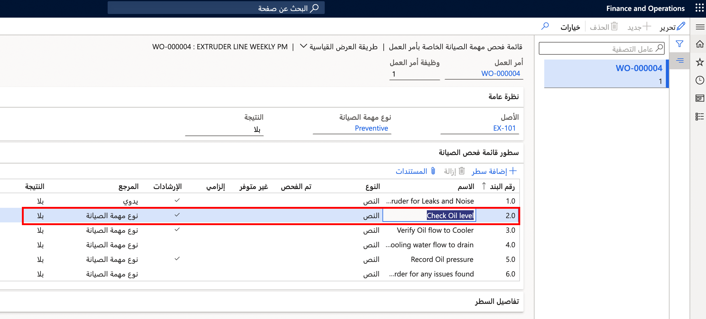

قائمة فحص الصيانة إحدى ميزات أمر العمل التي توضح التفاصيل المتعلقة بما تم إنجازه في مهمة الصيانة. حيث تسمح للشخص الذي يقوم بإعداد أمر العمل بتوضيح ما يجب تنفيذه، إضافة إلى التعليمات ذات الصلة. وبعد ذلك، يستطيع أي شخص يقوم بإكمال أمر العمل أن يُدخل النتائج. 

على سبيل المثال، يمكن أن تحتوي قائمة الفحص على بنود مثل "التحقق من شد السير" أو "التحقق من مستوي الزيت". 
 
يمكنك أيضاً إعداد متغيرات قائمة فحص الصيانة لإظهار النتائج المختلفة لبند الصيانة. على سبيل المثال، إذا كان لديك بنداً لمستوى الزيت، فيمكن أن يكون لديك متغيراً مثل "من 0 إلى 3 كوارتات يعني الفشل و4 كوارتات أو أكثر يعني احتمالية الاجتياز".
 
## املأ قائمة فحص الصيانة
اتبع هذه الخطوات لمعرفة كيفية إكمال قائمة فحص الصيانة: 

1.  انتقل إلى **إدارة الأصول > عام > أوامر العمل > جميع أوامر العمل** أو **أوامر العمل النشطة** وحدد "أمر العمل".
2.  من جزء الإجراءات، ضمن علامة التبويب  **أمر العمل** ، حدد **قائمة فحص الصيانة**. 
    
    تُعرض صفحة **قائمة فحص مهمة صيانة أمر العمل**، ما يُظهر قوائم الفحص لجميع مهام أمر العمل. 
    
    إذا كانت هناك أنواع مهام صيانة مختلفة مرتبطة بمهام أمر العمل، فقد تختلف قوائم فحص الصيانة حسب مهمة أمر العمل. 
3.  أكمل بنود قائمة فحص الصيانة بالترتيب الذي تظهر به. وبناء على نوع البند، تكون الخيارات المختلفة لإكمال البند كالآتي: 
    - **نوع النص** - إضافة ملاحظة توضح النتائج. 
    - **نوع القياس** - أدخل قيمه العداد من المعدات وأضف ملاحظة أيضاً، إذا لزم الأمر. 
    - **نوع الرأس** - تجميع بنود قائمة فحص الصيانة التي تظهر أسفل الرأس. ليس عليك ملء الرأس، ولكن يمكنك إضافة ملاحظة بند نوع **الرأس**. 
4.  عند الانتهاء من بند قائمة فحص الصيانة، حدد خانة الاختيار **تم الفحص** لتوضيح أنه تم إكماله. إذا كان بند قائمة فحص الصيانة غير مرتبط بأمر العمل، فحدد خانة الاختيار **غير متوفر** لاستبعاده من مهمة أمر العمل. إذا تم تحديد خانة الاختيار **إلزامي** في بند قائمة فحص الصيانة، فيجب تحديد إما خانة الاختيار **تم الفحص** أو خانة الاختيار **غير متوفر** .

    