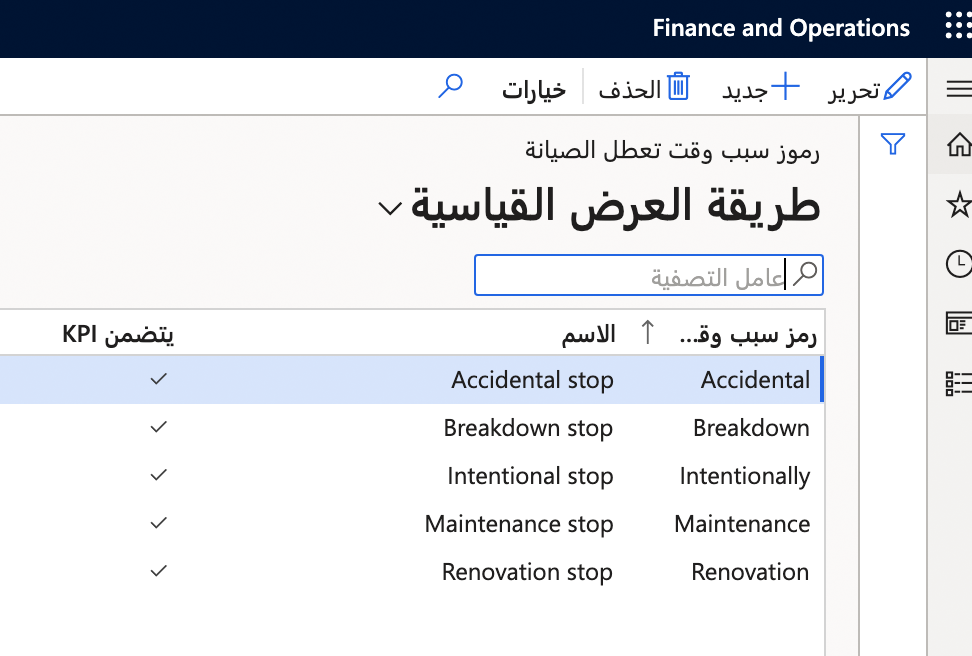
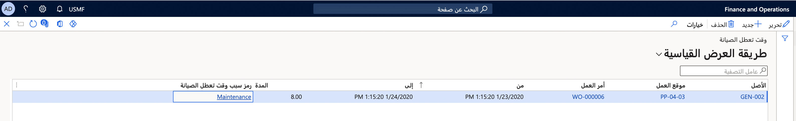
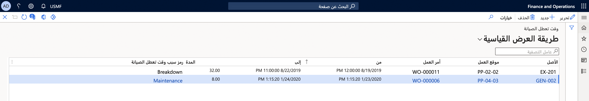

من الممكن أن يوجد أصل قيد الصيانة، ولن يكون متاحاً للاستخدام. على سبيل المثال، إذا تم استخدام أصل محدد في الإنتاج ولن يكون متوفراً لفترة محددة من الوقت، فإنك قد ترغب في ملاحظة التفاصيل بحيث لا تتم جدولته لمهمة إنتاج. لإظهار أن أحد الأصول معطلاً، تحتاج أولاً إلى إعداد أكواد سبب وقت التعطل.

## إنشاء أكواد سبب وقت تعطل الصيانة
قبل جدولة وقت تعطل الصيانة، يجب إنشاء كود سبب وقت تعطل الصيانة. اتبع الخطوات الآتية لإنشاء كود سبب وقت التعطل:

1.  انتقل إلى **إدارة الأصول > الإعداد > أوامر العمل > أكواد سبب وقت تعطل الصيانة** وحدد **جديد**.
2.  في حقل **كود سبب وقت تعطل الصيانة**، أدخل معرِّفاً لكود سبب وقت تعطل الصيانة. قد يكون هذا المعرِّف شيئاً مثل **صيانة** أو **تصنيف تفصيلي**.
3.  في حقل **الاسم**، أدخل اسماً يصف هذا الكود مثل **إيقاف التصنيف التفصيلي**.
4.  حدد خانة اختيار **تضمين مؤشرات الأداء الرئيسية** إذا كان يجب تضمين كود السبب في العمليات الحسابية لمؤشرات الأداء الرئيسية (KPIs) للأصل. وتحدث هذه الحالة إذا كان كود السبب سيؤثر في الأداء المتوقع. وبشكلٍ عام، نظراً إلى أن حالات توقف الإنتاج المخطط له لا تؤثر في الأداء، فلن تتم إضافتها إلى العمليات الحسابية لمؤشرات الأداء الرئيسية.
5.  حدد **حفظ**.

    

بعد إعداد أكواد السبب، حدد أصلاً معيناً في أمر العمل بسبب تعطله.

## إنشاء عمليات تسجيل وقت تعطل الصيانة
والآن بعد أن يتوفر لديك كود سبب وقت تعطل الصيانة، اتبع الخطوات الآتية لإنشاء تسجيل وقت تعطل الصيانة:

1.  انتقل إلى **إدارة الأصول > عام > أوامر العمل > جميع أوامر العمل** أو **أوامر العمل النشطة** وحدد "أمر العمل".
2.  في علامة التبويب **أمر العمل**، حدد **وقت تعطل الصيانة**.
3.  تظهر صفحة **وقت تعطل الصيانة**. حدد **جديد** لجدولة وقت التعطل.
4.  في حقل **البدء**، أدخل التاريخ والوقت الذي سيبدأ فيه وقت التعطل. في حقل **الانتهاء**، أدخل التاريخ والوقت المجدول لانتهاء وقت التعطل. 
    
    بعد إدخال التواريخ، يتم حساب حقل "المدة" تلقائياً.
    
    ويعتمد التقويم الذي يتم استخدامه لحساب تسجيل وقت تعطل الصيانة على ما تم تحديده في إعداد الأصول والمعلمات. على سبيل المثال، إذا تم تحديد إنتاج في أحد الأصول في علامة التبويب السريعة **الأصل الثابت** من صفحة **جميع الأصول**، عندئذٍ سيتم استخدام تقويم الإنتاج الذي تم إعداده للأصل المرتبط، كما هو موضح في الصورة الآتية.

    **إدارة الأصول > الإعداد > معلومات إدارة الأصول**
 
    

5.  في حقل **كود سبب وقت تعطل الصيانة** حدد كود السبب من القائمة المنسدلة. قد يكون هذا السبب نتيجة **الصيانة**. 
6.  استمر في إضافة سطور تسجيل إضافية، إذا لزم الأمر.
7.  عند الانتهاء، حدد **حفظ**.

    **إدارة الأصول > عام > أوامر العمل > جميع أوامر العمل** أو **أوامر العمل النشطة** > تحديد أمر العمل > **وقت تعطل الصيانة**.

    

    يمكنك أيضاً الوصول إلى صفحة الاستعلام لمعرفة جميع الأصول وجداول أوقات التعطل في **إدارة الأصول > الاستعلامات > وقت تعطل الصيانة**.

    