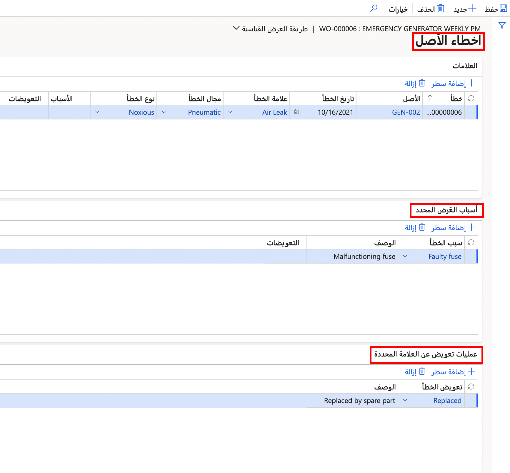

في جميع أوامر العمل، يمكنك إضافة خطأ محدد تم إنشاؤه للأصل المعين. ويتم إعداد هذه الأخطاء في مصمم الأخطاء. لمعرفة المزيد، انتقل إلى [إدارة الأخطاء](https://docs.microsoft.com/dynamics365/supply-chain/asset-management/setup-for-work-orders/fault-management/?azure-portal=true). 

يتم إعداد الأخطاء حسب أنواع الأصول. ومن ثَمَّ، عند إنشاء أمر عمل لأحد الأصول، ستتوفر فقط لهذا التحديد الأخطاء التي تم تعيينها لأنواع الأصول. على سبيل المثال، في أمر العمل الموضح في لقطة الشاشة الآتية، يكون الأصل هو "أداة الإنشاء" باستخدام نوع الأصل الخاص بـ "أداة الإنشاء".  

**إدارة الأصول > عام > أوامر العمل > جميع أوامر العمل**

 
في الصفحة **أخطاء الأصول**، يمكنك تحديد **الأعراض** و **أسباب الأعراض المحددة** و **الحلول الخاصة بالأعراض المحددة** لأنه تم إعدادها في **مصمم الخطأ**.

## إنشاء خطأ
قبل أن تتمكن من إضافة خطأ لأمر العمل، يجب إنشاء الخطأ.

1.  انتقل إلى **إدارة الأصول > الإعداد > الخطأ > مصمم الخطأ**.
2.  ضع المؤشر على **الرافعة الشوكية**.
3.  في القائمة العليا، حدد **إنشاء مجموعات الأخطاء**.
4.  في مربع الحوار، حدد **موافق**.
5.  أغلق الصفحة.

## إضافة خطأ إلى أمر العمل
والآن بعد أن تعرفت على كيفية إنشاء خطأ، اتبع الخطوات الآتية لإضافة خطأ إلى أمر العمل.

1.  انتقل إلى **إدارة الأصول > عام > أوامر العمل > جميع أوامر العمل**.
2.  حد أمر عمل.
3.  في القسم **الأصل**، حدد **خطأ الأصل‬**. تظهر الصفحة **خطأ الأصل**‬.
4.  في علامة التبويب السريعة **الأعراض**، حدد **إضافة بند**.
5.  في الحقل **أعراض الأخطاء**، حدد **مصهر محترق**.
6.  في الحقل **منطقة الخطأ**، أدخل **كهربائي**.
7.  في الحقل **نوع الخطأ**، أدخل **ضار**.
8.  في علامة التبويب السريعة **أسباب الأعراض المحددة**، حدد **إضافة بند**.
9.  في الحقل **سبب الخطأ**، حدد **مصهر معيب**.
10. أغلق الصفحة.

    
 
سيظهر كل خطأ يتم إنشاؤه على أحد أوامر العمل في صفحة الاستعلام، والتي يمكنك العثور عليها بالانتقال إلى **إدارة الأصول > الاستعلامات > خطأ الأصل > أخطاء الأصول**.

 
بالإضافة إلى ذلك، في الصفحة **إدارة الأصول > عام > الأصول > تفاصيل كل الأصول** لأحد الأصول، في علامة التبويب **عام**، يمكنك إنشاء تقرير حول جميع الأخطاء التي تم تسجيلها لأحد الأصول. 

