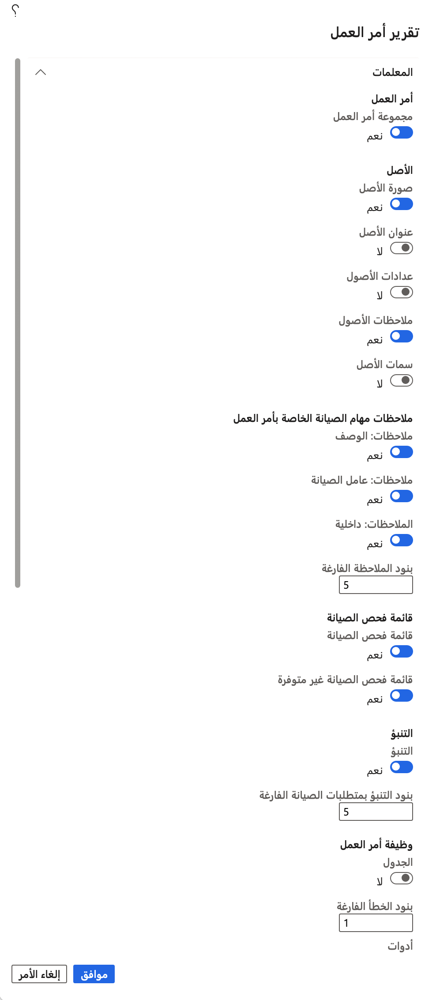
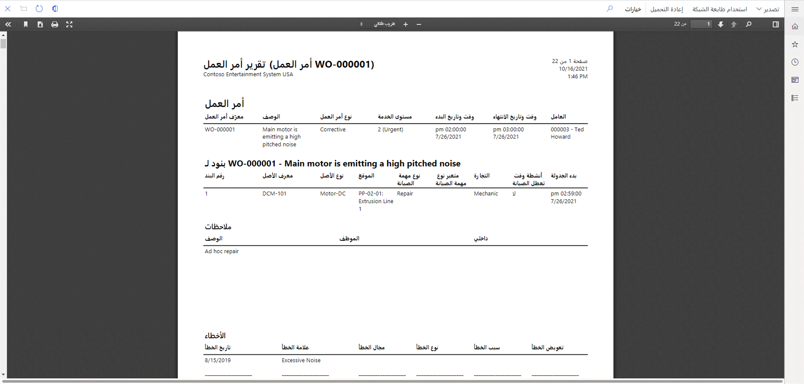

إن تقرير أمر العمل أحد التقارير الرئيسية لمستخدمي إدارة الأصول. وهذا التقرير يوفر معلومات تفصيلية حول أمر عمل واحد أو مجموعة محددة من أوامر العمل:

1.  انتقل إلى **إدارة الأصول > التقارير > أوامر العمل > تقرير أمر العمل**.
2.  يفتح مربع حوار **تقرير أمر العمل**، حيث يمكنك تحديد **نعم** أو **لا** في أزرار التبديل المختلفة لتحديد التفاصيل التي تريد إدراجها في التقرير. 

    في حالة وجود مهام صيانة ذات صلة، يمكنك إدراج هذه المعلومات في قسم **إعدادات الطباعة**، حيث يمكنك تحديد ما إذا كنت تريد إدراج المرفقات من إعداد نوع مهمة الصيانة ذات الصلة .

3.  في علامة التبويب السريعة **السجلات المراد تضمينها**، حدد **عامل التصفية** إذا كنت تريد تصفية محتويات التقرير حسب أوامر العمل.
4.  في علامة التبويب السريعة **تشغيل في الخلفية**، يمكنك تشغيل هذا التقرير كمهمة مجمعة وتحديد عدد مرات تشغيله في صفحة **التكرار**. 
5.  بعد انتهائك، حدد **موافق** لإنشاء التقرير.

توضح الصورة الآتية معلمات مختلفة يمكنك الاختيار من بينها لتشغيل تقريرك.

 
الصورة الآتية عبارة عن نموذج لصفحة من تقرير أمر العمل.

