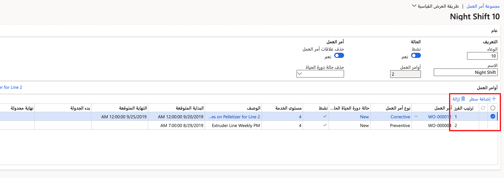
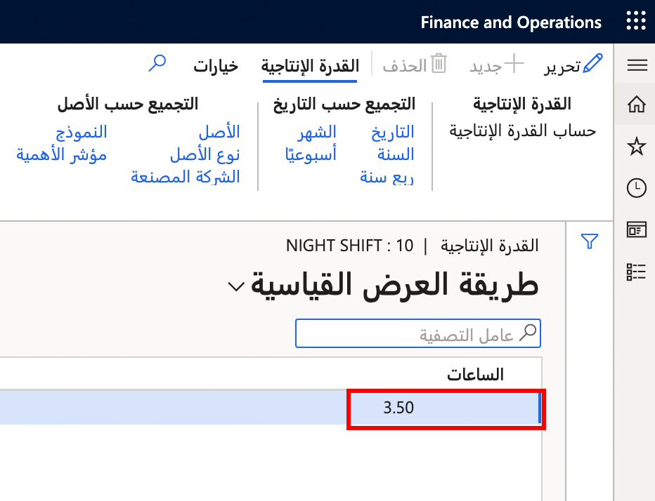
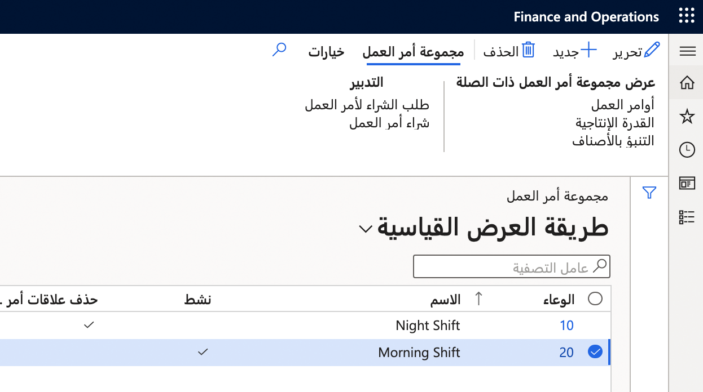
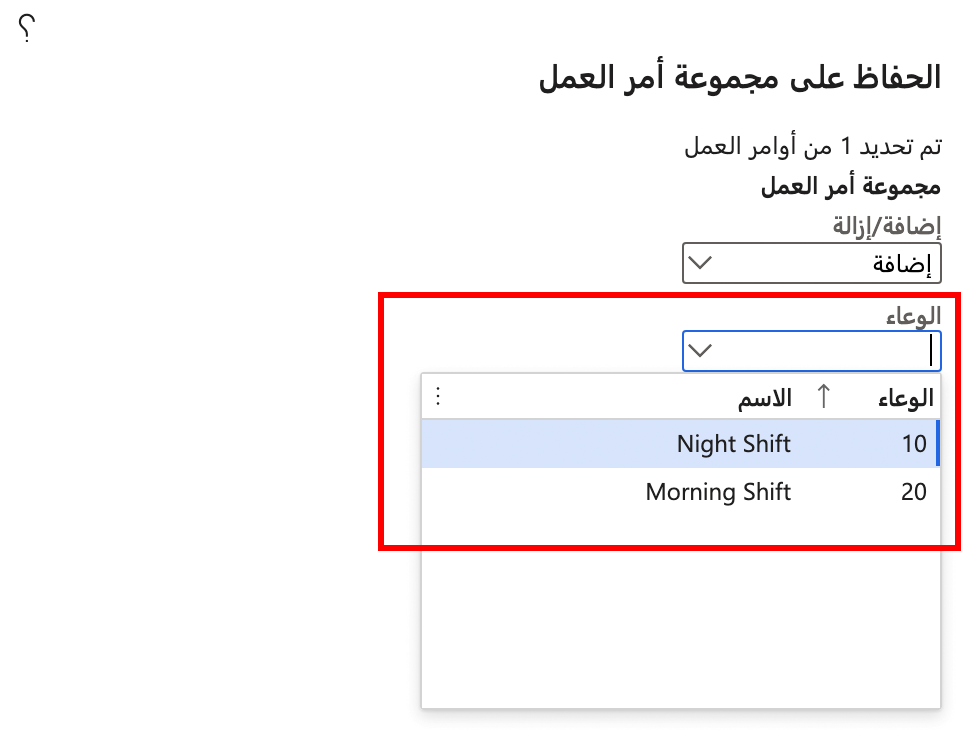

يتم استخدام أوعية أوامر العمل لتجميع أوامر العمل معاً لأسباب مختلفة للأعمال. تتضمن أنواع أوامر العمل التي يمكن تجميعها معاً:

- معدات تقنية معينة تتطلب تجهيزات معتمدة
- المواقع الفعلية
- أطقم العمل، على سبيل المثال، العاملون في الوردية الليلية

## إنشاء مجموعة أوامر عمل
اتبع الخطوات التالية لإنشاء مجموعة أوامر العمل:

1.  انتقل إلى **أداره الأصول > شائع > أوعية أوامر العمل > كافة أوعية أوامر العمل** أو **أوعية أوامر العمل النشطة**، وحدد **جديد**.
2.  في الحقل **الوعاء**، أدخل معرفاً لوعاء أوامر العمل هذا.
3.  في حقل **الاسم**، أدخل اسماً مثل **وردية ليلية**.
4.  قم بتعيين الخيار **النشط** إلى **نعم** إذا أردت جعل وعاء أوامر العمل هذا نشطاً.
5.  قم بتعيين الخيار **حذف علاقات أمر العمل** إلى **نعم** إذا كنت ترغب في إزالة أوامر العمل تلقائياً من وعاء أوامر العمل بعد الانتهاء منها. 
6.  في الحقل **حذف حالة دورة الحياة**، حدد حالة دورة الحياة لأمر العمل النهائي. على سبيل المثال، عند اكتمال أمر عمل، يمكن تعيين حالة دورة الحياة تلقائياً إلى حذف العلاقات لأوعية أوامر العمل.
7.  في علامة التبويب السريعة **أوامر العمل**، حدد **إضافة بند** لإضافة أوامر العمل.
8.  في الحقل **أمر العمل**، حدد أمر العمل. يتم تحديث الحقول المرتبطة تلقائيا.

وهناك ميزه أخرى **لوعاء أوامر العمل** هي العمود **ترتيب الفرز**، حيث يمكنك تحديد أولوية أوامر العمل، كما هو موضح في الصورة التالية.

 
في القائمة **وعاء أوامر العمل**، في القسم **عرض وعاء أوامر العمل المرتبطة**، يمكنك تحديد **القدرة الإنتاجية** لفتح مربع الحوار  **حساب القدرة الإنتاجية** لتحديد المعلمات. ووفقاً للتحديدات التي قمت بها، يمكنك عرض القدرة الإنتاجية الخاصة بجدول الصيانة وأوامر العمل غير المجدولة وأوامر العمل المجدولة. تعرض لقطة الشاشة التالية نطاق تاريخ أوامر العمل وإجمالي الساعات المحسوبة. 

 
مثل القدرة الإنتاجية، يمكنك تحديد **التنبؤ بالأصناف** لفتح مربع الحوار **حساب التنبؤ بالأصناف**. في مربع الحوار هذا، يمكنك إجراء التحديدات اللازمة لحساب التنبؤات وعرضها للأصناف (الأجزاء الاحتياطية والأصناف المطلوبة الأخرى) المرتبطة بجدول الصيانة وأوامر العمل غير المجدولة وأوامر العمل المجدولة. 

لعرض قائمة طلبات الشراء المرتبطة بأوامر العمل في وعاء أوامر العمل، في جزء الإجراء، في علامة التبويب **وعاء أوامر العمل**، في القسم **التدبير**، حدد **طلب شراء أمر العمل** لفتح الصفحة **طلب الشراء الخاص بأمر العمل**.

لعرض قائمة طلبات الشراء المرتبطة بأوامر العمل في وعاء أوامر العمل، في جزء الإجراء، في علامة التبويب **وعاء أوامر العمل**، في القسم **التدبير**، حدد **طلب شراء أمر العمل** لفتح الصفحة **طلب الشراء الخاص بأمر العمل**.

لحذف كافة بنود أمر العامل، قم بتعيين الزر **حذف علاقات أمر العمل** إلى **نعم**. ويعد هذا الخيار مفيداً إذا كنت ترغب في إنشاء وعاء فارغ يمكنك استخدامه لاحقا لأوامر العمل الأخرى، على سبيل المثال. عندما تكون مستعداً لاستخدام وعاء أمر العمل لإنشاء علاقات أمر عمل جديدة لاحقاً، تذكر تعيين الزر **حذف علاقات أمر العمل** إلى **لا**.

تعرض اللقطة التالية مثالاً لصفحة **وعاء أوامر العمل**.

**إدارة الأصول > شائع > أوعية أوامر العمل > كافة أوعية أوامر العمل**

## إضافة أمر عمل إلى وعاء أوامر عمل
يمكنك أيضاً إضافة أمر عمل إلى وعاء أوامر عمل من الصفحة **كافة أوامر العمل**.

1.  انتقل إلى **إدارة الأصول > عام > أوامر العمل > جميع أوامر العمل**.
2.  حدد أمر عمل لفتح الصفحة الخاصة به. في المجموعة **صيانة**، حدد **وعاء أوامر العمل** لفتح مربع الحوار **الاحتفاظ بوعاء أوامر العمل**.
3.  في الحقل **إضافة/إزالة**، حدد **إضافة** لإضافة وعاء أمر العمل ثم من الحقل **الوعاء**، يمكنك تحديد وعاء أوامر العمل من القائمة المنسدلة.
4.  عند الانتهاء، حدد **موافق**.

    **إدارة الأصول > شائع > أوامر العمل > كافة أوامر العمل** > تحديد أمر عمل > **وعاء أوامر العمل**
 
    