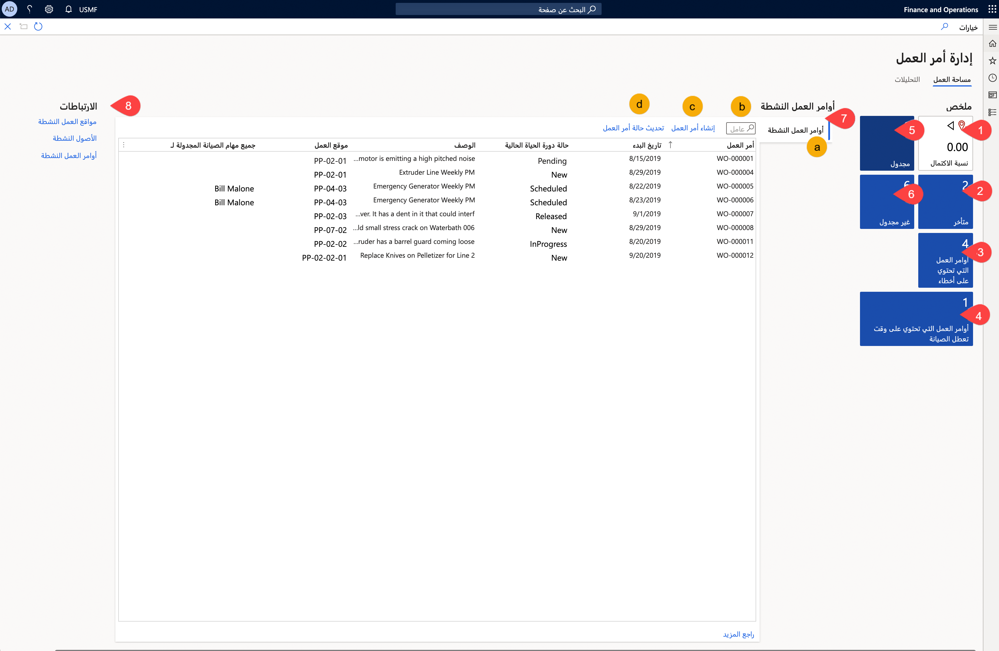

تقوم مساحة العمل **إدارة أمر العمل** أيضاً بعرض موقع واحد لعرض جميع أوامر العمل لديك في "إدارة الأصول" وإدارتها. 

**إدارة الأصول > أوامر العمل > إدارة أمر العمل**

 
يمكنك الوصول إلى مساحة العمل من خلال تحديد **إدارة الأصول > مساحات العمل > إدارة أمر العمل**. وتراجع القائمة التالية الإطارات المتجانبة وعلامات التبويب التي تم العثور عليها في صفحة **إدارة أمر العمل** بمزيد من التفاصيل، ويتوافق الترقيم مع الصورة السابقة:

1.  **اكتمال** – يوفر عرضاً لعدد أوامر العمل المكتملة. ويؤدي تحديد الإطار المتجانب إلى نقلك إلى الصفحة **اكتمال**. وتقدم الصفحة **اكتمال** تحليلات ومعلومات تشخيصية لإدارة أوامر العمل لديك.
1.  **مؤجلة** – يعرض عدد أوامر العمل التي تم تأجيلها في عملية الإصلاح. ويؤدي تحديد هذا الإطار المتجانب إلى نقلك إلى الصفحة **أوامر العمل النشطة** وتقوم بتصفية البيانات لعرض أوامر العمل التي تم تأجيلها فقط.
1.  **أوامر عمل تحتوي على أخطاء** – تلخص عدد أوامر العمل التي تحتوي على أخطاء مرتبطة بها. ويؤدي تحديد هذا الإطار المتجانب إلى نقلك إلى الصفحة **أوامر عمل تحتوي على أخطاء**. 
1.  **أوامر عمل لها وقت تعطل صيانة** – يلخص عدد أوامر العمل التي لها وقت تعطل صيانة مرتبط بها. ويؤدي تحديد هذا الإطار المتجانب إلى نقلك إلى الصفحة **أوامر عمل لها وقت تعطل صيانة**.
1.  **مجدولة** – يلخص إجمالي عدد أوامر العمل المجدولة للإصلاح أو الصيانة. ويؤدي تحديد الإطار المتجانب إلى نقلك إلى الصفحة **أوامر العمل النشطة**.
1.  **غير مجدولة** – يلخص إجمالي عدد أوامر العمل التي لم تتم جدولتها للإصلاح أو الصيانة حتى الآن. ويؤدي تحديد هذا الإطار المتجانب إلى نقلك إلى الصفحة **جميع أوامر العمل**.
1.  يوجد في القسم الأوسط علامة تبويب فردية بعنوان **أوامر العمل النشطة** وارتباطات سريعة أيضاً لمساعدتك على إنشاء أمر العمل وتحديث حالة دورة حياة الصيانة.

    1. **أوامر العمل النشطة** - تعرض أوامر العمل النشطة مع رقم **أمر العمل** الخاص بها و **تاريخ البدء** و **حالة دورة الحياة الحالية** و **الوصف** و **موقع العمل** و **جميع مهام الصيانة المجدولة** للتفاصيل.

    1.  **عامل التصفية** – يوفر خيار البحث عن أمر عمل محددة وتصفيته.

    1.  **إنشاء أمر العمل** – يوفر ارتباطاً سريعاً لفتح مربع الحوار **إنشاء أمر عمل**. 

    1.  **تحديث حالة أمر العمل** - بعد تحديد أمر العمل، يمكنك استخدام هذا الارتباط لإدارة حالة أمر العمل وتحديثها بسرعة.

1.  **الارتباطات** - تتوفر للوصول السريع إلى عرض **مواقع العمل النشطة** و **الأصول النشطة** و **أوامر العمل النشطة** وتحديثها.