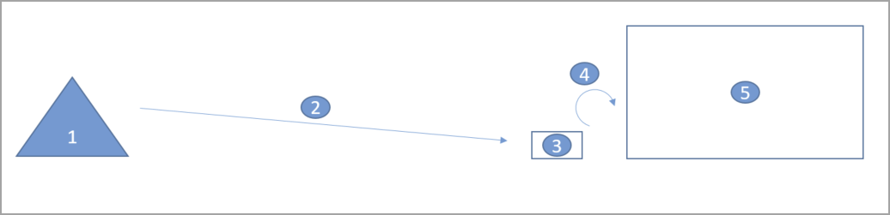
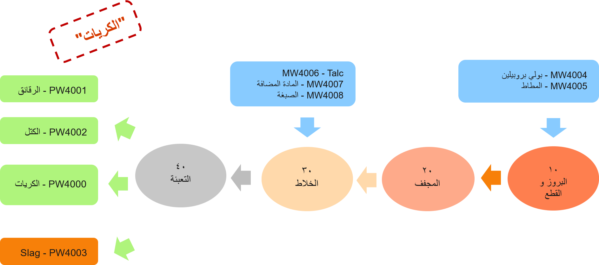
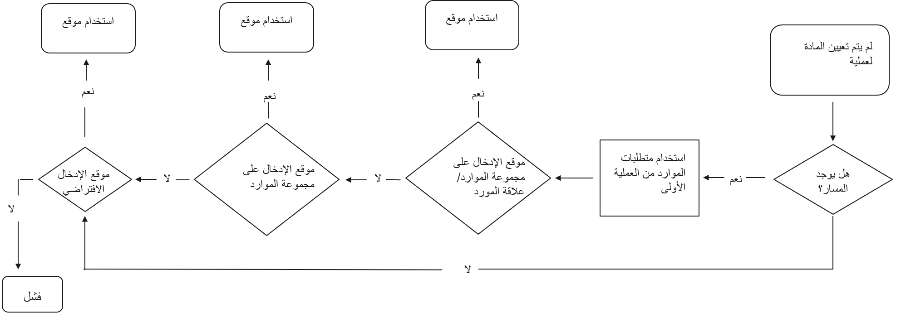
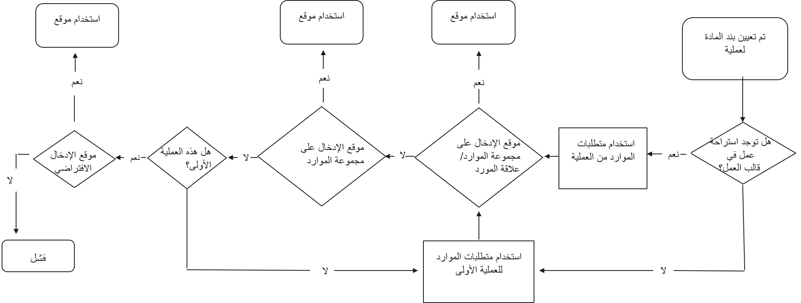

الاستهلاك هو العملية التي تقتطع مواد من المخزون الفعلي وتقوم بتعيين قيمه المواد المستهلكة إلى **العمل الجاري** (‏WIP) لأوامر الإنتاج وأوامر المجموعة. ويتم عادةً استهلاك المواد الخام من موقع تم تكوينه للعملية التي تستهلك المواد. ويُعرف هذا الموقع بموقع إدخال الإنتاج.

قبل استهلاك المواد، يتم نقل المواد إلى موقع الإدخال. تعرض الصورة التالية هذه العملية.

1.  مستودع المواد
2.  انتقاء المواد الخام
3.  موقع إدخال الإنتاج
4.  استهلاك المواد الخام
5.  عملية الإنتاج

لدعم عملية فعّالة لانتقاء المواد الخام في الإنتاج، يمكنك تقسيم عمل المستودع من أجل انتقاء المادة الخام لكل عملية توجيه.

في مجموعات الموارد، والعلاقة بين مجموعه الموارد والمورد، يمكنك إعداد موقع إدخال الإنتاج لاستخدامه في العمل الخاص بالمستودع. تساعد هذه الميزة على تأمين عملية انتقاء أكثر فعالية لأوامر الإنتاج وأوامر المجموعة لأن عمل المستودع سيقوم بتوجيه العامل في المستودع بدقة إلى المواقع التي يتم استهلاك المواد فيها. تعد هذه العملية مفيدة في سيناريو الإنتاج المجمّع/التعبئة"

## مثال

في هذا السيناريو، توجد عملية واحدة لإجراء المواد المجمعة وتوجد عملية واحدة للتعبئة والتغليف. تعمل هاتان العمليتان على استهلاك المواد، لكن سيتم تنفيذ العمليتين في مواقع تقليدية مختلفة، ومن المحتمل داخل مبانٍ مختلفة. سيؤدي تقسيم العمل لكل عملية، في هذه الحالة، إلى تأمين عملية يتم فيها توجيه عامل المستودع، من خلال عمل المستودع، لتسليم المواد المنتقاة إلى المواقع بالضبط التي يتم استهلاك المواد فيها.

تعرض الصورة التالية إنتاج الحبيبات من شركة USPI، والتي تتوفر في بيانات العينة القياسية المتوفرة في Supply Chain Management التي يتم تثبيتها باستخدام Lifecycle Services‏.

 
 
توفر المعلومات التالية نظرة عامة حول الأصناف الموجودة في الصورة:

-   وتبدأ أرقام الأصناف الخاصة بالمكونات (أو المواد الخام) بالحرفين **MW**.
-   تكون الأصناف الأربعة النهائية مسبوقة بالحرفين **PW**:
    -   **PW4000 - Pellets** هو عنصر المعادلة.
    -   **PW4001 - الشرائح** و **PW4002 - الكتل** هي المنتجات المشتركة.
    -   **PW4003 - Slag** هي منتج ثانوي.

وبمجرد ان تظهر الصورة، يتم استهلاك المكونات من إنتاج الحبيبات في عمليتين مختلفتين. توضح الأقسام التالية كيفية تقسيم العمل الآن لكل عملية عند إصدار أمر مجموعة لمعادلة الحبيبات.

أولاً، قم بإنشاء أمر مجموعة للحبيبات وتنفيذ الخطوات **التقدير** و **الجدولة** و **الإصدار**. في خطوة **الإصدار**، يتم إنشاء عمل المستودع ويتم إنشاء عنصري عمل المستودع.

-   يكون عنصر العمل الأول خاصاً بتخصيص المواد لعملية الانبثاق، وهي العملية الأولى في التوجيه. يتم تخصيص المواد لموقع إدخال الإنتاج في EXT.

-   عنصر العمل الثاني خاص بتخصيص المواد لعملية الخلط.
    يتم تخصيص المواد لموقع إدخال إنتاج في MIX.

## تمكين موقع إدخال الإنتاج

يلقي هذا القسم نظرة عن كثب حول كيفية تمكين موقع إدخال الإنتاج.

أولاً، قم بإعداد مواقع إدخال الإنتاج التي سيتم تطبيقها على عمليات التوجيه. تشتمل معادلة الحبيبات مسار إنتاج مزود بأربعة عمليات.

العملية الاولي، **PPExtCut**، تستهلك **MW4004 - بولي بروبيلين** و **MW4005 - المطاط**. ويتم العثور على موقع إدخال إنتاج قابل للتطبيق لهذه العملية من خلال **متطلبات الموارد** الخاصة بالعملية. في القسم **متطلبات الموارد** الخاص بالمسار، يمكنك إعداد معايير للعثور على مورد قابل للتطبيق أو مجموعة موارد أثناء الجدولة.

يمكن تحديد موقع الإدخال في مجموعة الموارد، ولكن أيضاً في العلاقة بين مجموعة الموارد والمورد.

في حالة عدم العثور على أي مواقع إدخال من مجموعات الموارد أو علاقات مجموعات الموارد، يتم استخدام موقع إدخال الإنتاج الافتراضي كموقع احتياطي. يتم إعداد موقع الإدخال الافتراضي في المستودع.

بعد إعداد مواقع الإدخال، يجب تحديد العمليات التي تستهلك المواد. يمكنك إعداد هذا التعيين على بنود المواد باستخدام الحقل **رقم العملية**. إذا لم يتم تحديد أي عملية في بند المادة، يمكنك البحث عن موقع إدخال الإنتاج من مجموعة الموارد أو علاقة مجموعه الموارد، والتي تنطبق على العملية الأولى في مسار الإنتاج. في حالة عدم العثور على مواقع إدخال قابلة للتطبيق، فسيتم استخدام موقع الإدخال الافتراضي للمستودع.

يتم عرض التدرج الهرمي الافتراضي في الرسومات التخطيطية التالية.

يعرض المخطط الأول القواعد التي يتم تطبيقها للبحث عن موقع إدخال الإنتاج لبند المادة الذي يتم تعيينه إلى عمليه المسار الأول أو الذي لا يحتوي على موقع محدد.

يعرض المخطط الثاني القواعد التي يتم تطبيقها للبحث عن موقع إدخال الإنتاج لبند المادة الذي لم يتم تعيينه إلى العملية الأولى، لكن إلى إحدى العمليات التالية في مسار الإنتاج.

عند إنشاء قالب عمل جديد لانتقاء المادة الخام، يتم إدراج فاصل عمل تلقائياً. يتم تكوين فاصل العمل هذا من خلال Supply Chain Management لمجموعه العمل لكل عملية توجيه. يمكنك إزالة فاصل العمل، وفي هذه الحالة، سيتم إنشاء عنصر عمل واحد فقط عند الإصدار إلى المستودع من الإنتاج. وفي هذه الحالة، يتم استخدام موقع الإدخال الذي يتم العثور عليه من العملية الأولى في المسار كموقع إدخال الإنتاج، وإذا لم يتم العثور على أي شيء في المسار، يتم إعداد موقع الإدخال الافتراضي للمستودع.
