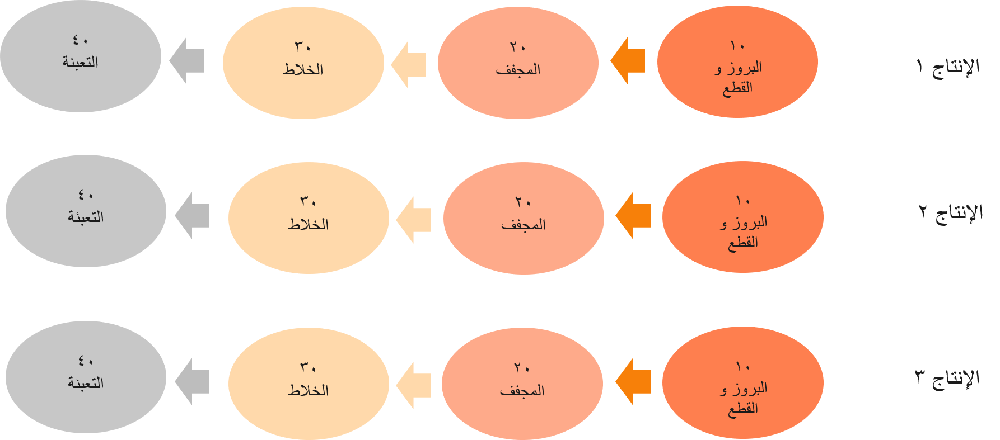

موقع إخراج الإنتاج هو المكان الذي يتم فيه تخزين الصنف النهائي بعد إنتاجه. عادةً ما يكون هذا الموقع قريباً من عملية الإنتاج التي تنتج السلعة النهائية. يتم استخدام موقع إخراج الإنتاج كمخزن وسيط للمادة قبل نقلها إلى منطقة الشحن، وموقع التخزين، وموقع إدخال الإنتاج لعملية الإنتاج النهائية، وما إلى ذلك.

لمتابعة مثال إنتاج الحبيبات من الوحدة السابقة، تُظهر الصورة التالية العديد من مواقع المخرجات للإنتاج لكل عملية إنتاج أو أمر دفعي. توفر العديد من مواقع مخرجات الإنتاج لعامل المستودع نظرة عامة أفضل على مكان انتقاء المنتجات النهائية للتخزين النهائي.

 

يتم تعيين موقع إخراج الإنتاج الافتراضي عند الإبلاغ عن البضائع المنتهية في أمر الإنتاج أو الأمر الدفعي. يتم استخدام التدرج الهرمي التالي لتحديد موقع الإخراج هذا:

1.  استخدم موقع الإخراج المحدد في أمر الإنتاج أو رأس الأمر الدفعي.
2.  إذا لم يتم العثور على موقع هناك، فاستخدم موقع الإخراج المحدد في المورد الذي تستخدمه آخر عملية تم تحديدها في مسار الإنتاج.
3.  إذا لم يتم العثور على موقع هناك، فاستخدم موقع الإخراج المحدد في مجموعة الموارد التي يستخدمها المورد للعملية الأخيرة التي تم تحديدها في مسار الإنتاج.
4.  إذا لم يتم العثور على موقع هناك، فاستخدم موقع الإخراج المحدد في المستودع المحدد لأمر الإنتاج.

يتم تعيين موقع إخراج الإنتاج الافتراضي فقط للمنتجات التي تم إعدادها باستخدام عمليات المستودعات المتقدمة. عندما يتم الإبلاغ عن هذا النوع من الأصناف على أنه منتهي، يتم إنشاء عمل المستودع الخاص **بالبضائع المنتهية** أو **‏‫تخزين المنتج المساعد والمنتج الثانوي‬**. يستخدم هذا النوع من العمل موقع إخراج الإنتاج كموقع انتقاء. يتم تحديد موقع التخزين من خلال توجيهات الموقع.