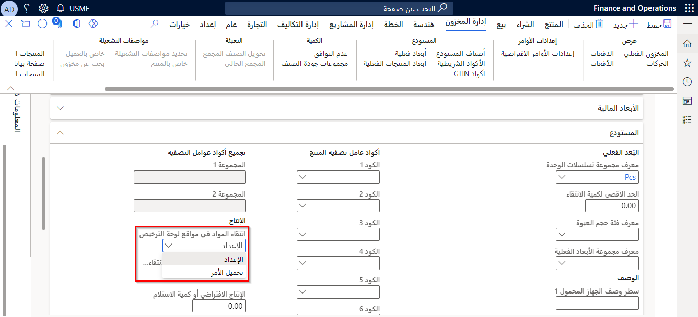
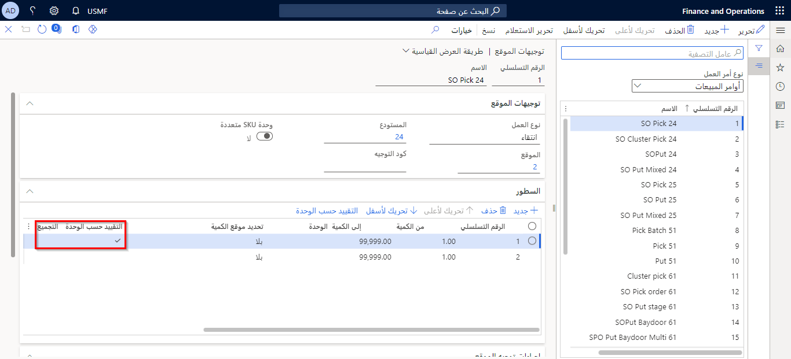

اختيار المواد الخام له مبدآن من مبادئ الانتقاء: 

- انتقاء الأمر
- التدريج 
 
المصطلح *انتقاء الطلب* يستخدم عندما يتم اختيار الكمية المطلوبة، بينما المصطلح *التدريج* يتم استخدامه عند نقل الكمية الكاملة الموجودة على لوحة الترخيص المختارة. يمكنك ضبط أي من المبدأين يجب استخدامه لانتقاء المواد الخام. يمكنك التحكم في هذه السياسة على مستوى الصنف باستخدام **انتقاء المواد في مواقع لوحة الترخيص** في مجال **المستودع** علامة التبويب السريعة.

**إدارة معلومات المنتجات >المنتجات > المنتجات الصادرة**

  

عندما يتم إنشاء منتج جديد، فإن قيمة **انتقاء المواد في مواقع لوحة الترخيص** يُضبط الحقل على **انتقاء الطلب**.

## تقريب العمل لانتقاء المواد الخام

يمكنك ضبط توجيه الموقع لانتقاء المواد الخام، لتقريب العمل إلى أقرب وحدة معالجة المواد يتم فيها انتقاء المادة للإنتاج. **التقريب إلى وحدة** يتم استخدام الحقل جنباً إلى جنب مع **تقييد حسب الوحدة** حقل.

**إدارة المستودعات > إعداد > توجيهات الموقع**

 