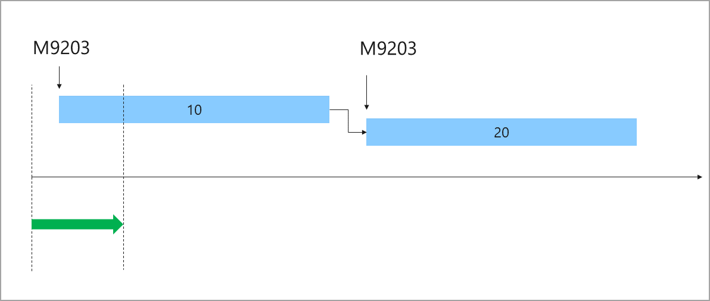
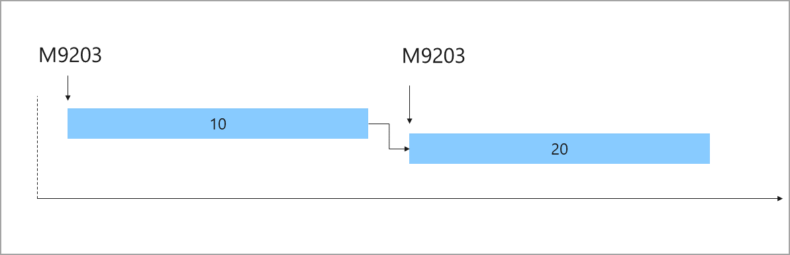

تصف هذه الوحدة عملية إصدار المواد الخام لبنود قائمة مكونات الصنف (BOM) وخطوط المعادلة إلى المستودع. عندما تقوم إصدار قائمة مكونات الصنف أو بند المعادلة إلى المستودع، يحدد النظام أولاً إذا كانت المادة متاحة بالفعل في موقع إدخال الإنتاج في أرضية المتجر حيث سيتم استهلاك المواد لعملية الإنتاج.

-   إذا كانت المادة متاحة في موقع إدخال الإنتاج، فسيتم انتقاؤها من هذا الموقع فوراً بعد إعطاء الإشارة لإصدار المواد إلى المستودع.

-   إذا لم تكن المادة متاحة في موقع إدخال الإنتاج، يشير إصدار المادة إلى أنه يجب نقل المواد من المواقع الموجودة في المستودع إلى موقع إدخال الإنتاج. يتم نقل المواد عن طريق أعمال المستودعات لانتقاء المواد الخام. لذلك، يجب ضبط عمليات المستودعات لانتقاء المواد الخام. لمزيد من المعلومات، راجع الارتباطات المتوفرة في وحدة الملخص في هذه الوحدة.

## طرق إصدار قائمة مكونات الصنف وخطوط المعادلة

يمكنك تكوين إصدار قائمة مكونات الصنف وبنود المعادلة بحيث يحدث كجزء من إصدار أمر الإنتاج أو أمر الدُفعة.
بدلاً من ذلك، يمكن التحكم في الإصدار من خلال وظيفة دفعية أو القيام به كتفاعل يدوي.

يتم التحكم في الطريقة المستخدمة لإصدار قائمة مكونات الصنف وخطوط المعادلة بواسطة المعيار **إصدار خط الإنتاج**. يمكنك العثور على هذه المعيار في **التحكم في الإنتاج > الإعداد > معايير الإنتاج**.

-   **إصدار قائمة مكونات الصنف وبنود المعادلة كجزء من الإنتاج أو إصدار الأمر الدُفعي** - في هذه الطريقة، يتم إصدار قائمة المواد وبنود المعادلة لأمر الإنتاج أو الدُفعة كجزء من عملية إصدار الأمر. عادةً، أثناء إصدار أمر الإنتاج أو الدُفعة، يتم إصدار مهام الإنتاج لعمال ورشة العمل ويتم طباعة أوراق الإنتاج. أثناء هذه العملية، تتغير حالة الطلب أيضاً إلى **تم الإصدار**.

-   **إصدار قائمة مكونات الصنف وخطوط المعادلة عبر وظيفة دفعية أو كتفاعل يدوي** - في هذه الطريقة، لا يمكن إصدار قائمة مكونات الصنف وخطوط المعادلة إلا من خلال **الإصدار التلقائي لقائمة المواد وخطوط المعادلة** دفعة عمل أو كتفاعل يدوي. لإصدار قائمة مكونات الصنف وسطر المعادلة يدوياً، في صفحة القائمة **أمر الإنتاج** أو صفحة **تفاصيل أمر الإنتاج**، في جزء الإجراء، حدد **الإصدار إلى المستودع**.

## إصدار قائمة المواد وبنود المعادلة باستخدام وظيفة دفعية

تمر مهمة الدُفعة **الإصدار التلقائي لقائمة المواد وخطوط المعادلة** عبر قائمة المواد المحددة وأسطر المعادلة التي تحتوي على كمية متبقية يجب إصدارها. تعتبر الوظيفة فقط الطلبات التي لها حالة **تم إصدارها**، أو **تم البدء**، أو **تم الإبلاغ عن أنها منتهية**. إذا كان هناك كمية متبقية في قائمة مكونات الصنف أو بند معادلة، يتم إصدار الوظيفة حتى الكمية التي يمكن تغطيتها بالكمية التي تم حجزها فعلياً والكمية المتوفرة فعلياً.

### مثال على إصدار الوظيفة الدُفعية

| السيناريو| الكمية المتبقية للإصدار| الكمية المحجوزة فعلياً| الكمية المتاحة فعلياً| الكمية الصادرة عن الوظيفة الدفعية|
 | ------------- | ------------- |
 | 1| 100 | 20 | 90 | 100 |
 | 2| 100 | 20 | 70 | 90 |
  | 3| 100 | 0 | 90 | 90 |
  | 4| 100 | 0| 110 | 100 |
  | 5| 100 | 20 | 0| 20 |
 
### إعداد وظيفة الدفعية

في الاستعلام الخاص بوظيفة الدُفعات **الإصدار التلقائي لقائمة المواد وأسطر المعادلة**، يمكنك إعداد معيار عامل التصفية لتحديد عدد الأيام التي يجب أن تبحث فيها الوظيفة عن البنود التي تحتوي على كميات لم يتم إصدارها. في الاستعلام عن الوظيفة، في الحقل **تاريخ المادة الخام**، استخدم الوظيفة **(LessThanDate())** كعامل تصفية.

تُظهر الصورة التالية أمر إنتاج يحتوي على وظيفتين، 10 و20، تغطيان التجميع والتعبئة لأمر الإنتاج. تم إعداد كل وظيفة لاستهلاك كمية من المواد. في هذه الصورة، الحد الزمني للإصدار المشار إليه بالسهم الأخضر أسفل الخط الزمني يساوي عدد الأيام التي تم تحديدها في المعيار **(LessThanDate())**. على سبيل المثال، يشير **(LessThanDate(2))** إلى أن الوظيفة يجب أن تبحث عن الكميات التي لم يتم الإفراج عنها إلا في غضون فترة زمنية مدتها يومين.

 

## إصدار المواد لكل رقم عملية أو بما يتناسب مع كمية البضائع النهائية

إذا قمت بإصدار مواد باستخدام إعداد المعلمة **في إصدار أمر الإنتاج**،فعند إجراء إصدار يدوي، يكون لديك خياران للتحكم في إصدار المادة:

-   إصدار المواد لكل رقم عملية.
-   إصدار المواد بما يتناسب مع كمية البضائع الجاهزة.

## إصدار المواد لكل رقم عملية

للتحكم في العمليات التي يجب إصدار المواد إليها، استخدم صفحة **الإصدار إلى المستودع**.

-   حدد **التحكم في الإنتاج > أوامر الإنتاج > كل أوامر الإنتاج**، وحدد أمر الإنتاج، ثم في **المستودع** علامة التبويب، حدد **إصدار إلى المستودع**. ثم استخدم **من عامل التشغيل رقم.** و **من عامل التشغيل رقم.** حقول لتحديد نطاق أرقام العمليات.

تُظهر الصورة التالية أمر إنتاج يحتوي على عمليتين: 10 و20.
في هذا المثال، إذا قمت بقصر الإصدار على العملية 10، فسيتم إصدار المادة M9203 فقط.

 

للحصول على عرض توضيحي سريع لكيفية إصدار المواد بما يتناسب مع كمية البضائع الجاهزة، شاهد مقطع الفيديو القصير YouTube عن طريق تحديد الارتباط الذي يتم توفيره في وحدة الملخص في هذه الوحدة.

## إصدار المواد بما يتناسب مع كمية البضائع الجاهزة

يمكنك إصدار مادة خام لكمية جزئية من البضائع النهائية أو في وحدة معينة.

-   لإصدار مادة خام لكمية جزئية من البضائع النهائية، حدد **التحكم في الإنتاج > أوامر الإنتاج > كل أوامر الإنتاج** وحدد أمر الإنتاج، ثم في **المستودع** حدد علامة تبويب **إصدار إلى المستودع**. ثم أدخل كمية في الحقل **الكمية**.

     على سبيل المثال، يتم إنشاء أمر إنتاج وجدولته لـ 1،000 قطعة (قطعة). يخطط مشرف ورشة العمل لإنتاج 100 قطعة. من أجل التحول التالي ويريد إطلاق مواد لهذا التحول فقط. في هذه الحالة، يمكن للمشرف استخدام حقل **الكمية** لإصدار المواد لـ 100 قطعة. التي تم التخطيط لها في التحول التالي.

-   لإصدار مادة خام في وحدة معينة، حدد **التحكم في الإنتاج > أوامر الإنتاج > كل أوامر الإنتاج**، وحدد أمر الإنتاج، ثم في **المستودع**، حدد علامة تبويب **الإصدار إلى المستودع**. بعد ذلك، استخدم الحقل **الوحدة** لتحديد وحدة السلعة النهائية لإصدار المواد فيها.

     يتم تحديد الوحدات المتوفرة في معرف مجموعة تسلسلات الوحدة للسلعة النهائية. على سبيل المثال، تحتوي السلعة النهائية على وحدة تحويل الوحدات التالية بين أرطال (رطل) ومنصة نقالة (PL): 1 رطل = 100 رطل. لإنشاء أمر إنتاج بقيمة 10000 رطل. من السلعة النهائية، يمكنك إصدار المواد الخام لعدد المنصات التي تخطط لإنتاجها. حدد **PL** كوحدة، ثم حدد الرقم المقابل في حقل **الكمية**.
