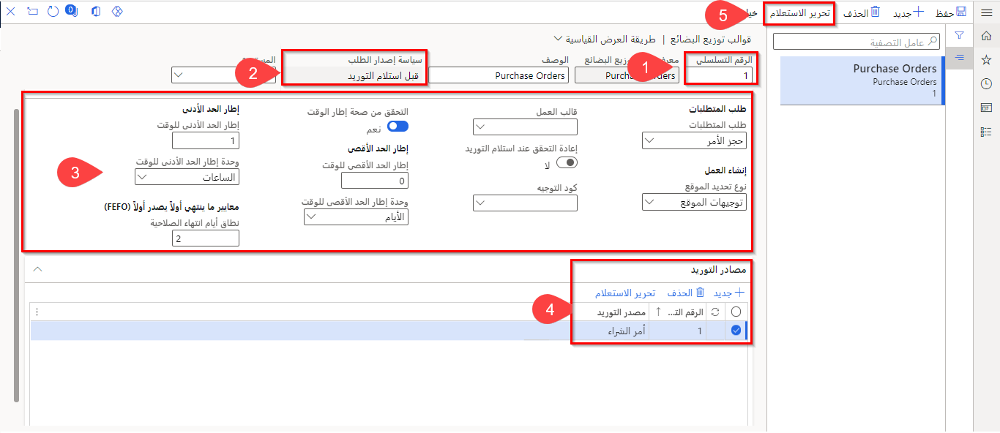
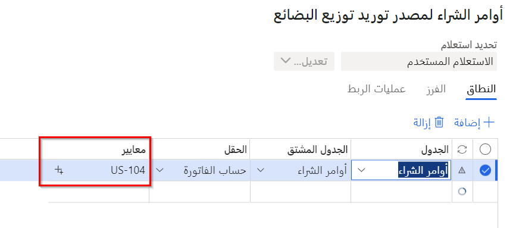
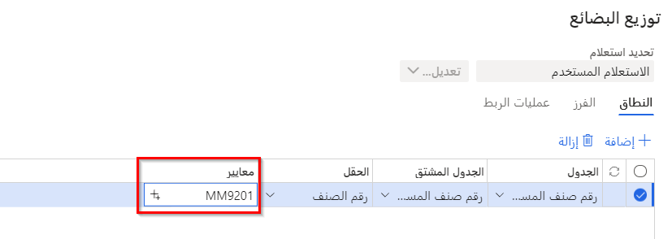
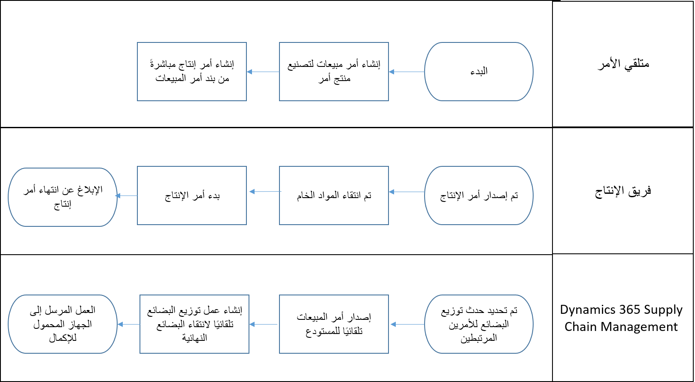

تتيح لك ميزة توزيع البضائع المخططة نقل المخزون الوارد لأمر موجود مباشرةً إلى منطقة التوزيع أو منطقة التدريج الصادرة. إذا لم يكن المخزون ضرورياً للأوامر، فسيتم توجيهه إلى موقع التخزين الصحيح من خلال عملية الإيداع العادية. تقلل هذه العملية من لمسات المخزون والوقت والمساحة في المستودع.

يمكن لخيار قالب **توزيع البضائع** أن يجعل عملية توزيع البضائع تلقائية. توضح لقطة الشاشة التالية كيفية استخدام النموذج في **إدارة المستودعات > الإعداد > العمل >قوالب توزيع البضائع**.

1.  يشير **رقم التسلسل** إلى الترتيب الذي سيحدد به النظام البيانات من النموذج. إذا كانت البيانات لا تفي بالمعايير المحددة، فسينتقل النظام إلى التسلسل التالي، وهكذا دواليك، حتى يتم استيفاء المعايير (إن وجدت).
2.  ستكون **سياسة إصدار الطلب** التي ستحددها إما **قبل استلام التوريد** أو **عند استلام التوريد**. بمعنى آخر، يعتمد التحديد على ما إذا كان سيتم التخطيط له قبل استلامه أم أنه سيتم التخطيط له فقط في وقت استلامه. 
3.  تحتوي علامة التبويب السريعة **التخطيط** على عدة خيارات:

    - **متطلبات الطلب** – حدد **محدد** إذا كان الطلب مطلوباً لربطه بالتوريد قبل الإصدار، أو حدد **حجز الطلب** إذا كان الطلب مطلوب مقابل العرض قبل الإصدار.

    - **إنشاء العمل** – يحدد كيفية العثور على مواقع الوضع، والتي تستند إلى توجيهات الموقع أو الموروثة من المواقع الموجودة على الشحنة.
 
    - **قالب العمل** – حدد هذا الخيار إذا كنت بحاجة إلى إعداد أي قوالب عمل توزيع البضائع.

    - **إعادة التحقق عند استلام التوريد** – يشير هذا الخيار إلى ما إذا كان يجب إعادة التحقق من التوريد أثناء الاستلام أم لا. إذا تم تعيين الخيار على **نعم**، فسيتم تحديد أقصى فترة زمنية ونطاق أيام انتهاء الصلاحية لتلك الأطر الزمنية.

    - **تحقق من نافذة الوقت** – يشير إلى ما إذا كان يجب تقييم أقصى نافذة زمنية عند تحديد مصدر الإمداد.

    - **أقصى نافذة زمنية** – أقصى فترة زمنية مسموح بها بين وصول العرض ومغادرة الطلب.  

    - **أقصى نافذة زمنية للوحدة** – تشير إلى نافذة زمنية بحد أقصى أيام أو ساعات.

    - **الحد الأدنى للنافذة** – الحد الأدنى للفترة الزمنية المسموح بها بين وصول العرض ومغادرة الطلب. 

    - **الحد الأدنى من وحدة النافذة الزمنية** – يشير إلى الحد الأدنى من النافذة الزمنية للأيام أو الساعات.

    - **نطاق أيام انتهاء الصلاحية** – الحد الأقصى للأيام بين تاريخ انتهاء صلاحية الدُفعة الأولى المنتهية الصلاحية والدُفعة التي يتم استلامها.

4. في منطقة **مصادر التوريد** يمكنك تنفيذ الإجراءات التالية: 

    - حدد بين **أمر الشراء**، **أمر الإنتاج**، و **إيصال أمر التحويل**. 

    - استخدم الخيار **تحرير الاستعلام** لتحديد مورد معين في أمر الشراء أو حقل آخر في مصدر التوريد المحدد (على سبيل المثال). 

    

5. في الجزء العلوي من الصفحة يوجد خيار **تحرير الاستعلام** آخر. ومع ذلك، فإن الحقل الوحيد المراد تحديده هو **رقم الصنف**، والذي سيشير إلى العنصر (العناصر) التي سيتم إرساءها بشكل عرضي. 

     

## الإصدار التلقائي للشحنة لتوزيع البضاعة

تتيح لك ميزة **الإصدار التلقائي للشحنة لتوزيع البضائع** إمكانية إصدار أمر إلى المستودع تلقائياً عندما يتم الإبلاغ عن أمر الإنتاج الذي يوفر المنتج كمنتهي. يتم نقل الكمية المطلوبة لأمر المبيعات أو أمر التحويل مباشرةً من موقع إخراج الإنتاج إلى موقع الصادر. 

- على عكس المناقشة السابقة حول توزيع البضائع، تدعم هذه الميزة أوامر الإنتاج فقط كعرض وأوامر المبيعات وأوامر التحويل فقط كطلب. 

- يمكن بدء توزيع البضائع حتى إذا لم يتم تحرير أمر الطلب (المبيعات أو النقل) إلى المستودع قبل الإبلاغ عن أمر الإنتاج كمنتهي. 

### مثال - تدفق توزيع البضائع للإصدار التلقائي للشحنة

يوضح الرسم التخطيطي التالي مثالاً على تدفق توزيع البضائع للإصدار التلقائي للشحنة.

