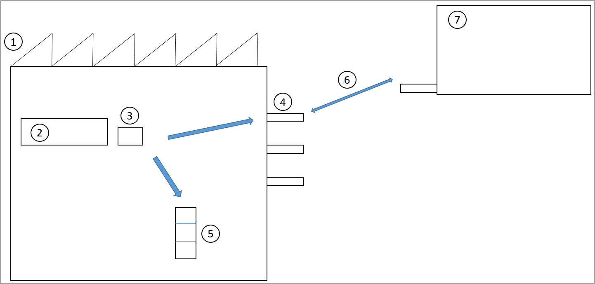

يعد توزيع البضائع من الإنتاج إلى الموقع الخارجي مناسباً للمصنعين الذين ينتجون كميات كبيرة ويريدون شحن المنتجات النهائية بشكل مثالي بمجرد الإبلاغ عن انتهاء خطوط الإنتاج من إنهاءها. والغرض من ذلك هو شحن المنتجات إلى مراكز التوزيع الموجودة فعلياً بالقرب من طلب العملاء بدلاً من تكديس المخزون في موقع التصنيع.

وفي حالة عدم وجود طلب فوري على منتج ما، فيجب تخزينه في المستودعات في موقع التصنيع. يُطلق على هذه العملية أيضاً اسم *توزيع البضائع الانتهازي*، مما يشير إلى أنه إذا كان هناك طلب على شحن المنتج، فيجب انتهاز هذه الفرصة بدلاً من وضع المنتج جانباً بغرض التخزين الداخلي.

يوضح المثال التالي ثلاثة أشكال مختلفة للسير الذي يبدأ في نهاية خط الإنتاج (2).

 

يتم الإبلاغ عن منتج على أنه منتهي إلى موقع إخراج الإنتاج (3)، وسيقوم سائق الرافعة الشوكية بالتقاط البالتة في هذا الموقع (3).

-   إذا كان هناك نشاط مخطط (6) لنقل المنتج من التصنيع (1) إلى مركز التوزيع (7)، فسيتم توجيه سائق الشاحنة من قِبل النظام لوضع البليت بواسطة موقع باب الخليج (4).

-   إذا تم تخصيص مقطورة بالفعل لباب الخليج، فسيتم توجيه سائق الشاحنة لتحميل المنتج مباشرة على المقطورة.

-   إذا لم يكن هناك نشاط مخطط لنقل المنتج، فسيتم توجيه سائق الرافعة الشوكية لتخزين المنتج في مكان في المستودع الداخلي (5).

## تكوين توزيع البضائع

يمكنك تكوين عملية توزيع البضائع في **سياسات العمل**. تتضمن سياسة العمل نوع أمر العمل والموقع والمنتج. في المثال التالي، تم تكوين توزيع البضائع للمنتج X والموقع Y.

- أنواع أمر العمل:

    -   **نوع أمر العمل** - تخزين البضائع الجاهزة
    -   **طريقة إنشاء العمل** - توزيع البضائع
    -   **اسم سياسة توزيع البضائع** - أوامر النقل

- مواقع المخزون:

    -   **المستودع** - 51
    -   **الموقع** - Y

- المنتجات:

    -   **رقم الصنف** - X

يمكن تكوين توزيع البضائع لنوعين من أوامر العمل:

-   تخزين البضائع المنتهية
-   تخزين المنتج المساعد والمنتج الثانوي

في **سياسة توزيع البضائع** يمكنك تحديد أنواع المستندات التي يمكن تطبيقها على توزيع البضائع. نوع المستند الوحيد المدعوم هو **‏‫أوامر النقل‬‬**. يوضح المثال التالي تكوين سياسة توزيع البضائع.

-   **اسم سياسة توزيع البضائع** - أمر النقل
-   **الرقم التسلسلي‬** - 10
-   **نوع أمر العمل** - مشكلة نقل
-   **يتطلب طلب توزيع البضائع موقعاً** - خطأ
-   **استراتيجية توزيع البضائع** - ‏‫التاريخ والوقت‬

## الرقم التسلسلي

يشير **الرقم التسلسلي** إلى أولوية نوع المستند.
النوع الوحيد المدعوم حالياً هو **‏‫مشكلة نقل‬‬**.
لذلك، سيصبح الرقم التسلسلي مناسباً فقط عندما يتم دعم المزيد من أنواع أوامر العمل.

## سياسة توزيع البضائع

تحدد سياسة توزيع البضائع أيضاً سياسة ترتيب أولويات طلب أمر التحويل. على سبيل المثال، في حالة وجود أوامر نقل متعددة لنفس المنتج، فإن التاريخ والوقت المجدولين اللذين تم تعيينهما على حمل العمل والمرتبطين بأمر النقل يحددان الأولوية بين الأوامر. يمكن تعيين التاريخ والوقت المجدولين مباشرة على حمل العمل، أو يمكن تعيينهما على **جدول مواعيد** مرتبط بحمل العمل. يتم تحديد ترتيب الأولويات من خلال استراتيجية توزيع البضائع. حالياً، هناك إستراتيجية واحدة فقط: **التاريخ والوقت**.

انتقل إلى **‏‫إدارة المستودعات‬ > الإعداد > العمل > سياسة توزيع البضائع**

 

## طلب توزيع البضائع يتطلب موقعاً

في سياسة توزيع البضائع، يمكنك إعداد معيار للمطالبة بأن يكون لأوامر النقل موقع معين لتكون مؤهلة لتوزيع البضائع. يتم تعيين هذا المعيار في الحقل **طلب توزيع البضائع يتطلب موقعاً**. يتم استخدام الموقع الموجود في جدول المواعيد المرتبط بحمل العمل كموقع نهائي للبضائع التي يتم توزيعها. يتم تحديد الموقع النهائي للبضائع التي يتم توزيعها من خلال توجيه الموقع الخاص بـ **مشكلة نقل** لنوع أمر العمل **وضع**. قد تجد أنه من المفيد تعيين الحقل **طلب توزيع البضائع يتطلب موقعاً** في سيناريو حيث يجب أن يتم توزيع البضائع النهائية فقط إذا تم تعيين مقطورة في باب الخليج. في هذا السيناريو، يتم نقل البضائع مباشرة من خط الإنتاج إلى المقطورة. عندما يتم تعيين مقطورة إلى باب الخليج، فسيقوم المستخدم بتعيين الموقع لجدول المواعيد، وبالتالي سيجعل الموقع قابلاً للتطبيق على توزيع البضائع. تصف الأقسام التالية مثالين على هذا الموقف.

### السيناريو 1 - توزيع البضائع من الإنتاج إلى أوامر النقل

بعد الإبلاغ عن انتهاء خطوط الإنتاج من إنهاء منتج، يتم نقله إلى موقع باب الخليج حيث يتم تحميله على شاحنة ونقله إلى مركز التوزيع. استخدم شركة USMF في بيانات العينة القياسية المتوفرة في Supply Chain Management المثبتة باستخدام Lifecycle Services.

1.  تمكين رقم تسلسلي جديد لتوزيع البضائع. انتقل إلى صفحة **الأرقام التسلسلية** وقم بتحديد الزر **إنشاء**. سيرشدك المعالج خلال العملية.

2.  إنشاء سياسة توزيع البضائع. انتقل إلى صفحة **سياسة توزيع البضائع** وقم بإنشاء سياسة جديدة باسم **توزيع البضائع لأمر النقل**. نوع أمر العمل الوحيد الذي يمكنك تحديده هو **مشكلة نقل**، وإستراتيجية توزيع البضائع الوحيدة المتوفرة هي **التاريخ والوقت**.

3.  إنشاء سياسة عمل. انتقل إلى صفحة **سياسات العمل** وقم بإنشاء سياسة عمل جديدة باسم **توزيع البضائع L0101**.

4.  قم بإعداد أحمال العمل بحيث يتم إنشاؤها تلقائياً لأوامر التحويل. في معلمات المستودع، قم بإعداد الأحمال بحيث يتم إنشاؤها تلقائياً عند إنشاء أوامر التحويل. يعتبر حمل العمل شرطاً أساسياً لجعل أمر النقل مؤهلاً لتوزيع البضائع.

5.  قم بإعداد تعيين تحميل الصنف‏‎. انتقل إلى صفحة **تخطيط تحميل الصنف** وقم بإعداد قالب تحميل قياسي لمجموعة أصناف **CarAudio‎**. سيقوم هذا التعيين بإدراج قالب حمل العمل تلقائياً في حمل العمل عند إنشاء أمر النقل.

6.  قم بإنشاء أمر نقل للصنف رقم L0101، الكمية = 20.

7.  قم بتحرير أمر النقل من منضدة عمل تخطيط الحِمل. في علامة التبويب **الشحن**، حدد صنف القائمة لمنضدة عمل تخطيط الحِمل، ومن قائمة **تحرير** في خط حمل العمل، حدد **تحرير إلى المستودع**. يوجد الآن سطر موجة مفتوح من النوع **مشكلة نقل** لأمر النقل.

8.  إنشاء أمر إنتاج. انتقل إلى صفحة القائمة **أمر الإنتاج** وقم بإنشاء أمر إنتاج للمنتج L0101، الكمية = 20.  قم بتقدير أمر الإنتاج والبدء فيه. يظل الحقل **قائمة ما بعد الانتقاء** معيناً على **لا**.

9.  قم بالإبلاغ عن انتهائه من الجهاز المحمول. انتقل إلى بوابة الأجهزة المحمولة وحدد صنف القائمة **الإبلاغ عن الانتهاء والتخزين**. الآن، قم بالإبلاغ عن المنتج النهائي L0101 من الجهاز المحمول. الكمية = 10. موقع الوضع هو **باب الخليج**، والذي يمكن العثور عليه من توجيه الموقع **مشكلة نقل** الخاص بنوع أمر العمل **وضع**. لاحظ أيضاً أنه تم إنشاء وإكمال العمل من النوع **مشكلة نقل**. انتقل إلى تفاصيل عمل أمر النقل للتحقق من العمل.

10. الإبلاغ عن 10 قطع إضافية من الجهاز المحمول. مرة أخرى، موقع الوضع هو **باب الخليج**. لاحظ أنه تم إنشاء عمل جديد من النوع **مشكلة نقل** للعشر قطع.

11. حاول البدء في 20 قطعة أخرى في أمر الإنتاج ثم حاول الإبلاغ عن انتهاء 20 قطعة. باستخدام الجهاز المحمول. هذه المرة، تم اقتراح الموقع **LP-001** كموقع الوضع. تم العثور على هذا الموقع من توجيه الموقع لـ **تخزين البضائع المنتهية**. يتم استخدام توجيه الموقع هذا لأنه لا توجد فرصة لتوزيع البضائع. تم استيفاء أمر النقل لـ LP-001 من خلال نشاطي توزيع البضائع في الخطوة 9 و10. لاحظ أنه تم إنشاء عمل من النوع **تخزين البضائع المنتهية** ومعالجته.

### السيناريو 2 - توزيع البضائع من الإنتاج إلى أوامر النقل باستخدام جدول مواعيد

بعد الإبلاغ عن انتهاء خط الإنتاج من إنهاء منتج، يتم نقله إلى موقع باب الخليج المحدد بواسطة جدول مواعيد لمواقع أبواب الخليج. استخدم شركة USMF في مجموعة بيانات العينة القياسية.

1.  قم بتغيير سياسة توزيع البضائع التي قمت بإنشائها في **السيناريو 1** من خلال تحديد مربع الاختيار **طلب توزيع البضائع يتطلب موقعاً**.

2.  قم بإنشاء أمر نقل جديد.

3.  افتح خيار **تحميل منضدة عمل تخطيط الحِمل**.

4.  من طاولة عمل تخطيط الحِمل، انتقل إلى قسم **الأحمال** ثم حدد **جدول المواعيد** من قائمة **النقل** لإنشاء جدول مواعيد جديد. يحتوي جدول المواعيد على مرجع لأمر النقل في الحقل **رقم الأمر**. في الحقل **تاريخ/وقت البدء المخطط في الموقع**، يمكنك تعيين التاريخ والوقت للموعد. سيتم استخدام هذا التاريخ والوقت عندما يتم إعطاء الأولوية لطلب توزيع البضائع أثناء عملية توزيع البضائع. سيؤدي التاريخ والوقت اللذان قمت بتعيينهما في هذا الحقل إلى تحديث الحقل **تاريخ ووقت شحن التحميل المجدول** في التحميل المقابل. يحدد الموقع الموجود في علامة التبويب السريعة **تفاصيل الشحن** الموقع الذي يتم فيه شحن أمر النقل.

5.  في صفحة **منضدة عمل تخطيط الحِمل**، قم بتحرير المنتج إلى المستودع.

6.  أنشئ أمر إنتاج للصنف رقم **L0101**، ثم اضبط الحالة على **تم البدء** بكمية 20.

7.  قم بالإبلاغ عن انتهائه من الجهاز المحمول.

8.  انتقل إلى بوابة الأجهزة المحمولة وحدد صنف القائمة **الإبلاغ عن الانتهاء والتخزين**.

9.  الإبلاغ عن انتهاء الصنف رقم **L0101** من الجهاز المحمول. موقع الوضع الآن هو **BAYDOOR 2**. تم العثور على هذا الموقع من جدول المواعيد بدلاً من توجيه الموقع **استلام النقل**.

يتم دعم سيناريو توزيع البضائع للأصناف الخاضعة للرقابة على الدُفعة والتسلسل، سواء مع أبعاد الدُفعة والرقم التسلسلي المحددة أعلى وأسفل الموقع في التدرج الهرمي للحجز.