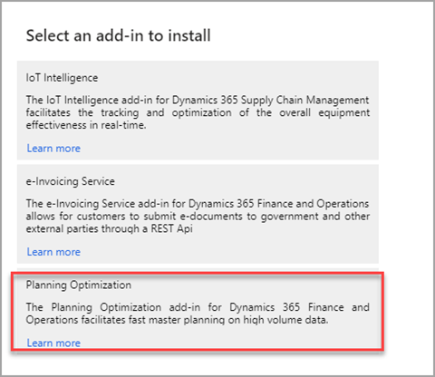

تتيح الوظيفة الإضافية لتحسين التخطيط لـ Microsoft Dynamics 365 Supply Chain Management أن تحدث عملية حساب التخطيط الرئيسي خارج Dynamics 365 Supply Chain Management وقاعدة بيانات SQL الخاصة به. يُحسن تحسين التخطيط الأداء ويكون له تأثير ضئيل على قاعدة بيانات SQL أثناء تشغيل عمليات التخطيط. 

بدلاً من إنشاء مصرف لموارد قاعدة البيانات التي تتطلب عادةً تشغيل هذا الحساب ليلاً أو بعد ساعات العمل العادية، يمكنك تشغيل حسابات التخطيط بانتظام على مدار اليوم للاستفادة من أحدث الطلبات وتقليل المهلة الزمنية لتلبية احتياجات العملاء. بالإضافة إلى تحسين السرعة بسبب البنية، تمت إضافة تحسينات وظيفية للمساعدة في تحسين العملية الإجمالية للشحن والتخزين.

الوظيفة الإضافية لتحسين التخطيط قيد التطوير المستمر وستتطلب تحديثات منتظمة في الأشهر القادمة لتظل محدثة. 

## تحسين الأداء

تم تصميم "تحسين التخطيط" لإجراء عمليات حسابية سريعة لكميات كبيرة من البيانات. لقد تم إنشاؤه كخدمة متعددة المستأجرين قابلة للتوسع بشكل كبير وتتيح لمثيلات متعددة العمل معاً لحساب الخطة. يزيل تحسين التخطيط حمل التخطيط الرئيسي من نظامك ويقلل من حمل الخادم. يمكن أن يساعدك تحسين التخطيط في تحقيق الأهداف التالية:

- تحسين أداء التخطيط خلال وقت تشغيل أقصر.
- تقليل التأثير على العمليات الأخرى أثناء تشغيل التخطيط الرئيسي.
- إجراء تخطيط السلوك بشكل متكرر. (لا تقتصر على عمليات التشغيل اليومي.)
- قم بتحسين المرونة باستخدام تقويم مركزي لتوزيع التغييرات تلقائياً على الموارد للتخطيط.
- قم بتحسين تغييرات التوريد الحالية والمخططة عن طريق إنشاء رسائل إجراءات لضمان مطابقة الأوامر للمتطلبات الحالية. على سبيل المثال، إذا تم إلغاء أمر عميل مهم، فسيتم إخطارك بأن التوريد ذي الصلة لم يعد مطلوباً، وإذا أمكن، يجب أن تحاول إلغائه. 
- زيادة الثقة في نمو الأعمال في المستقبل الذي لن يثقل كاهل نظام التخطيط.

## تدفق البيانات

بعد تثبيت الوظيفة الإضافية لتحسين التخطيط، تتصل الوظيفة الإضافية بخدمة تحسين التخطيط. عند تشغيل التخطيط الرئيسي، يتم إرسال بيانات الحركات من Supply Chain Management إلى خدمة تحسين التخطيط، ثم يتم تنفيذ الإجراءات التالية:

1.  يرسل عميل Supply Chain Management إشارة لطلب تشغيل التخطيط من "تحسين التخطيط".
2.  يطلب "تحسين التخطيط" البيانات المطلوبة من خلال الموصل المتكامل.
3.  ترسل قاعدة بيانات SQL المعلومات المطلوبة حول بيانات الإعداد والرسالة والحركات إلى "تحسين التخطيط" من خلال الموصل. يقوم الموصل بترجمة المعلومات بين Supply Chain Management وخدمة تحسين التخطيط.
4.  تحتفظ خدمة "تحسين التخطيط" بالبيانات المتعلقة بالتخطيط في الذاكرة وتقوم بعمليات الحساب المطلوبة.
5.  يتم إرسال نتيجة التخطيط إلى قاعدة بيانات Supply Chain Management من خلال الموصل. تتضمن النتائج معلومات مثل الأوامر المخططة ومعلومات تثبيت الأسعار. يرسل "تحسين التخطيط" إشارة إلى Supply Chain Management للإشارة إلى اكتمال عملية التخطيط. كما يرسل أي رسائل وتحذيرات ذات صلة.

يوضح الرسم التوضيحي التالي تدفق البيانات.

تُظهر الصورة ما يحدث عند تشغيل "تحسين التخطيط" في Supply Chain Management. تبدأ المهمة، ويسترد "تحسين التخطيط" البيانات من عميل Supply Chain Management للخطة. ثم يقوم بإجراء العمليات الحسابية وفقاً للإعداد ثم يرسل المعلومات مرة أخرى إلى عميل Supply Chain Management. 

## الترخيص
إذا كان بإمكانك تشغيل التخطيط الرئيسي باستخدام ترخيصك الحالي، فلن تضطر إلى شراء ترخيص إضافي لبدء استخدام "تحسين التخطيط".

## تثبيت تحسين التخطيط وتمكينه
لاستخدام "تحسين التخطيط"، يجب عليك التأكد من أن نظامك يحتوي على جميع المتطلبات الأساسية ثم تمكين مفتاح الترخيص الخاص به وتثبيت الوظيفة الإضافية لتحسين التخطيط لـ Dynamics 365 Supply Chain Management.

عندما يتم تثبيت الوظيفة الإضافية، يمكنك الانتقال إلى **معلمات تحسين التخطيط** لتمكينها للاستخدام. في الوقت الحالي، لا تدعم الوظيفة الإضافية جميع ميزات محرك التخطيط الرئيسي الحالية، ولكنها في النهاية ستحل محل محرك التخطيط الرئيسي المضمن. 

لمعرفة المزيد، راجع [الترحيل إلى تحسين التخطيط للتخطيط الرئيسي](/dynamics365/supply-chain/master-planning/new-master-planning-engine/?azure-portal=true).

عند تنشيطها وتعيينها إلى **نعم**، تحل الوظيفة الإضافية لتحسين التخطيط محل محركات التخطيط الرئيسية المضمنة التي تم استخدامها وتؤثر على نتائج وميزات التخطيط الرئيسي.
 
### المتطلبات الأساسية
قبل تثبيت الوظيفة الإضافية لتحسين التخطيط، يجب تلبية المتطلبات الأساسية التالية:

- يجب أن تقوم بتشغيل Supply Chain Management في بيئة توفر عالية ممكنة لـ Lifecycle Services، من المستوى 2 أو أعلى (ليست بيئة OneBox)، مع الإصدار 10.0.7 من Dynamics 365 Supply Chain Management أو إصدار أحدث. إذا حاولت تثبيت الوظيفة الإضافية في بيئة OneBox، فلن يكتمل التثبيت وستحتاج إلى إلغاء التثبيت.

- يجب إعداد نظامك لتكامل Microsoft Power Platform. لمزيد من المعلومات، راجع [المتطلبات الأساسية لإعداد الوظائف الإضافية](/dynamics365/fin-ops-core/dev-itpro/power-platform/add-ins-overview?azure-portal=true#prerequisites-for-setting-up-add-ins) و[إعداد الوظائف الإضافية](/dynamics365/fin-ops-core/dev-itpro/power-platform/add-ins-overview?azure-portal=true#set-up-add-ins).
