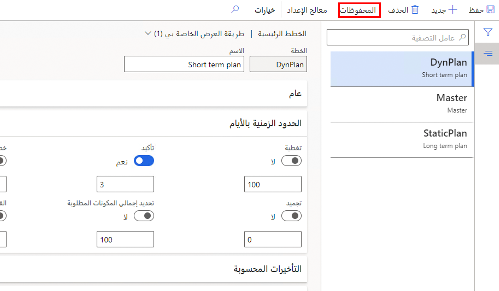
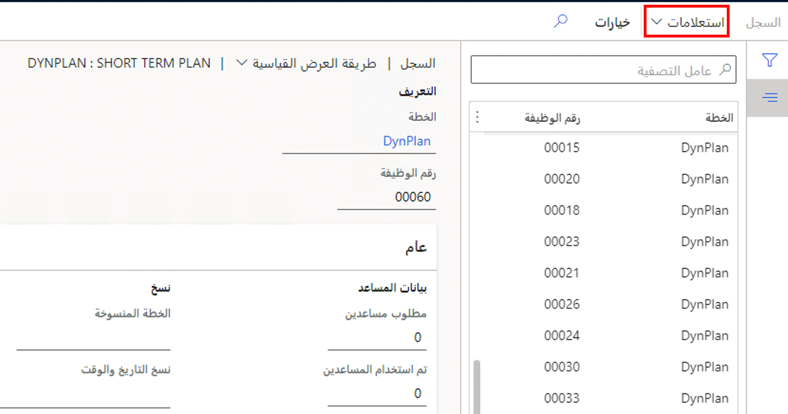
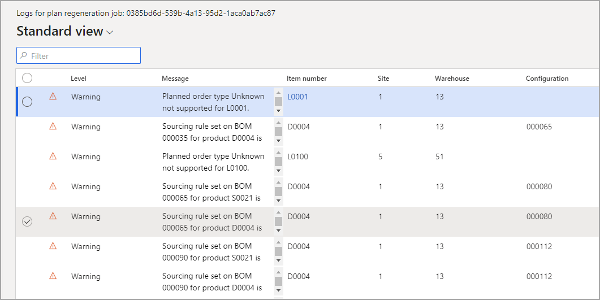

عندما تقوم بتشغيل خطة يتم تشغيلها بواسطة وظيفة تحسين التخطيط، يمكنك عرض سجلات التخطيط والسجل. يمكن أن تكون السجلات مفيدة لمشاهده وقت بدء المهام وأية تحذيرات قد يكون تم إنشاؤها. 

لعرض المحفوظات، انتقل إلى **التخطيط الرئيسي > الإعداد > الخطط > الخطط الرئيسية**، وقم بوضع المؤشر على إحدى الخطط، ثم حدد **المحفوظات** في جزء الإجراءات.

وعند عرض المحفوظات، يمكنك أيضاً عرض السجلات الخاصة بالخطة، التي تسرد المشكلات التي تحدث عند تشغيل الخطة، وذلك بتحديد علامة التبويب **سجلات** في جزء الإجراءات. 

يتم عرض مثال للسجلات في لقطة الشاشة التالية. ستحتوي كافة الخطط التي تمت معالجتها على سجل بسبب ظهور سجلات فقط عند حدوث المزيد من المعلومات والتحذيرات.

