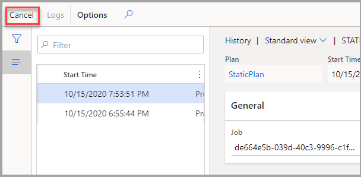

إذا قمت بجدولة خطة رئيسية تستخدم وظيفة تحسين التخطيط للتشغيل كمهمة مجموعة، سيتم تمكين خيار **إلغاء الأمر** عند عرض سجل الخطة. 

اتبع الخطوات التالية لإلغاء الخطة:

1.  انتقل إلى **التخطيط الرئيسي > الإعداد > الخطط**.
2.  حدد الخطة المناسبة لتشغيل التخطيط.
3.  حدد **المحفوظات**.
4.  حدد وظيفة التخطيط لإلغائها.
5.  حدد **إلغاء**. سيتم **إلغاء** حالة الوظيفة حتى يتم إلغاء الوظيفة، ستصبح الحالة **ملغاة**. 

