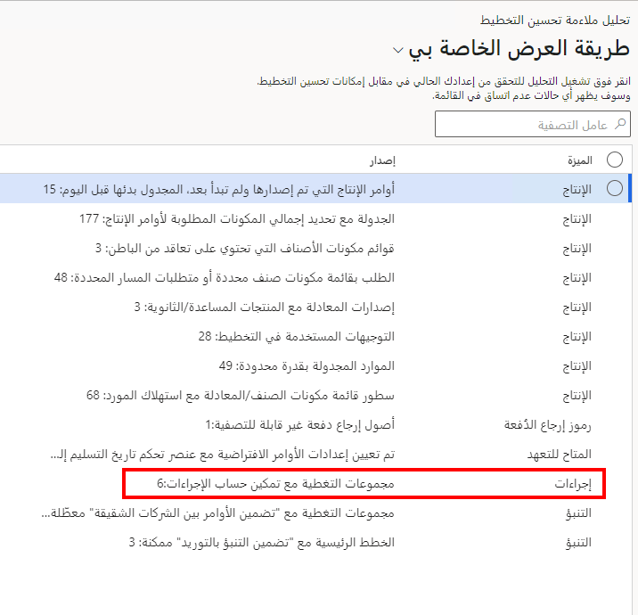

عندما يكون "تحسين التخطيط" نشطاً، يتم تشغيل جميع الخطط الرئيسية باستخدام الوظيفة الإضافية. قد تحدث نتائج مختلفة من هذه العملية عما قد يحدث مع التخطيط الرئيسي المضمن. يساعد تحليل الملاءمة في تحديد المواضع التي قد تختلف فيها النتائج بين التخطيط الرئيسي المضمن وتحسين التخطيط. 

يمكنك تشغيل **تحليل ملاءمة تحسين التخطيط** من **التخطيط الرئيسي > الإعداد > إعداد ملاءمة تحسين التخطيط**. تقوم هذه الأداة بتحليل الإعداد الحالي الخاص بك مقابل إمكانات "تحسين التخطيط". سيتم عرض أي تناقضات في القائمة.

تُظهر لقطة الشاشة السابقة أن التحليل وجد ست مجموعات تغطية حيث يتم تشغيل حساب الإجراء. نظراً لأن الإصدار الحالي من "تحسين التخطيط" لا يدعم الإجراءات، فلن يتم إنشاء أية إجراءات أثناء التخطيط الرئيسي. 

> [!NOTE]
> إذا تم العثور على تناقضات، فلا يزال بإمكانك استخدام "تحسين التخطيط". تُظهر نتائج تحليل الملاءمة الأماكن التي لا تحترم فيها خدمة التخطيط إعدادك الحالي. بمعنى آخر، تُظهر النتائج الأماكن التي قد يتم فيها تجاهل بعض العمليات أو قد لا يتم دعمها.

للحصول على قائمة شاملة بالنتائج المحتملة لهذا التحليل، راجع " [تحليل ملاءمة تحسين التخطيط](/dynamics365/supply-chain/master-planning/planning-optimization/planning-optimization-fit-analysis/?azure-portal=true).

