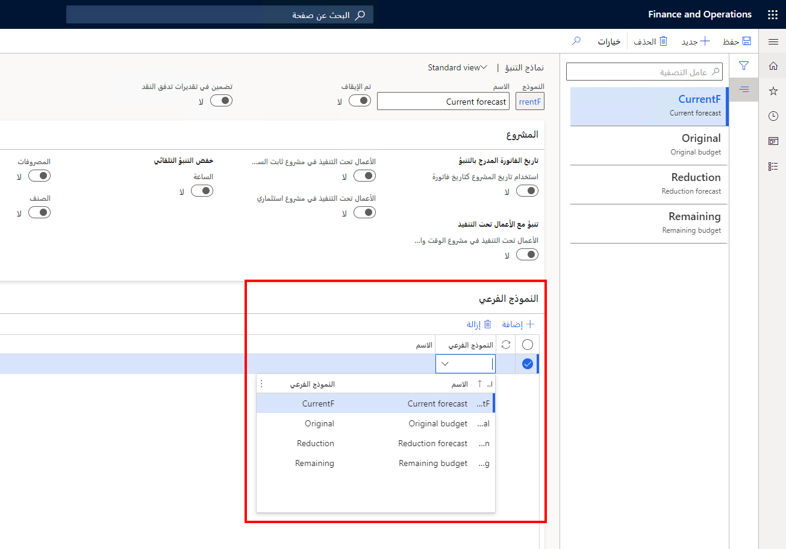

إذا قمت بإنشاء خطة رئيسية تستخدم وظيفة تحسين التخطيط، يمكنك استخدام توقع الطلب للتخطيط للطلب المتوقع. 

لمعرفة المزيد حول استخدام التنبؤ بالطلب، راجع [نظرة عامة على التنبؤ بالطلب](/dynamics365/supply-chain/master-planning/introduction-demand-forecasting/?azure-portal=true). 

يمكن للمخططين التنبؤ بالطلب من تاريخ الطلب باستخدام المدخلات من نماذج متعددة للتنبؤ بالطلب ونماذج فرعية. يمكن للمخططين أيضاً توقع خطوط لمنتج معين في صفحة **المنتجات الصادرة**.

عندما تقوم بإنشاء توقع مرتبط بخطة رئيسية، يمكنك إنشاء نماذج فرعية للتنبؤ. لا يوجد حد لعدد النماذج الفرعية التي يمكنك إضافتها إلى توقع. ومع ذلك، إذا كنت تستخدم نموذجاً فرعياً في توقع، فلا يمكن إضافته كنموذج فرعي في توقع آخر.

على سبيل المثال، إذا كان التنبؤ A يستخدم التنبؤات B وC كنماذج فرعية، فلا يمكن للتنبؤ D استخدام التنبؤات B وC كنموذج فرعي.

لإنشاء نموذج فرعي للتنبؤ، اتبع الخطوات التالية:

1.  انتقل إلى **التخطيط الرئيسي > الإعداد > التنبؤ بالطلب> نماذج التنبؤ**.
2.  حدد توقعات.
3.  في علامة التبويب السريعة **نموذج فرعي**، حدد **إضافة**.
4.  حدد توقعاً كنموذج فرعي، كما هو موضح في لقطة الشاشة التالية.
 
 

لمزيد من المعلومات حول التخطيط الأمثل والتخطيط الرئيسي مع توقعات الطلب والنماذج الفرعية، راجع [التخطيط الرئيسي مع توقعات الطلب](/dynamics365/supply-chain/master-planning/planning-optimization/demand-forecast/?azure-portal=true).

