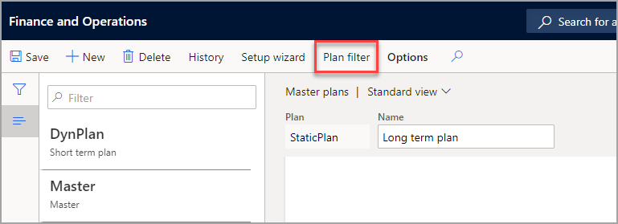
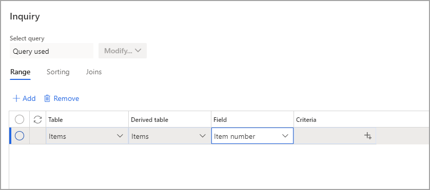
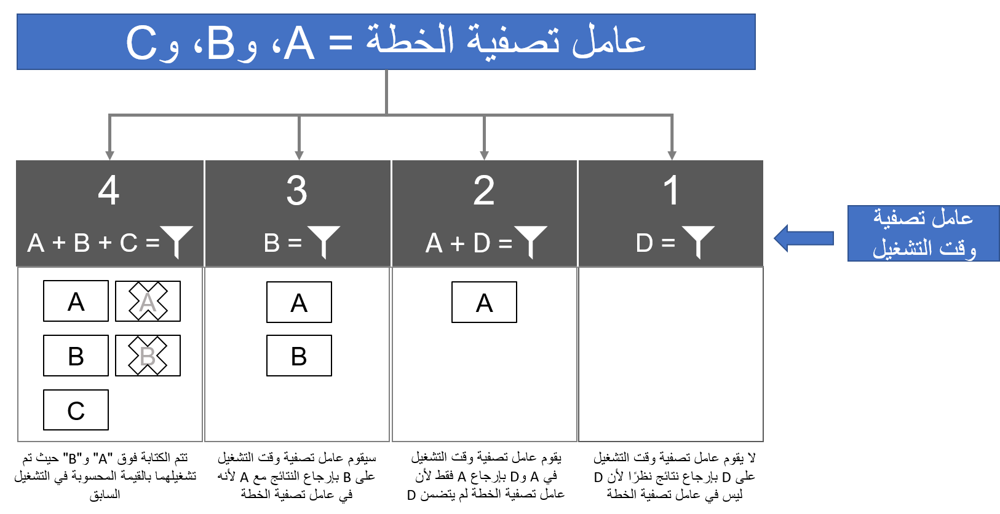

عند استخدام "تحسين التخطيط"، يمكنك تطبيق عامل تصفية على خطة. سيجعل عامل التصفية الخطة تقتصر على مجموعة محددة من العناصر ويضمن عدم تضمين أي عناصر أخرى كجزء من الحسابات. 

يمكن تطبيق عوامل تصفية الخطة وعوامل تصفية وقت التشغيل، التي تقوم بتعيينها عند تشغيل خطة ما، عند تشغيل التخطيط الرئيسي. يتم تضمين تقاطع عاملين من عوامل التصفية فقط في تشغيل التخطيط. 

لا ينتج عن تشغيل "تحسين التخطيط" الذي تمت تصفيته لوقت التشغيل حذف النتائج الحالية في الخطة الناتجة عن تشغيل سابق. على سبيل المثال، إذا قمت بتشغيل خطة للعنصر أ، فستمنحك نتائج للعنصر أ، ويتم الاحتفاظ بهذه الأوامر عند تشغيل خطة تمت تصفيتها للعنصر ب. سيتضمن التشغيل الثاني الآن أ وب. 

لا يحتفظ التشغيل الذي لم يتم تصفيته سوى بالأوامر المخططة المعتمدة بين عمليات التشغيل. 

يمكن الوصول إلى **عامل تصفيه الخطة** من **التخطيط الرئيسي > الإعداد > الخطط > الخطط الرئيسية** عندما تكون خاصية تحسين التخطيط مفعلة. تُظهر لقطات الشاشة التالية علامة تبويب **عامل تصفية الخطة** وصفحة **الاستعلام**.

## مثال

يوضح الرسم البياني التالي ما يحدث عند تخصيص عامل تصفية الخطة للعناصر أ وب وج، ويضم أيضاً عامل تصفية وقت التشغيل الذي يتم تعيينه عند تشغيل خاصية تحسين التخطيط. في الرسم البياني، تمثل المربعات المسماة 1 و2 و3 و4 عمليات تشغيل التخطيط الرئيسي، ولكل منها عامل تصفية لوقت التشغيل إلى جانب عامل تصفية الخطة. 

تكتمل عمليات التشغيل بالتسلسل وتُترك النتيجة من التشغيل السابق دون تغيير. 

علي سبيل المثال، في عملية التشغيل الثانية، يقوم عامل تصفية وقت التشغيل في العنصر أ ود وعامل تصفية الخطة الخاص بالعنصر أ وب وج بتوفير النتائج للعنصر أ. 

في عملية التشغيل الثالثة، يتم الاحتفاظ بالنتيجة الخاصة بالعنصر أ من عملية التشغيل الثانية كعملية تشغيل تمت تصفيتها ولا تتضمن إعادة احتساب للعنصر أ بل ب فحسب.

 
شاهد الفيديو التالي لمعرفة كيفية استخدام عوامل تصفية الخطة.

 > [!VIDEO https://www.microsoft.com/videoplayer/embed/RE4Ihni]

