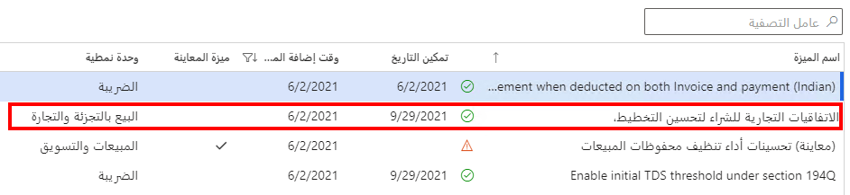
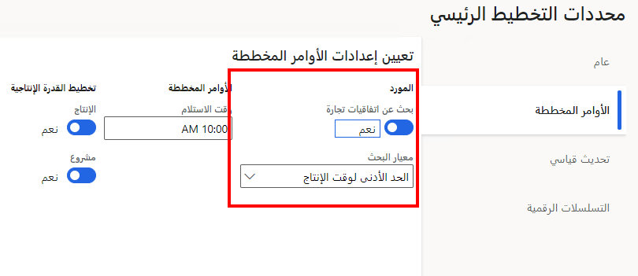
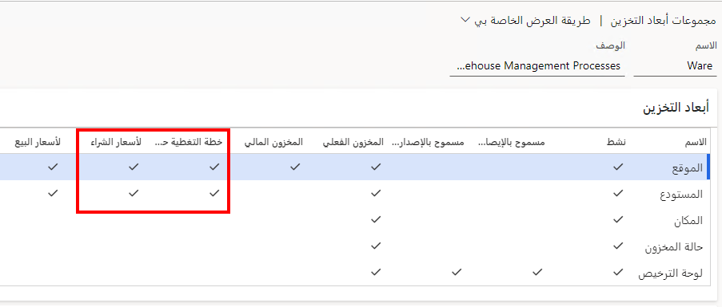
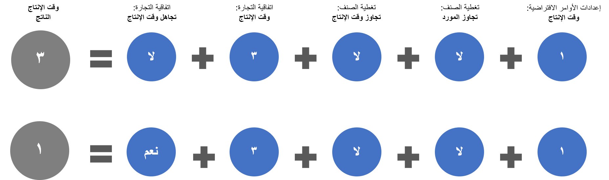

باستخدام "‏‫تحسين التخطيط"، يمكن لـ Supply Chain Management العثور على المورد و/أو الحد الأدنى لوقت الإنتاج لأمر مخطط من خلال البحث في جميع اتفاقيات الشراء التجارية. باستخدام ميزة **الاتفاقيات التجارية للشراء لتحسين التخطيط**، سيبحث تحسين التخطيط عن أفضل الأسعار وكذلك سيقوم أيضاً باعتبار الحد الأدنى لوقت الإنتاج المحسوب للوفاء بتاريخ الطلب. 

يجب تشغيل الميزة من مساحة عمل **إدارة الميزات** لاستخدامها، كما هو موضح في لقطة الشاشة التالية.

شاهد الفيديو التالي للاطلاع على عرض توضيحي حول الاتفاقيات التجارية للشراء.

 > [!VIDEO https://www.microsoft.com/videoplayer/embed/RE4IvCN] 

## إعداد النظام لتقييم اتفاقيات الشراء التجارية أثناء التخطيط الرئيسي

الخطوات الثلاث الأساسية لتطبيق تحسين التخطيط لتقييم اتفاقيات الشراء التجارية الخاصة بالشراء هي:

1.  انتقل إلى **التخطيط الرئيسي > الإعداد > معلمات التخطيط الرئيسي**. ضمن علامة التبويب **الأوامر المخططة**، في قسم **المورد**، قم بتعيين القيم التالية:
    - **بحث عن اتفاقيات تجارة** - قم بتعيين هذا الخيار على **نعم** لتضمين اتفاقيات الشراء التجارية في التخطيط الرئيسي.
    - **معيار البحث** – حدد المُعامل الذي ترغب في منحه الأولوية لكل اتفاقية شراء تجارية: **الحد الأدنى لوقت الإنتاج** أو **أقل سعر للوحدة**.

    

2.  انتقل إلى **التدبير وتحديد الموارد > الإعداد > الأسعار والخصومات > تنشيط السعر/الخصم**، ثم تأكد من تعيين الخيار **المورد** إلى **نعم**.
3.  انتقل إلى **إدارة معلومات المنتجات > الإعداد > مجموعات الأبعاد والمتغيرات > مجموعات أبعاد التخزين**، ثم حدد مجموعة أبعاد تخزين تنطبق على المنتجات التي يجب أن يقيِّم التخطيط الرئيسي اتفاقيات الشراء التجارية لها. تأكد من أن كل بعد تخزين ذي صلة في هذه المجموعة تقابله علامة اختيار في العمود **لأسعار الشراء**. كرر هذه الخطوة مع كل مجموعة أبعاد تخزين أخرى ذات صلة. 

    

## إعداد منتج صادر لتقييم اتفاقيات الشراء التجارية
لإعداد منتج صادر لتقييم اتفاقيات الشراء التجارية، اتبع الخطوات التالية.

1.  انتقل إلى **إدارة معلومات المنتجات > المنتجات > المنتجات الصادرة** وافتح منتجاً هدفاً.
2.  في علامة التبويب السريعة **الشراء**، تأكد من عدم تعيين أي مورد في حقل **المورد**.
3.  في جزء الإجراءات، ضمن علامة التبويب **الخطة**، في المجموعة **تغطية**، حدد **تغطيه الصنف** لفتح الصفحة **تغطية الصنف** الخاصة بالمنتج المحدد. تحقق من صحة الإعدادات التالية:
    - في علامة التبويب **عام**، يمكنك إعداد تجاوزات المورد. إذا كنت ترغب في أن يستخدم تحسين التخطيط اتفاقيات الشراء التجارية لتحديد مورد، فيجب أن تمنع تجاوزات المورد بإلغاء تحديد خانة الاختيار **استخدام الإعداد المحدد**.
    - في علامة التبويب **الحد الأدنى لوقت الإنتاج**، يمكنك إعداد تجاوزات الحد الأدنى لوقت الإنتاج. إذا كنت ترغب في أن يستخدم تحسين التخطيط اتفاقيات الشراء التجارية لتحديد الحدود الدنيا لوقت الإنتاج، فيجب منع تجاوزات الحد الأدنى لوقت الإنتاج. قم بإلغاء تحديد خانة الاختيار لكل نوع من الحد الأدنى لوقت الإنتاج تريد تحديده باستخدام اتفاقيات الشراء التجارية (**الشراء** و/أو **الإنتاج** و/أو **التحويل**).
4.  قم بإغلاق صفحة **تغطية الصنف** للرجوع إلى صفحة **التفاصيل** الخاصة بالمنتج المحدد.
5.  في جزء الإجراءات، ضمن علامة التبويب **الخطة**، في المجموعة **التنبؤ**، حدد **التنبؤ بالتوريد** لفتح صفحة **التنبؤ بالتوريد**. تأكد من أن عدم احتواء أي من الصفوف المعروضة على قيمة في عمود **حساب المورد**.
6.  قم بإغلاق صفحة **التنبؤ بالتوريد** للرجوع إلى صفحة **التفاصيل** الخاصة بالمنتج المحدد.
7.  في جزء الإجراءات، ضمن علامة التبويب **شراء**، في المجموعة **اتفاقيات تجارية**، حدد **عرض الاتفاقيات التجارية**. تأكد من أن جميع اتفاقيات الشراء التجارية ذات الصلة مذكورة. وتأكد أيضاً من تعيين الخيار **تجاهل وقت الإنتاج** على **لا** لكل اتفاقية تريد أن يستخدم لها تحسين التخطيط الحد الأدنى لوقت الإنتاج المحدد لهذه الاتفاقية.
8.  في جزء الإجراءات، ضمن علامة التبويب **الخطة**، في المجموعة **إعدادات الأوامر**، حدد **إعدادات الأوامر الافتراضية** لفتح الصفحة **إعدادات الأوامر الافتراضية** الخاصة بالمنتج المحدد. 
9.  في علامة التبويب السريعة **أمر الشراء**، قم بعرض قيمة الحقل **الحد الأدنى لوقت إنتاج المشتريات**. إذا لم يتم تحديد تجاوز وقت الإنتاج لتغطية الصنف، سيقوم تحسين التخطيط باستخدام هذه القيمة عند تحديد الاتفاقيات التجارية التي يتم فيها تعيين خيار **تجاهل الحد الأدنى لوقت الإنتاج** إلى **نعم**. لذلك، يجب تسوية هذه القيمة حسب الحاجة.
10. كرر هذا الاجراء مع كل منتج ذي صلة.

## تجاهل وقت الإنتاج

ينفذ إعداد مفتاح يُستخدم في تحسين التخطيط **تجاهل وقت الإنتاج**. 

تُظهر الصورة التالية ما يحدث عند تجاهل وقت الإنتاج في اتفاقية تجارية. 

- ويُظهر الصف الأول عندما لا يتجاهل الإعداد الحد الأدنى لوقت الإنتاج، ما يؤدي إلى حد أدنى لوقت الإنتاج قدره ثلاثة أيام. 
- أما الصف الثاني فيُظهر أنه إذا تجاهلت الحد الأدنى لوقت الإنتاج بناء على تحسين التخطيط، فيكون الحد الأدنى لوقت الإنتاج يوماً واحداً فقط. 

 
 

